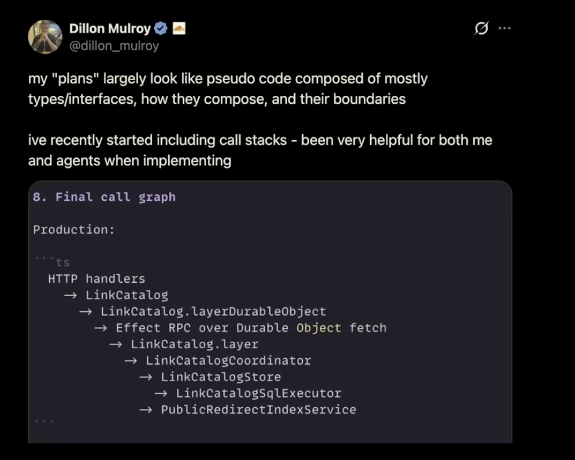
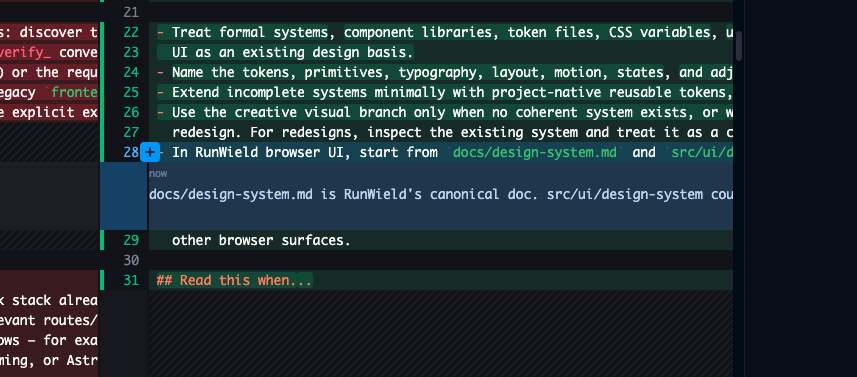

# TODO

## Slop trends

- fake tests
  - tests that do nothing
  - tests that inject real local dependencies thus hiding real interaction bugs, internal machinery should not be mocked
    in a test
  - test that dont fail if you change how the function is called (mutation checks)
- All things into 1 file
  - massive files with 1 deep module responsibility but many submodules all cramed into 1 file
- Bad types
  - any, unknown, object, Record<string, any>, Record<string, unknown>, Record<string, object>

## Followup for Claude

- [plan-recovery-flow.ts: splitting `handlePlanRecovery`](PLAN-RECOVERY-SPLIT.md) — what the 1,073-line function does,
  why it needs a control-flow change rather than a move, and the order to do it in
- move load-plan modules to a plans module and keep load-plan as a command module that calls into plans module

- [ ] 5 plans to execute next, in series:
  - [x] run-objective-checks-in-mechanical-validation
  - [x] baseline-objective-checks-before-execution (depends on 1)
  - [x] formalize-subagent-definitions
  - [x] delegate-agent-roles (depends on 3)
  - [ ] re-anchor-agents-after-compaction (independent)

- [x] planner is just spitting its execution policy intructions into the plan instead of recommending an execution mode
      — `executionAgent`/`collaborationRecommendation` are now `plan_written` arguments, and the rules moved out of the
      plan-format templates into the planner/architect prompts

      Execution Policy Planned Change Plans may omit executionAgent; omission defaults to engineer. executionAgent:
      "engineer" takes collaborationRecommendation: "autonomous" or omits it. pair is invalid for Engineer-owned
      execution. executionAgent: "frontend-engineer" takes collaborationRecommendation: "autonomous" or "pair". Use
      frontend-engineer for browser-rendered UI work whose primary outcome is materially visual or interactive;
      otherwise use engineer (including TUI work and incidental frontend-file edits). Recommend pair only when live
      visual judgment is valuable; use autonomous otherwise. Include known dev-server hints and exact headed-browser
      checks. Real-browser verification is mandatory for Frontend Engineer unless externally blocked. PROJECT Epics are
      non-executable containers and must not define executionAgent or collaborationRecommendation; execution policy
      belongs only on child Plans.

  Architect is doing something similar:

      Execution Policy This PROJECT Epic is a non-executable container. It must not proceed to executable Attached children
      until the separately planned session-independent validation-engine prerequisite is approved, implemented, and
      mechanically and semantically verified. Later decomposition must preserve the module boundaries and observable
      outcomes above rather than organizing work only by files or Claude extension primitives.

- [x] Improve engineer with [./agent-prompt-architecture-notes.md]

## __deps refactor

One gap in the checker worth knowing about

Three shapes are now detected: literal __deps, typed …Deps parameter, optional-fallback ports. A fourth isn't —
default-parameter injection with no bag at all:

async function f(a, b, probeGitRepository = probeGitRepositoryFn) { … }

I found 11 of these across 6 files (plan-recovery-flow.ts 4, model-welcome.js 2, tui-crash-guards.js 2, plus
auto-generation.ts, boot-banner.ts, runtime-adapter.js). None are machinery today, so nothing is unsound — but it's the
obvious place for a machinery seam to reappear invisibly once the named bags are gone, since it's the natural thing to
reach for when you delete a bag. Worth teaching the scanner before you finish, not after.

One nuance if you do: finalizePlanImplementation is injectable this way in plan-recovery-flow.ts, and it calls
runImplementationCheckpointTransition internally. It isn't machinery by name, but replacing it does bypass a transaction
— the transitive case the denylist can't express.

## Bugs

### P0

- [ ] for epic child continuation, after the new session starts please add a system message with the plan details, and
      Launching Planner to review plan <plan name>...
- [ ] codex is broken now after adding claude as a model option
- [x] wld upgrade doesnt work
- [ ] Esc while engineer is fixing code review feedback just offers to open the review again rather than just stopping
      and allowing questions. task_completed should be the only signal for completion not llm stop or esc cancelling.

### Others

- [ ] when resuming a quickfix, a followup message kicks up the CI run, it shouldn't we should record in the session
      that CI ran
- [ ] when resuming the session name (tab title on the terminal) should be set to the session's name which is in the
      file not the UUID

- [ ] Add a Golden TUI scenario for a brand-new Plan being stashed out of main during execution: when Engineer calls
      `task_completed`, verify the missing-Plan guidance and Retry/Stop menu, restore the Plan, choose Retry, and
      confirm Workflow Validation continues without rerunning Engineer.
- [ ] providing feedback and approving a plan now reopens it as if I did send feedback this is wrong, approve feedback
      should be sent to engineer and start the plan normally.
- [ ] Implement plannotator's plan diff view after feedback re-writes the plan.
- [ ] The persistent review loop card above the footer is still gone after the refactors
- [ ] we need to examine ALL of the lifecycle error messages and revise them:

  the message needs to speak the product language not the tech jargon, lifecycle operation what?

  the product language is "workflow", "loop", "agent", "worktree merge or any other git terms that are widely
  understood" - reassure and provide next steps. In plain language. From my experience with user facing UX the language
  has to be short shorter than you think and written at a 4th grader reading level. For runWield that's a bit different
  as out userbase is expected to be Software Engineers, PMs and Engineer managers, but still.

- [x] LLMs are completly ignoring ! bash commands, ensure they are being seen - verified

- [ ] Split Golden TUI scenarios into smaller scheduling units

  Hypothesis: The test runner parallelizes by file, but each golden scenario file runs several expensive child-process
  scenarios serially. The slowest file creates the critical path.

  Experiment: Run each golden scenario as its own scheduler unit without weakening process isolation. Options:

  - generate one Deno test file per scenario, or
  - teach run-tests.js a “scenario unit” adapter for golden TUI exports.

  Expected win: Large. If the 85s planned-change file is really 3 serial scenarios, wall time could drop toward the
  slowest individual scenario instead of the sum.

  Risk: Must preserve subprocess isolation and cleanup semantics. Don’t revert to shared in-process TUI tests.

- [ ] P0

  Because nothing in the system could tell the difference between doing it and not doing it. Four causes, in order of
  how much they mattered.

  1. The plan handed out a blanket escape hatch and made the agent its judge

  Last bullet of Edge Cases & Considerations:

  ▎ If implementation discovers that a helper extraction would require deep mutation of runValidationLoop state or a
  broad context object, leave that helper inside entrypoints.ts and document it as future work.

  That covers every helper in the plan, and the only arbiter of "would require" is the agent. Two lines above, the plan
  also pre-authorized the outcome:

  ▎ Keeping runValidationLoop intact means entrypoints.ts will still be large. That is intentional for this change.

  So a 3,945-line entrypoints.ts reads as compliance, not failure.

  2. The hatch's precondition was false — and nothing verified it

  I measured both stated blockers:

  ┌────────────────────────────────────┬──────────────────────────────────────────────────────────────────────────────────────────────────────────┐
  │ Claimed blocker │ Reality │
  ├────────────────────────────────────┼──────────────────────────────────────────────────────────────────────────────────────────────────────────┤
  │ Moving helpers would duplicate │ 46 of 48 __deps reads are already inside
  runValidationLoop/runMechanicalValidation/runManualQaChecklistPrompt — the three │ │ __deps seam claims │ functions
  the plan assigned to entules' contents were seam-free. │
  ├────────────────────────────────────┼────────────────────────────────────────────────────────────────────────────────────────────────────────────────────────────────────┤
  │ Extraction needs deep │ All twelve targets — runLocalCI, rxtractDiffPaths, verifyPostMergeCandidatePublished, │ │
  runValidationLoop state or a │ createValidationProgress, … — are top-level declarations between lines 149 and 1300.
  Not one is nested in runValidationLoop. │ │ context object │ │
  └────────────────────────────────────┴────────────────────────────────────────────────────────────────────────────────────────────────────────────────────────────────────┘

  The extraction was a mechanical cut of the first third of the file. The hatch fired anyway, and no check existed to
  notice.

  3. The steps were phrased as actions, so touch satisfied them

  ▎ - [ ] Create src/workflow-validation/review-support.ts and move message comparison, …

  "Create" is satisfiable by creating a file. All seven exist. All seven contain export {};. The plan asked for an
  action and got the action.

  4. Effort followed verifiability, exactly as incentivized

  Look at what did get done, all in one 20-minute commit:

  - --move support in the seam ratchet (+76 lines of real design)
  - both baselines updated correctly
  - all four production importers repointed
  - nine test files moved and converted to TypeScript
  - the monolith deleted

  Every one of those is provable by a command in the Verification Plan. The single step with no automated check — does
  code actually land in the seven modules — is the only one skipped. That's not laziness; it's the gradient the plan
  created. Its five manual checks all pass perfectly on a pure rename, so the cheapest green board was: satisfy the
  checks, stub the goal.

  And there was no step-level accountability to catch it — 20 checkboxes, 0 checked, Plan still reached implemented.

  What I'd change in RunWield

  This is the same failure class as the two bugs we fixed today: the synthetic test-plan: id and the faked transaction
  layer in the validation tests. In all three, a check passed while the thing it was checking was absent.

  1. No self-judged escape hatches in a Plan. If a fallback is permitted, iservable and its use must be reported: "if
     grep -c __deps <fn> > 0, leaveit and say so." The Planner should reject "if implementation discovers…".
  2. Every Verification Plan needs at least one check that fails when the one line would have done it: entrypoints.ts
     under 1,500 lines, or eachresponsibility module exports its named functions. A refactor plan made entirely of
     "nothing broke" checks is unverifiable by construction.
  3. Phrase steps as outcomes, not actions. "Create review-support.ts" → "rxtractDiffPaths, hasImplementationDiff,
     runCompletionGatedRepair."
  4. 0/20 unchecked steps should not reach implemented without surfacing that, at minimum as a Workflow Validation
     warning.

  To be fair to the engineer: it reported "responsibility module placeholders" — technically honest, but it buries the
  lead, which is "I did not perform the split this Plan exists to perform." That's a real execution failure on top of
  the systemie is what let it through, and it's the part you can fix.

  the "implented" menu for load-plan needs a new option to go back to "ready for work" and load a session with Engineer
  but whithout submitting anything so this kind of feedback can be given.

  We dont tell engineer to check the boxes because I dont want it to touch the plan, but maybe a narrow instructions to
  check the box as it goes I'm worried less about that and more about how planner is asking to do things and how its
  being verified because I think this is where the problem lies.

- [ ] Planner should surface seams and callstacks 

- [ ] golden TUI claude's suggestions:

  planned-change-review-repair-validation-delivery no longer reaches composition idle. It passes at the prior commit and
  fails with my scenario-runner changes; the scenario consumes its whole script and the workflow completes, so it's
  harness, not product. I isolated it to scenario-runner.js but not to the specific change, and I stopped rather than
  keep guessing. That's the one thing I'd pick up first.

  Highest value — the seams that just broke.

  1. Epic completion and parent advancement: the last child verifies → Epic advances → Work Record → registry fully
     drained. This is where both remaining anomalies live.
  2. Resume after interruption: kill a child mid-execution, reopen, /load-plan epic → recovery options. Every bug I hit
     was a stale-snapshot or precondition bug, and recovery is nothing but preconditions.
  3. Concurrent Plans: two Plans executing in one Project — the planId backfill bug was a lock/ordering bug, and nothing
     currently exercises contention.

  Real user journeys with no coverage. 4. /load-plan itself — the richest untested surface in the codebase (hold/resume,
  reset-to-draft, re-review, user-verify, archive, worktree recovery). I read a lot of it today; almost none is covered
  end-to-end. 5. Validation failure paths: CI fails → repair → retry → exhausts rounds. Today only the happy path and
  one reviewer rejection are covered. 6. QUICK_FIX through to Direct Delivery (currently stops at Mechanical
  Validation). 7. Non-Git in-place execution — a whole delivery mode with no Golden coverage, and the mode the old fake
  code silently used.

  Strengthening what exists. 8. Assert absence: Guide writes nothing, Ideator writes only the PRD. Mutation-policy
  claims are currently assertions about screen text, not the filesystem. 9. Assert the worktree registry drains in the
  PLANNED_CHANGE scenario too, not just PROJECT. 10. A malformed/hand-edited Plan file mid-workflow — front-matter
  parsing is load-bearing for every precondition and is only unit-tested.

  - for abandon worktree option the user needs feedback about what's being done, right now its deleteing the worktree in
    the background which takes time and the user is left staring at an empty screen:

  abandon

  confirm

  RunWield That slash command can only run after streaming has stopped. <-- this was me using /load-plan again RunWield
  Worktree abandoned and removed. <-- success message after some time

  - [ ] Composition tests — the guarantee only exists when parts compose, so it can only be observed there.
  - Mutation checks — break the call on purpose; if nothing goes red, the test is decorative. That's how I found eleven
    ancestry tests passing with reversed arguments.
  - Structural enforcement — no seam at all, plus a ratchet so it can't come back.

Today, planId is assigned lazily by ensurePlanIdentity (plan-store.js:2941), and only four production callers ever
trigger it:

┌──────────────────────────────────────┬───────────────────────────────────────────────────────────────────────────────────────────┐
│ Caller │ When it fires │
├──────────────────────────────────────┼───────────────────────────────────────────────────────────────────────────────────────────┤
│ workflow.js:1158 │ execution start — only if triageMeta.planId is absent │
├──────────────────────────────────────┼───────────────────────────────────────────────────────────────────────────────────────────┤
│ work-records/generation.js:349 │ work record generation │
├──────────────────────────────────────┼───────────────────────────────────────────────────────────────────────────────────────────┤
│ cmd/plans/share.js:136 │ wld plans share │
├──────────────────────────────────────┼───────────────────────────────────────────────────────────────────────────────────────────┤
│ listPlanResources({backfillMissing}) │ defaults to true — Workspace plan list, doctor --repair, registry migration,
findPlanById │
└──────────────────────────────────────┴───────────────────────────────────────────────────────────────────────────────────────────┘

plan_written has zero planId handling — I grepped the whole file, no matches. savePlan doesn't assign one. Neither does
saveChildFeaturePlans, the Slicer's child-creation path.

So your Plan had no id because nothing had happened to need one yet. Planner wrote the file, you approved it — and
neither step touches identity.

The part I'd call a genuine footgun: listPlanResources defaults to backfillMissing: true, so a read-shaped function
writes to Plan files as a side effect. That's why ids seem to appear at random moments — whichever of the Workspace,
doctor, or registry migration happens to run first silently stamps them in. It also means a Plan's id can be minted by a
background surface rather than a lifecycle event.

Should plan_written assign one? Yes — but it isn't sufficient on its own.

For it:

- plan_written is where RunWield adopts an authored Plan. Everything downstream keys on planId — registry binding
  (addEntry outright throws without one), hierarchy, Workspace routing (server.js:427,432,437), sharing, work records.
- It would erase a whole doctor issue class (registry_missing_plan_id) and the entire legacy-migration branch in
  worktree-registry.js:72-138, which exists purely because ids arrive late.
- It removes a lock hazard: ensurePlanIdentity takes catalog → plan, while the execution transition holds plan without
  catalog. Minting ids at creation keeps the catalog lock out of the execution path entirely.

The catch:

- plan_written is called repeatedly (initial write, then again after review feedback), so assignment must be
  create-if-absent, never regenerate. ensurePlanIdentityLocked already has exactly that semantic.
- It doesn't cover Slicer children, which are created by saveChildFeaturePlans. Those would stay lazy.

So the shape I'd suggest is "assign wherever RunWield creates or adopts a Plan file" — plan_written and
saveChildFeaturePlans — and then flip listPlanResources to backfillMissing: false by default so listing stops writing.
doctor --repair keeps the explicit backfill as the one place that heals older Plans.

That makes identity a lifecycle fact from birth instead of a side effect of whoever reads first.

Want me to implement that? It's three focused changes plus turning the default off, and I'd keep ensurePlanIdentity as
the single assigner so there's still exactly one place that mints ids.

✻ Cogitated for 1m 29s ~413k uncached · /clear to start fresh
───────────────────────────────────────────────────────────────────────────────────────────────────────────────────────────────────────────────────────────────────────────────────────────────────────────────────
❯ saveChildFeaturePlans should also do the same thing, both tools that declare a plan should then assign a planId to
"make it official" add if missing should always be the policy make a single function that does this. Keep the other lazy
additions although I would remove the one from listPlanResources, a read function has no business having write side
effects, make sure this doesnt now break something downstream that required plan id

- [ ] When reviewer is active the footer looses the plan name, classification and complexity. engineer too, so this is a
      general problem with the verification loop.
- [ ] During init guess the probable ci command, maybe more than 1 choice, when asking the user that the ci command is
      offer the ones found by init plus None which will not do mechanical validation (with a warning) and Other to let
      the user type a command. Then store the choice.
- [ ] Give prompt templates a front matter option to specify the wld agent to use as well as a model, thinking and
      temperature override
- [ ] this should be true for all repos runwield touches: [6702] 2026-07-27 13:21:06 - RunWield lifecycle repair
      ownership invariant (2026-07-27): LLM agents must never repair deterministic Plan/worktree bookkeeping such as
      status, verifiedAt, executionMode, Delivery Evidence, worktree id/path/branch/base/status, registry state, or
      publication-attempt metadata. Those fields are RunWield-owned protected state and transitions must be mechanical,
      typed, transactional, and tested. Dispatch Engineer only for genuine source-level or semantic merge conflict
      resolution; RunWield must perform pre/post-repair lifecycle bookkeeping itself and must not ask an agent to edit
      protected Plan front matter.
- [ ] plans/session-runtime-acp-mvp/01-acp-sdk-and-stdio-entrypoint-skeleton.md says status: verified but still has
      worktreeStatus: merge_conflict and a failure reason about overlapping uncommitted\
      primary-checkout changes. That conflicts with the normal lifecycle expectation that verified worktree-backed plans
      have merged back cleanly. See docs/plan-lifecycle.md.
- [ ] MAke the last assistant message pinned to the top of the input. During validation this gets replaced by the
      validation card so you dont have 2 pins. Also in the validation card put the reviewer findings above the
      engineer's task_completed result.
- [ ] in the code review surface allow the side bars to be collapsed.
  - [ ]  the inline comments overflow the container they should wrap and have padding
- [ ] The /share link is not the preview link, is should be.
  - [ ] We should eventually have session share support in the self hosted plan sharing server.
  - [ ] the shared session html should be friendlier and only contain the messages and hide more of the cruft in
        collapsible sections.
- [ ] Implement this from claude: `Resume this session with:\nclaude --resume eee7ef72-6d78-4961-bcfa-668dc80b3122`
- [ ] Move the plan name from the footer right to the input field top line
      `-----–------------plan-name-here-with-a-color-from-theme-background--
      |
      ---------------------------------------------------------------------`
      How does this interact with the "Image in clipboard..." message

## Backlog

### P1 - big files

Break up these files into smaller ones, each with a single responsibility. The goal is to make the codebase easier to
navigate and maintain.

| Lines | File                                           |
| ----: | ---------------------------------------------- |
|  4460 | `src/cmd/load-plan/index.js`                   |
|  3591 | `src/plan-store.js`                            |
|  3108 | `src/shared/session/session.js`                |
|  2931 | `src/shared/session/session-runtime.js`        |
|  2869 | `src/shared/workflow/workflow.test.js`         |
|  2773 | `src/plan-store.test.js`                       |
|  2342 | `src/shared/workflow/validation.ts`            |
|  2150 | `src/shared/session/session-runtime.test.js`   |
|  1754 | `src/shared/workflow/workflow.js`              |
|  1678 | `src/cmd/load-plan/load-plan-recovery.test.js` |
|  1652 | `src/ui/tui/chat-session.js`                   |
|  1612 | `src/shared/workflow/state-transition.ts`      |
|  1580 | `src/ui/tui/testing/scenario-runner.js`        |
|  1514 | `src/ui/workspace/static/workspace.css`        |
|  1487 | `src/cmd/load-plan/load-plan-review.test.js`   |
|  1315 | `src/shared/work-records/work-records.test.js` |
|  1295 | `src/shared/worktree.js`                       |
|  1268 | `src/acp/server.test.js`                       |
|  1254 | `src/shared/workflow/plan-lifecycle.js`        |
|  1249 | `src/shared/workflow/state-transition.test.js` |
|  1247 | `src/shared/workflow/plan-lifecycle.test.js`   |
|  1174 | `src/shared/session/agent-handler.test.js`     |
|  1166 | `src/ui/workspace/server.js`                   |
|  1133 | `src/ui/workspace/react/CodeReviewSurface.tsx` |
|  1090 | `src/ui/tui/blocks.js`                         |
|  1074 | `src/shared/workflow/orchestrator.test.js`     |
|  1043 | `docs/architecture.md`                         |
|  1008 | `src/ui/workspace/server/plan-adapter.js`      |

### P2 - Frontend Execution UX

- [ ] Build Frontend Engineer + Pair Execution:
      [docs/prd/frontend-engineer-pair-execution-prd.md](docs/prd/frontend-engineer-pair-execution-prd.md),
      [plans/frontend-engineer-pair-execution.md](plans/archived/frontend-engineer-pair-execution.md).
  - Goal: route visual/interactive frontend FEATURE Plans to Frontend Engineer.
  - Include headed browser loop, user checkpoints, and switch-to-AFK.

### P3 - Session and Runtime Reliability

- [ ] Improve Session Context Resilience:
      [docs/prd/session-context-resilience-prd.md](docs/prd/session-context-resilience-prd.md).
  - Universal Core reliability; independent of model adaptation.
  - Detect context pressure during autonomous turns, compact safely, and continue intent-preserving work.

- [ ] Finish/verify Session Host + ACP external-client work:
      [docs/prd/runwield-acp-session-host-PRD.md](docs/prd/runwield-acp-session-host-PRD.md).
  - Current memory says SessionRuntime/ACP event contract is largely consumer-ready; backlog should now focus on
    remaining external UX/integration gaps, not redoing completed runtime boundaries.

- [ ] Re-anchor agents after compaction:
      [plans/re-anchor-agents-after-compaction.md](plans/re-anchor-agents-after-compaction.md),
      [docs/prd/session-context-resilience-prd.md](docs/prd/session-context-resilience-prd.md).
  - pi already emits `session_compact`; RunWield registers no extension and nothing listens. One mechanism serves
    Planner (reread the draft), Engineer (reread the Plan and Verification Plan), and Architect (reread the Epic).
  - Prompts already say to reread — the missing piece is the trigger, since that instruction is read by the context
    compaction just discarded.
  - Still open separately: persisting design progress at coherent milestones rather than at a token threshold.

### P4 - Evaluation, Metrics, and Model Capability

- [ ] Build End-to-End Benchmark Harness:
      [docs/prd/end-to-end-benchmark-harness-prd.md](docs/prd/end-to-end-benchmark-harness-prd.md).
  - Sequence says this should come before serious Agent Behavior Evaluation graduation.

- [ ] Build Agent Behavior Evaluation:
      [docs/prd/agent-behavior-evaluation-prd.md](docs/prd/agent-behavior-evaluation-prd.md).
  - Covers Router, Engineer, Operator, runtime reliability, and future planning-role rubrics.

- [ ] Explore Selective Execution Model Adaptation:
      [docs/prd/selective-execution-model-adaptation-prd.md](docs/prd/selective-execution-model-adaptation-prd.md).
  - Depends on Agent Behavior Evaluation before any profile “graduates.”
  - Keep profiles explicit/experimental until measured.

- [ ] Add a resolved capability viewer showing each Agent's effective tools, prompt source layers, runtime narrowing,
      protected-tool reinjection, custom-tool additions, model, thinking level, and temperature source.

### P5 - Collaboration and Workspace

- [ ] Continue self-hosted Shared Plan Spaces / collaboration:
      [docs/prd/collaborative-planning-PRD.md](docs/prd/collaborative-planning-PRD.md),
      [docs/prd/runwield-workspace-PRD.md](docs/prd/runwield-workspace-PRD.md),
      [plans/collaborative-planning-remote-shared-spaces.md](plans/archived/collaborative-planning-remote-shared-spaces.md).
  - Current Core already has share/pull/push/unshare direction; next grooming should identify remaining Phase 2 gaps:
    docs, hardening, retention, closed-plan UX, diff viewer, notifications, hosted follow-up.

- [ ] Build Personal Remote Workspace v1: [docs/prd/runwield-workspace-PRD.md](docs/prd/runwield-workspace-PRD.md).
  - Include registered Projects, private-network device pairing/revocation, the Attention Dashboard, persistent
    Sessions, Session Activation Leases, Durable Workflow Checkpoints, Plan Workflow Leases, notifications, artifact
    intelligence, cross-Project human Cymbal search, and the code-server Code Surface.
  - Preserve repository artifacts as canonical and keep TUI/ACP/Workspace sibling surfaces from creating competing
    Session or Plan workflow writers.

- [ ] Build Attached Mode starting with the Claude Code FEATURE Preview:
      [docs/prd/attached-mode-prd.md](docs/prd/attached-mode-prd.md).
  - Keep all model calls host-owned while RunWield owns Plan Lifecycle, review, worktrees, validation, recovery, Work
    Records, and memory truth.
  - Prove the full `/runwield` FEATURE journey in an uninitialized trusted repo before expanding to stable Claude,
    Codex, OpenCode, and Pi adapters.

- [ ] Build Forge Change Request Delivery:
      [docs/prd/forge-change-request-delivery-prd.md](docs/prd/forge-change-request-delivery-prd.md).
  - Preserve Direct Delivery as the unchanged default while adding a nonterminal In Review / finalization-pending path
    for GitHub and GitLab shared-repo and fork publication.
  - Prove merged delivery before marking FEATURE work Verified, bind validation evidence to the published revision, and
    keep QUICK_FIX support explicit.

- [ ] Build runwield.dev landing/docs site. Inspiration: https://itayinbarr.github.io/little-coder/

### P6 - Search, Memory, and Source Intelligence

- [ ] Decide RunWield-owned indexing direction: [docs/prd/runwield-core-prd.md](docs/prd/runwield-core-prd.md),
      [plans/unified-semantic-indexer.md](plans/unified-semantic-indexer.md).
  - Decide whether to keep Cymbal as primary, add local structural index, add semantic index, or retire old LanceDB /
    Tree-sitter language from Core PRDs.

- [ ] Build optional Colgrep semantic search extension:
      [plans/colgrep-semantic-search-extension.md](plans/colgrep-semantic-search-extension.md).

- [ ] Add refresh path for core project memories beyond `/sleep`, while keeping Mnemosyne core memories as source of the
      compressed project brief.

- [ ] Build Team Memory sharing: [docs/prd/team-memory-sharing-prd.md](docs/prd/team-memory-sharing-prd.md).
  - Classify memory audience independently from Core importance, materialize reviewable repository text at safe
    checkpoints, and reconcile accepted Trusted Branch Team Memories back into local Mnemosyne state.
  - Never commit database/index state or activate Team Memories from untrusted branches.

- [ ] Groom remaining Work Records v1 resume points: [docs/prd/work-records-prd.md](docs/prd/work-records-prd.md).
  - Decide headless/backfill flags, edit governance, Workspace integration, external Plan import behavior, richer
    authorship/audit direction, and any deferred `wld wr` subcommands.

### P7 - Architecture / Codebase Shape

- [ ] Revisit deep semantic source modules:
      [plans/deep-semantic-source-modules.md](plans/deep-semantic-source-modules.md).
  - Decide whether this is still worth doing now, or defer until after Work Records / Frontend Engineer / Workspace
    surfaces stabilize.

- [x] Relative Markdown links are ratcheted: `deno task doc-links:check`, wired into `deno task ci`.
  - Resolves every relative link against the file it appears in and every `#fragment` against the target's headings.
    Found 5 broken links beyond the 2 fixed by hand, all since repaired.
  - Still open: cardinality agreement between the entity-model diagrams and `CONTEXT.md`, which resisted mechanization.
    The two Plan-to-Work-Record edges looked contradictory but describe the same relation at different points in time,
    and only reading the generation code settled it.
  - Decided against a Slicer boundary gate: the "every child passes, the journey works in none of them" risk is now
    prompt guidance in `slicer-prompt.md` rather than a mechanical check, on the same avoid-ceremony reasoning that
    rejected the blocking Plan Quality Gate.

### P8 - Security and Hardening

- [ ] Decide future Core guardrails: [docs/prd/runwield-core-prd.md](docs/prd/runwield-core-prd.md).
  - Clean-primary-checkout policy?
  - Dangerous shell policy in RunWield vs Pi vs user/project instructions?
  - Governance/Security Reviewer as workflow gate vs Skill/policy?

- [ ] Add Security Reviewer as optional planning/review gate for production-oriented FEATURE and PROJECT workflows.
- [ ] Make security review mode-aware so prototypes and one-off builds can bypass it.
- [ ] Investigate running restricted Agents' bash commands under a read-only OS user for stronger write barriers.

- [ ] Plan human review ideas:

  - Set plan on hold
  - Send back to planner with a custom prompt, or just to review the plan to make adjustments, then re-run in the same
    worktree
  - open VS code in the work tree so the human can tweak the code directly
  - go back to implementation engineer with a custom prompt
