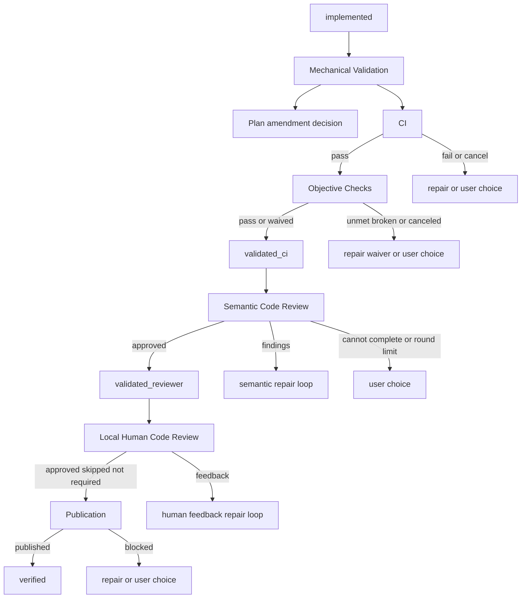

# Deepen Golden TUI Workflow Validation Coverage

## Context

The Golden terminal user interface (TUI) portfolio proves selected journeys, but it does not prove the complete Workflow
Validation tree. Existing scenarios cover a normal Planned Change, one semantic repair, selected continuous integration
(CI) repair and exhaustion paths, a dirty-checkout publication pause, non-Git delivery, and repaired-merge restart. Many
decisions remain covered only by direct workflow tests. Those tests cannot prove that the user sees the stop reason,
that the real TUI interaction resumes the correct phase, or that the canonical Plan and worktree records match the
transcript.

The reported regression shows the gap. Mechanical Validation displayed:

```text
Build, tests, and Objective-Failing Checks passed.
```

Workflow Validation then rejected a Plan-only diff during Semantic Code Review and stored the failure reason, but the
TUI did not make the failure clear. The current uncommitted work adds one regression scenario for a loaded `implemented`
Plan whose Objective-Failing Checks are all waived. That scenario is one required leaf, not the requested coverage
boundary.

The intended invariant for every Golden validation branch is:

```text
visible transcript and interaction
            |
            v
actual next phase or Agent turn
            |
            v
canonical Plan + worktree state
```

A scenario does not prove a branch unless it checks all three layers that apply. A final status alone is insufficient. A
rendered phrase alone is insufficient.

## Objective

Make the Golden TUI portfolio branch-complete for the current user-visible Workflow Validation tree. Exercise Mechanical
Validation, Semantic Code Review, Local Human Code Review, and publication through the composed TUI and production
runtime. Cover automatic loops, round limits, user choices, cancellation, repair completion gates, loaded-Plan
continuation, process restart where state must survive, and distinct recoverable or terminal errors.

Each scenario must prove:

1. the exact progress, failure reason, and choices shown to the user;
2. the next phase or Agent turn that did or did not run;
3. the canonical Plan status and relevant failure, counter, waiver, review, delivery, and worktree fields; and
4. for a successful path, that publication contains the implementation and repairs that passed validation.

## Approach

Add a dedicated validation-tree Golden suite instead of continuing to enlarge the general Planned Change file. Keep the
existing full Plan Review-to-delivery scenario as the top-level anchor. Most branch scenarios will enter through the
real `/load-plan` flow with a real seeded worktree and canonical Plan status. This is a supported product entry point
and keeps the suite practical while still traversing the TUI, Session Runtime, validation engine, Plan Lifecycle, Git,
worktree registry, Agent turns, and interactions.

Do not inject RunWield-owned validation or lifecycle behavior. Produce CI and Objective Check outcomes with real
commands and files in the isolated project/worktree. Script only genuine external boundaries: Agent model turns, user
selections, Local Human Code Review responses, and user cancellation through the virtual terminal.

Organize coverage by stable branch IDs in `validation-workflow-coverage.ts`. Each ID records its entry status, expected
phase, trigger, user-visible result, durable result, and owning Golden scenario. A meta-test will enforce:

- every declared validation branch has exactly one primary Golden owner;
- every owner has an assertion tagged with that branch ID;
- every user-choice value found in the validation interaction option lists is represented in the branch inventory;
- the required branch IDs are fixed in the meta-test, not inferred only from the scenarios under test; and
- each branch assertion is mutation-checked: removing transcript text, routing/turn evidence, or canonical project state
  from a real scenario result must make the corresponding evidence check fail. Scenario metadata and no-op tests cannot
  claim coverage.

The suite will cover this tree:



Group scenarios by phase, but keep distinct scenarios for branches with different messages, choices, lifecycle events,
or resume behavior. Low-level failures that converge on the same user-visible recovery contract can use one real
representative failure per boundary class. This avoids one scenario per possible operating-system error while still
covering every product branch.

Retain the narrow waived-check/Plan-only-diff regression already in progress. Strengthen it to prove the stored
`failureReason`, the `implemented` status after the `validated_ci -> validation_failed` transition, and the absence of a
Reviewer turn.

Set aside a unit-only expansion. It would be faster, but it cannot catch missing TUI output, incorrect Runtime handoff,
or a durable state that disagrees with what the user saw.

## Files to Modify

- `src/ui/tui/golden-scenarios/validation-workflow-tree.ts` — add phase-focused composed TUI scenarios, shared typed
  fixture builders, and three-layer assertions for the full validation tree.
- `src/ui/tui/golden-scenarios/validation-workflow-tree.test.ts` — run each validation-tree scenario in an isolated
  child process with scenario-owned timeouts and no ignored cases.
- `src/ui/tui/golden-scenarios/planned-change-workflow.js` — keep the full journey and existing publication anchors;
  remove only validation cases moved verbatim into the dedicated suite and preserve their behavior assertions.
- `src/ui/tui/golden-scenarios/planned-change-workflow.test.js` — keep export registration aligned if scenarios move.
- `src/ui/tui/golden-scenarios/load-plan-workflow.ts` — retain and strengthen the in-progress loaded implemented Plan,
  all-waivers, Plan-only-diff regression scenario.
- `src/ui/tui/golden-scenarios/load-plan-workflow.test.ts` — retain registration for the loaded-Plan regression.
- `src/ui/tui/golden-scenarios/catalog.js` — register all validation-tree scenarios in the portfolio and extensive
  suite.
- `src/ui/tui/testing/validation-workflow-coverage.ts` — define the typed branch inventory and validation-specific
  ownership/assertion checks.
- `src/ui/tui/testing/validation-workflow-coverage.test.ts` — prove the inventory matches scenario ownership and all
  current validation interaction choices.
- `src/ui/tui/testing/scenario-runner.js` — add only environment-level actions and observations needed to create real
  validation states, cancel active CI/Objective Check processes, inspect intermediate lifecycle states, alter files at a
  user pause, and capture Agent/phase routing without mutating lifecycle truth directly.
- `src/ui/tui/testing/scripted-review-surface.js` — add a distinct scripted Local Human Code Review response queue with
  approval, feedback, annotations, images, cancellation, and no-answer outcomes; do not conflate it with Plan Review.
- `src/ui/tui/testing/coverage-matrix.js` — replace broad validation claims with phase and recovery capabilities backed
  by the new branch inventory.
- `src/shared/workflow/validation-semantic.ts` — preserve the in-progress correction that emits the Plan-only/empty-diff
  Semantic Code Review failure before recording the lifecycle failure.
- `src/shared/workflow/validation-loop-core.test.js` — preserve the focused direct regression that checks the emitted
  semantic failure reason and the waived-check transition into review.

## Reuse Opportunities

- `src/ui/tui/testing/scenario-runner.js` — reuse composed TUI isolation, real Git fixtures, `seedActiveWorktree`,
  `captureProjectState`, lifecycle waits, restart support, and durability checks.
- `src/ui/tui/testing/scenario-actor.js` — reuse protocol-checked Agent, phase, Plan, ordinal, and required-tool
  matching to prove the correct Agent actually receives each repair or review turn.
- `src/ui/tui/testing/portfolio-assertions.js` — reuse capability-tagged assertions, but add validation-specific checks
  where a broad screen assertion cannot prove routing and durable state.
- `src/ui/tui/golden-scenarios/planned-change-workflow.js` — reuse its real Plan Review, implementation, semantic
  repair, CI repair, publication, and durability fixtures.
- `src/ui/tui/golden-scenarios/repaired-merge-interruption.ts` and
  `src/ui/tui/golden-scenarios/repaired-merge-publication.ts` — reuse the two-process durable merge-repair pattern.
- `src/shared/worktree-test-helpers.js` — create real registered Git worktrees. Do not add an injection seam for Plan,
  lifecycle, registry, or validation behavior.
- `src/shared/workflow/validation-*.test.*` — use the existing direct tests as the branch-discovery inventory. Golden
  tests complement these tests; they do not replace detailed algorithm tests.

## Implementation Steps

- [ ] `validation-workflow-coverage.ts` contains one stable branch entry for every current user-visible validation
      decision and stop outcome. The inventory covers phase entry/resume, Plan amendment, CI, Objective Checks, Semantic
      Code Review, Local Human Code Review, and publication. Its meta-test contains the independently expected branch-ID
      set and fails for an omitted or invented branch, unowned branch, duplicate primary owner, missing tagged
      assertion, or validation interaction option absent from the inventory.

- [ ] Validation evidence checks reject counterfeit coverage. For each completed scenario result, the test reruns its
      branch evidence checks against three altered copies: one without transcript/screen text, one without runtime
      events and Agent/phase turn sequence, and one without captured Plan/registry/Git state. Each altered copy must
      fail the applicable evidence check while the untouched real composed-TUI result passes. A scenario with no real
      actions or only metadata assertions cannot satisfy the inventory.

- [x] The Golden harness can script Plan Review and Local Human Code Review independently. Human review fixtures support
      approval; feedback with annotations/images; canceled review; and an ended review with no decision. Captured state
      records the actual request and response so assertions can prove the browser review occurred at the correct phase.

- [x] Harness extensions create failures through the environment, not through product-owned seams. A scenario can run a
      blocking real CI or Objective Check command and cancel it with Escape, modify a real worktree file before
      answering Retry, stage a real Plan amendment in the execution worktree, and capture intermediate and final
      Plan/registry/Git state. No action writes a lifecycle status or pretends a validation event occurred.

- [x] Mechanical Validation Golden scenarios prove all current Plan Amendment outcomes: a valid amendment is shown,
      approved, synchronized to both Plan copies, and restarts from `implemented`; Engineer follow-up parks awaiting
      Task Completion; Stop preserves the pending decision; and a changed Objective Check that is not red at the
      recorded baseline cannot be approved and offers only follow-up or Stop.

- [x] CI Golden scenarios prove pass; failure followed by completed repair and CI re-entry; repair without
      `task_completed`; cancellation followed separately by Retry, Engineer follow-up, and Stop; and automatic-round
      exhaustion followed separately by Retry, Engineer follow-up, and Stop. Assertions count real CI attempts, prove
      Semantic Code Review cannot start before a passing attempt, and check `status`, `failureReason`,
      `validationCiAttempts`, active owner, and worktree recovery state.

- [ ] Objective Check Golden scenarios prove no checks; all pass; a mix of active and already-waived checks; unmet
      checks repaired to pass; repair without `task_completed`; cancellation with Retry/follow-up/Stop; and exhausted
      automatic rounds with Retry/follow-up/Stop. Every command runs in the real execution worktree, and successful
      delivery includes the repair that made the check green.

- [x] Broken Objective Check scenarios prove both mechanical detection and an Engineer-reported defective check. Each
      reaches the real user judgement and covers waiver with an optional note, rejection with feedback and repair,
      Engineer follow-up, and Stop. Assertions verify exact command-matched durable waivers, stale report rejection,
      failure reason, subsequent skipped waiver behavior, and whether validation advances to `validated_ci`.

- [x] Semantic Code Review scenarios prove first-round approval; findings followed by completed repair, CI re-entry, and
      approval; repair without Task Completion; missing `review_complete` nudges; verdict without diff inspection
      nudges; an omitted prior finding prevents approval; Reviewer execution/incompletion pauses visibly with the ledger
      retained; discovery rounds become focused verification rounds; and automatic-round exhaustion offers Continue,
      Local Human Code Review, and Stop. Continue re-enters the focused reviewer, human review advances to
      `validated_reviewer`, and Stop preserves passing tests and open findings.

- [x] Semantic entry/resume scenarios prove an already-`validated_ci` loaded Plan starts Semantic Code Review without
      rerunning CI; a non-Git execution skips semantic review as specified; an empty diff uses the applicable skip path;
      and a Planned Change with no implementation diff fails visibly. The existing all-waivers scenario proves waived
      Objective Checks still reach the semantic phase and records the exact Plan-only-diff reason instead of appearing
      to stop after CI.

- [ ] Local Human Code Review scenarios prove mode `none`; mode `ask` with Skip; mode `ask` with Open and approval; mode
      `always` approval; review closure/no answer with Retry and Stop; and feedback followed by Engineer repair,
      Mechanical Validation, direct return to the same human reviewer, and approval. The feedback scenario proves the
      Semantic Reviewer does not run again, annotations are not duplicated, review metadata is durable, and publication
      cannot start before a final human decision.

- [x] Publication scenarios preserve normal Direct Delivery and non-Git success, dirty primary checkout Retry, and
      repaired merge restart. Added branches prove dirty checkout Stop and later `/load-plan` resume; merge conflict
      with completed Agent repair; merge repair without Task Completion followed by user Retry/Stop; missing target
      branch metadata; a stale stored repair-worktree path; and a representative generic Git publication failure. Paused
      publication remains `validated_reviewer`; successful retry does not rerun CI or either review and records exact
      Delivery Evidence before worktree cleanup.

- [x] Lifecycle-resume scenarios begin from each valid validation status (`implemented`, `validated_ci`, and
      `validated_reviewer`) and prove only the required remaining phases run. A remembered earlier phase with a Plan
      status that moved ahead heals to `implemented`, explains why, and reruns CI. Missing Plan, unsupported status,
      malformed Front Matter, missing execution context, and mismatched worktree/Plan identity fail closed with a
      visible reason and no false verified state.

- [ ] All validation-tree scenarios assert their actor queue is empty, leave no unexpected live worktree registry entry,
      and have no ignored tests. Expected pauses explicitly assert the preserved recovery entry. Expected verification
      asserts the published implementation, terminal Plan/Work Record result, Delivery Evidence, and registry cleanup.

- [x] Existing direct validation tests remain in place for detailed algorithms. Tests that overlap moved Golden
      scenarios are not deleted unless they only duplicated Golden portfolio registration. Behavior that remains
      protected includes lifecycle guards, review ledger identity, retry counters, waiver command matching, publication
      transaction proof, and repair completion gating. No current validation behavior is expected to stop existing; only
      silent or ambiguous failure output is replaced by an explicit reason.

## Approval Confirmation

This Plan does not supersede a Work Record. The prior Golden TUI expansion remains valid history; this change deepens
its validation coverage rather than materially replacing its result.

## Verification Plan

- Automated branch inventory: `deno run -A scripts/run-tests.js src/ui/tui/testing/validation-workflow-coverage.test.ts`
- Automated validation Golden suite:
  `deno run -A scripts/run-tests.js -A --no-check src/ui/tui/golden-scenarios/validation-workflow-tree.test.ts src/ui/tui/golden-scenarios/load-plan-workflow.test.ts src/ui/tui/golden-scenarios/planned-change-workflow.test.js src/ui/tui/golden-scenarios/repaired-merge-publication.test.ts`
- Automated complete Golden portfolio: `deno task test:golden-tui`
- Automated direct validation regressions:
  `deno run -A scripts/run-tests.js src/shared/workflow/validation-loop-core.test.js src/shared/workflow/validation-loop-repair.test.js src/shared/workflow/validation-loop-review.test.js src/shared/workflow/validation-loop-human-review.test.js src/shared/workflow/validation-publication-pause.test.js`
- Architecture guard: `deno task seams:check` remains at zero injection seams.
- Full repository verification: `deno task ci`.
- Review diagnostics from failed child processes and confirm each failure names its branch ID, last visible transcript,
  consumed interactions, actual Agent/phase turn sequence, Plan Front Matter, registry state, and artifact directory.
- Manually inspect representative snapshots for CI failure, Objective Check waiver judgement, semantic round-limit
  choice, human feedback repair, and publication pause. The transcript must state what happened and what the user can do
  without requiring internal lifecycle terms.

Expected key results:

- Mechanical pass is followed by visible Semantic Code Review progress or a visible semantic stop reason.
- Every Retry reruns only the phase that still lacks proof; it does not skip ahead or restart completed phases.
- Every Engineer follow-up or incomplete repair remains parked until `task_completed`.
- Every Stop leaves a durable state that `/load-plan` can resume.
- Human feedback returns to tests and then the same human review without an extra Semantic Reviewer sweep.
- Publication pauses preserve `validated_reviewer`; publication success produces `verified` Delivery Evidence and cleans
  the active worktree entry.

## Edge Cases & Considerations

- **Runtime cost:** Branch completeness adds many real child-process scenarios. Use loaded `implemented` or later-status
  Plans for phase-focused cases, reuse committed fixture factories, and keep one full Plan Review-to-delivery anchor. Do
  not move required branches out of normal CI merely to reduce duration.
- **False end-to-end tests:** Directly writing Plan statuses, lifecycle events, registry outcomes, or validation results
  would make scenarios shallow. Fixture setup may seed a supported starting status through existing test helpers, but
  all transitions under test must come from production Workflow Validation. The independent branch set and
  evidence-removal checks specifically prevent a short invented inventory plus no-op tests from satisfying the Plan.
- **Combinatorial growth:** Test every distinct product branch, not every permutation. CI cancellation with Retry and
  Objective Check cancellation with Retry are distinct because they control different processes and messages. Two
  operating-system errors that produce the same publication pause contract can share one representative case.
- **Flakiness:** Wait on runtime events, Plan revisions/statuses, and process cancellation instead of fixed sleeps. Keep
  scenario-owned timeouts sized for the repository test runner's parallel load. A timeout is a failure with retained
  diagnostics, never an ignored test.
- **Current dirty work:** Preserve the existing narrow semantic visibility fix and waived-check scenario. Integrate them
  into the branch inventory rather than replacing them or treating them as complete coverage.
- **Concurrent validation refactors:** The approved implementation for broader self-healing validation may change entry
  ownership and recovery state. Build the inventory from the production tree present at execution time and update branch
  expectations to the implemented behavior; do not preserve stale internal structure when the user-visible contract is
  unchanged.
