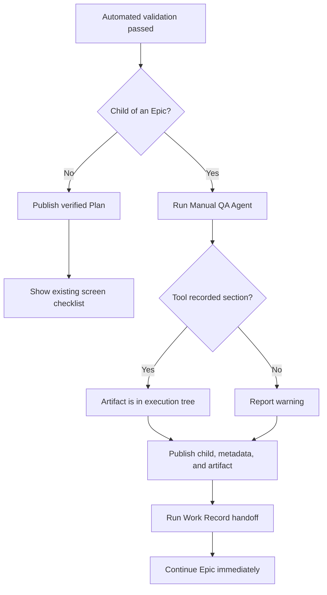

# Durable Epic Manual QA Artifact

## Context

A verified Child Planned Change currently starts a Manual QA Agent after delivery. The Agent prints a checklist into the
old Session Transcript. RunWield waits for that handoff before it starts the next Epic child.

```text
current child completion
  Workflow Validation passes
  publish verified child
  Manual QA Agent prints checklist to old Session
  Work Record handoff finishes
  resolve Epic continuation
  start next child
```

This creates two product problems:

1. A checklist that cannot affect verification delays automatic Epic continuation.
2. Each checklist stays in a separate Session Transcript, so the Epic has no complete checklist.

The required result is one ordinary Markdown file stored with the Epic:

```text
docs/plans/payments-redesign.md

docs/plans/payments-redesign/
├── 01-store-payment-method.md       # Child Planned Change
├── 02-use-payment-method.md         # Child Planned Change
└── manual-qa.md                     # Epic Artifact, not a Plan
```

Each verified child adds one section. A user can check items after an intermediate delivery or wait until the Epic ends.
RunWield does not track those checks. Checklist content, checkbox state, absence, and generation failure never change
Workflow Validation, Verified status, dependencies, delivery truth, Epic completion, or continuation.

## Objective

Make `docs/plans/<epic>/manual-qa.md` the first **Epic Artifact**: a recognized non-Plan file stored beside an Epic's
Child Planned Changes.

After automated validation passes for an Epic child, the existing Manual QA guidance runs before publication. The
isolated Manual QA Agent submits its Markdown through `qa_checklist_generated`. The tool adds one child section in the
execution tree. Publication then delivers implementation code, verified Plan metadata, and the updated artifact
together.

Generation is best effort. Agent failure, invalid content, a missing tool call, or a write failure produces a warning
but does not block delivery or Epic continuation.

## Approach

### Recognize one Epic Artifact without building an artifact platform

Add `src/shared/epic-artifacts.ts` as the single owner of V1 artifact names and paths:

```text
EPIC_ARTIFACT_FILE_NAMES = { "manual-qa.md" }
isEpicArtifactPlanName("epic/manual-qa") -> true
getEpicArtifactPath(root, "epic", "manual-qa.md") -> absolute path
appendEpicManualQaSection(...) -> created | already_present
moveEpicArtifacts(...) -> moved paths
```

Recognition is exact:

```text
if path is docs/plans/<one-top-level-epic>/manual-qa.md
  treat it as a recognized Epic Artifact
  never parse or list it as a Plan
else
  keep current Plan discovery behavior
```

Unknown Markdown keeps its current behavior. V1 does not add a registry, plugin system, QA database, artifact status, or
artifact user interface.

The Plan store rejects Plan writes to the reserved path. `plan_written` checks early and returns a useful repair result:

```text
epic/manual-qa is reserved for an Epic Artifact.
Choose a different child Plan name and call plan_written again.
```

Slicer receives the same central error if a future child-naming path reaches the reserved name. Do not add naming policy
to Planner or Slicer system prompts.

### Submit the checklist through one narrow workflow tool

Keep `src/agent-definitions/subagent-definitions/manual-qa-prompt.md` unchanged. Change only the dynamic request and the
Manual QA Agent's tool ceiling:

```text
Manual QA isolated session
  bundled checklist guidance                       # unchanged
  request: prepare this child checklist and submit it with the tool
  tool: qa_checklist_generated(checklistMarkdown)
```

The tool is available only to the isolated Manual QA Agent. It is not a top-level Agent tool.

```text
on qa_checklist_generated(checklistMarkdown)
  load the named child Plan from the execution tree
  require parentPlan to resolve to a PROJECT Epic
  validate the existing heading and 1..6 unchecked items
  locate docs/plans/<parent>/manual-qa.md

  if a stable section marker already names this child
    return already_present                         # change no existing byte

  if the file is absent
    create its title and advisory note

  append one marked child section
  write atomically
  return recorded and the relative path
```

Target file shape:

```markdown
# Manual QA for payments-redesign

This checklist is advisory. It does not change RunWield verification status.

<!-- runwield:manual-qa:start child="payments-redesign/01-store-payment-method" -->

## 01 — Store payment method

Manual verification steps for payments-redesign/01-store-payment-method

- [ ] Save a valid payment method and confirm it appears once.
- [ ] Reload the page and confirm the saved method remains available.

<!-- runwield:manual-qa:end child="payments-redesign/01-store-payment-method" -->
```

Stable child markers make retries safe. Existing sections are never regenerated, reordered, or rewritten. User edits and
checked boxes remain ordinary user-owned Markdown.

### Generate before publication and continue without a child screen checklist

Move generation only for Epic children. QUICK_FIX and standalone Planned Changes keep their current screen checklist.



The publication call stack changes as follows:

```diff
 runPublicationPhase
+  prepareEpicChildManualQaArtifact                # best effort
   publishOnce
     checkpointExecutionWorktree                   # includes artifact when written
     stageValidationPassedInExecutionWorktree
     runDirectDeliveryPublicationTransition
       mergeExecutionWorktree
       confirmPublishedPlanVerified
-    runPostVerificationHandoffs                    # child screen QA + Work Record
+    runPostVerificationHandoffs                    # child Work Record only
   return verified result
 SessionRuntime
   resolveEpicContinuation
   start next child
```

For Git delivery, write in `context.executionCwd` before `checkpointExecutionWorktree`. The sealed child commit then
contains the artifact. Do not add the artifact to `allowedDirtyPaths`: uncommitted user edits in the primary checkout
remain protected by the existing publication pause. Committed user edits use normal Git merge behavior.

For non-Git in-place execution, write in the project root before `validation_passed`. The same best-effort rule applies.

A publication retry checks the child marker first. It does not call the model again if the section exists. If generation
failed and the marker is absent, a later publication retry can try again.

Work Record generation stays after delivery. Epic children skip only the transient screen checklist in the
post-verification handoff. Final-child Epic Work Record behavior remains unchanged.

### Keep the artifact with its Epic during archive and restore

Plan discovery ignores the artifact, but central archive and restore logic moves it deliberately:

```text
active                                      archived

docs/plans/epic/manual-qa.md       <->      docs/plans/archived/epic/manual-qa.md
```

Use the central Plan-store archive and restore path so the terminal user interface Epic action, archive command, and
restore command share one rule. Never overwrite an existing destination. Roll back an already-moved artifact if the
related operation fails. Keep the existing child-first Plan archive order. Child counts include Plans only; success
output also names moved artifacts.

## Files to Modify

- `src/shared/epic-artifacts.ts` — own recognized names, safe paths, checklist validation, section markers, atomic
  append, and archive/restore helpers.
- `src/shared/epic-artifacts.test.ts` — cover recognition, exact file shape, idempotence, user-edit preservation, safe
  paths, and move collision/rollback behavior.
- `src/plan-store.js` — exclude recognized Epic Artifacts from Plan collection and direct Plan access; reject reserved
  Plan writes; move artifacts with Epic archive and restore.
- `src/plan-store.test.js` — prove the artifact is not a Plan or parse issue, unknown Markdown behavior is unchanged,
  reserved writes fail, and real archive/restore preserves bytes.
- `src/tools/qa-checklist-generated.ts` — define the typed isolated completion tool, child/Epic checks, and idempotent
  artifact write result.
- `src/tools/qa-checklist-generated.test.ts` — cover accepted, invalid, duplicate, missing-child, non-child, and
  missing-parent cases against real Plan files.
- `src/tools/plan-written.ts` — reject the reserved path before review with repair guidance.
- `src/tools/plan-written.test.ts` — prove review does not open for the reserved name.
- `src/shared/session/subagent-definitions.ts` — replace Manual QA's tool-free declaration with its one-tool ceiling.
- `src/shared/workflow/validation-ports.ts` — type the Manual QA isolated request/outcome and split pre-delivery QA from
  post-delivery Work Record handoffs without leaking session types into the validation engine.
- `src/shared/workflow/validation-session-adapter.ts` — compose the real tool into the isolated Manual QA session and
  return whether the tool recorded a section.
- `src/shared/workflow/validation-helpers.ts` — keep bundled guidance, add the dynamic tool request, split Epic Artifact
  generation from screen presentation, and make every generation error non-blocking.
- `src/shared/workflow/validation-publication.ts` — run Epic child generation before the publication checkpoint and keep
  post-delivery Work Record behavior.
- `src/shared/workflow/validation-prompts.test.js` — expect the Manual QA one-tool ceiling while proving bundled
  checklist guidance stays unchanged.
- `src/shared/workflow/validation-manual-qa.test.ts` — exercise the real tool call, artifact write, duplicate call,
  warning path, and standalone screen behavior.
- `src/shared/workflow/validation-loop-delivery.test.js` — prove real worktree publication puts the section and verified
  metadata on the target branch and remains Verified after QA generation failure.
- `src/shared/workflow/validation-work-record-handoff.test.ts` — prove Epic-child post-delivery handling has no Session
  checklist and preserves Work Record results.
- `src/ui/tui/golden-scenarios/project-workflow.js` — make each Manual QA Agent call the artifact tool in the real
  two-child Epic scenario.
- `src/ui/tui/golden-scenarios/project-workflow.test.js` — prove both sections are delivered, excluded from Plan lists,
  and terminal Epic evidence still completes.
- `src/cmd/load-plan/plan-epic-archive.ts` — report moved artifacts and keep child counts Plan-only.
- `src/cmd/load-plan/index.integration.test.ts` — cover terminal user interface archive with the artifact present.
- `src/cmd/plans/archive.test.ts` — cover direct archive and restore with the artifact.
- `docs/domain-language.md` — define Epic Artifact and state that it has no Plan Lifecycle or verification authority.
- `docs/workflows.md` — document pre-delivery child artifact generation and immediate continuation.
- `docs/usage.md` — show the layout, best-effort behavior, reserved name, user ownership, and archive location.
- `docs/user-facing-features.md` — describe durable Epic checklists.

`src/agent-definitions/subagent-definitions/manual-qa-prompt.md` is intentionally unchanged.

## Reuse Opportunities

- `src/shared/workflow/validation-helpers.ts:runManualQaChecklistPrompt` — retain source-context construction and the
  isolated launch; change the tool/result boundary.
- `src/shared/session/session.js:runIsolatedAgentSession` — use existing custom-tool composition.
- `src/tools/task-completed.ts:createTaskCompletedTool` — follow its typed workflow-tool result style without making QA
  lifecycle-owning or terminal.
- `src/shared/workflow/plan-lifecycle.js:stageValidationPassedInExecutionWorktree` — keep verified Plan and parent
  metadata staging authoritative; the artifact is normal execution-tree content.
- `src/shared/workflow/validation-publication.ts:checkpointExecutionWorktree` and
  `runDirectDeliveryPublicationTransition` — use the existing sealed commit and publication transaction.
- `src/plan-store.js:collectPlans` — add one central artifact exclusion instead of list-specific filters.
- `src/plan-store.js:archivePlan` and `restoreArchivedPlan` — make artifact movement common to terminal user interface
  and command paths.

## Implementation Steps

- [ ] `src/shared/epic-artifacts.ts` is the single owner of V1 Epic Artifact names and safe paths. It recognizes only
      the exact nested `manual-qa.md` location and exports
      `appendEpicManualQaSection({ projectRoot, epicPlanName,
      childPlanName, childHeading, checklistMarkdown })`
      plus the archive/restore operations used by Plan storage.
- [ ] Plan discovery and direct Plan access never return `docs/plans/<epic>/manual-qa.md` as a Plan or parse error.
      Unknown Markdown retains current behavior, and Plan-writing authorities reject the reserved name with rename
      guidance.
- [ ] `qa_checklist_generated` accepts only the existing Manual QA shape, resolves real child and parent Epic Plans, and
      atomically records one stable-marked section. A repeated call returns `already_present` without changing any byte.
- [ ] Checked boxes and prose in earlier sections survive later writes byte-for-byte. Workflow code never reads checkbox
      state as validation, continuation, dependency, or Epic completion input.
- [ ] Epic-child Manual QA runs after automated validation and before the publication checkpoint. A successful tool call
      is included in sealed child delivery; no child checklist is left only in the old Session Transcript.
- [ ] Missing calls, invalid content, Agent failures, and write failures emit warnings but still permit
      `validation_passed`, publication, a Verified result, Work Records, and Epic continuation. Retry occurs only when
      the child marker is absent.
- [ ] Standalone Planned Changes and QUICK_FIX preserve their screen checklist. Final-child Epic Work Record behavior is
      unchanged.
- [ ] Direct Delivery does not treat `manual-qa.md` as an allowed dirty workflow path in the primary checkout.
      Uncommitted user edits retain current publication protection.
- [ ] Epic archive and restore move recognized artifacts without overwrite, roll back partial artifact moves on failure,
      keep child counts accurate, and leave no active artifact after successful archive.
- [ ] `docs/domain-language.md`, workflow docs, usage docs, and feature docs define **Epic Artifact** narrowly and state
      that Manual QA is advisory. The bundled Manual QA prompt remains unchanged.

## Approval Confirmation

No Work Record supersession is proposed. Prior Manual QA and Epic continuation Work Records remain correct historical
records; this Plan adds a new durable behavior.

## Verification Plan

Run the focused suite:

```sh
deno run -A scripts/run-tests.js \
  src/shared/epic-artifacts.test.ts \
  src/plan-store.test.js \
  src/tools/qa-checklist-generated.test.ts \
  src/tools/plan-written.test.ts \
  src/shared/workflow/validation-prompts.test.js \
  src/shared/workflow/validation-manual-qa.test.ts \
  src/shared/workflow/validation-loop-delivery.test.js \
  src/shared/workflow/validation-work-record-handoff.test.ts \
  src/ui/tui/golden-scenarios/project-workflow.test.js \
  src/cmd/load-plan/index.integration.test.ts \
  src/cmd/plans/archive.test.ts
```

Then run:

```sh
deno task check
deno task seams:check
deno task ci
```

Use mutation proof to show that tests use production behavior:

- Remove the pre-publication QA call from `runPublicationPhase`; delivery and Golden Epic tests must fail.
- Make QA generation failure escape through publication; the best-effort test must fail unless the Plan remains Verified
  and a warning is emitted.
- Remove artifact exclusion from `collectPlans`; Plan-store and Golden tests must fail.
- Make a duplicate tool call overwrite its section; the idempotence test must fail after checking a box between calls.

Behavior that must remain protected:

- QUICK_FIX and standalone Planned Change checklist display.
- Best-effort QA failure does not reverse automated validation.
- Work Record generation, final-child parent advancement, and Epic continuation.
- Sealed publication, Delivery Evidence, retry, and dirty-checkout protection.
- Nested child Plan loading, Slicer writing, archive, and restore.

Behavior expected to stop:

- Epic-child Manual QA exists only in the old Session.
- Epic continuation waits for child screen presentation.
- Plan discovery parses the reserved artifact as a Plan.

Manual flows:

1. Complete child one of a two-child Epic. Confirm the target branch contains one artifact section in the delivered
   child history and child two starts without an old-Session checklist.
2. Check one box and commit the Markdown edit. Complete child two. Confirm the new section appears and the checked box
   remains checked.
3. Make the Manual QA Agent omit the tool call. Confirm a warning, Verified delivery, and continued Epic execution.
4. List and load Plans. Confirm `manual-qa` is absent. Submit `<epic>/manual-qa` to `plan_written`; confirm rename
   guidance and no review.
5. Archive and restore the Epic. Confirm the artifact moves to and from `docs/plans/archived/<epic>/manual-qa.md`
   without content changes.

| Scenario                      | Artifact                   | Plan                       | Continuation          |
| ----------------------------- | -------------------------- | -------------------------- | --------------------- |
| Valid call                    | Delivered child section    | Verified                   | Continues             |
| Duplicate call                | Existing bytes unchanged   | Verified                   | Continues             |
| Agent, tool, or write failure | Warning; section absent    | Verified                   | Continues             |
| Standalone Plan               | Screen checklist only      | Verified                   | Not applicable        |
| Uncommitted user edit         | Existing publication pause | At publication boundary    | Does not consume edit |
| Committed user edit           | Normal Git merge           | Verified after publication | Continues             |

Confirm the glossary does not imply an artifact lifecycle, QA tracking, or verification authority.

## Edge Cases & Considerations

- **Final child:** Its section, verified child metadata, and terminal parent metadata can land in one publication. Work
  Record generation then sees canonical terminal state.
- **User Verified or Closed Without Verification child:** These did not pass automated validation, so this hook creates
  no section.
- **Model emits text without the tool:** Warn and continue. Do not parse free text as an authoritative tool result.
- **Malformed existing artifact:** Never overwrite it. Warn and continue so the user can repair ordinary Markdown.
- **Existing marker:** Treat it as idempotence even if the user changed all checklist text.
- **Concurrent edits:** Merge committed changes normally. Protect uncommitted primary-checkout changes as today.
- **Name collision:** Reject only exact nested `manual-qa`; `01-manual-qa-support.md` remains a valid child Plan.
- **Future artifacts:** Add recognized names and dedicated writers to the shared module. V1 adds no generic user
  interface or tracker.
- **Failure meaning:** Generation is not a validation phase and adds no Plan Status.
