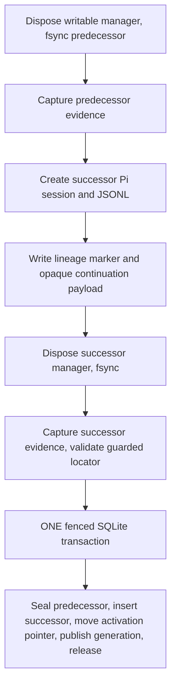

# Transactional Segment Rollover Primitives

## Context

Slices 8 and 9 built more of this slice's stated surface than the original draft assumed. All of the following already
exists and passes tests:

- `appendSessionTranscriptSegment` (`sessions.js:658`) inserts a successor row, and refuses while a current segment is
  still unsealed. Seal-before-append is therefore already enforced.
- `sealSessionTranscriptSegment` (`sessions.js:722`) seals only the current segment and only against evidence that
  matches the file on disk.
- SQLite triggers maintain `session_transcript_segment_state.current_segment_id` on insert and seal
  (`schema.js:418-446`), and reject any update or delete of a sealed segment (`schema.js:385-397`).
- `session_activation_state` carries `current_segment_id` and `expected_current_segment_id`; `acquireSessionActivation`
  binds the expectation into the proof and `publishGenerationAndRelease` rejects a mismatched one.
- `projectAggregateTranscript` renders sealed segments plus the current committed prefix as one timeline.
- `recordSegmentLineageEvidence` and `readSegmentLineageEvidenceFromTranscript` persist and recover lineage through the
  transcript itself.

What does not exist is **composition**. Nothing calls these together, and the three ways they fail to compose are the
real work of this slice.

**1. Inserting a successor row makes every surface fail closed.** `requireOrderedManifest`
(`session-transcript-manifest.ts:98`) throws `Committed generation references an ambiguous segment lineage` for any
segment whose ordinal exceeds the segment named by the latest committed generation. The successor row exists the moment
it is inserted; the generation naming it is published later, in a separate transaction. Between those two points the
terminal UI, Workspace, and ACP all go degraded, and a crash in that window leaves the Session degraded permanently with
no recovery path. Slice 8's tests never caught this because they exercise the storage layer with no generation
publication at all, and slice 9's manifest test hand-constructs a generation that already names the second segment.

**2. The activation segment pointer does not move while an operation is active.** Both triggers that maintain
`session_activation_state.current_segment_id` are guarded `WHEN state <> 'active'` (`schema.js:429,445`), and a rollover
runs only while active. So after seal and append the activation row still names the predecessor,
`proof.expectedCurrentSegmentId` still names the predecessor, and `publishGenerationAndRelease` rejects evidence naming
the successor with `Current segment proof was rejected`. Rollover must move that pointer itself, under fence.

**3. Managed Session metadata has no segment identity.** `ManagedSessionMetadata` carries `transcriptPath` and
`piSessionId` but no segment ID, and the pre-flight check in `#runManagedOperation` (`session-runtime.js:2702-2724`)
verifies the committed generation's evidence against `managed.transcriptPath` unconditionally. After a rollover the
generation describes the successor while `transcriptPath` may still name the predecessor, so the next operation reports
`reconcile_required` on a perfectly healthy Session.

Two mechanical constraints shape the implementation. `appendSessionTranscriptSegment` is async because
`validateGuardedLocator` reads the successor's JSONL header, and `OwnerCoordinationDatabase.transaction` issues
`BEGIN IMMEDIATE` with no nesting (`database.js:53-63`). An atomic rollover therefore cannot call the existing exports;
it needs header validation hoisted ahead of the transaction and the transactional bodies extracted as sync internals.

## Objective

Implement Session Transcript Segment Rollover so that:

- one call seals the predecessor segment, creates and registers the successor segment, moves the activation segment
  pointer, and publishes the next committed generation naming the successor, with every database effect in a single
  fenced transaction;
- no observer ever sees a committed state in which a successor segment row exists without a committed generation naming
  it, so `projectAggregateTranscript` never degrades because of a rollover;
- managed Session metadata rolls `piSessionId`, `transcriptPath`, and segment identity together, so the operation after
  a rollover verifies the right file and does not report `reconcile_required`;
- the only durable anomaly a crash can produce is an orphan successor JSONL with no database row, which is invisible to
  readers, identifiable through its lineage marker, and safely discardable;
- rollover carries an opaque continuation payload it never interprets, so slice 13 can define execution handoff and
  slice 14 can reuse the identical primitive for semantic repair;
- rollover requires the current activation capability and proof of the expected current segment; it introduces no
  segment-level lock and leaves Session Activation as the sole mutation authority.

## Approach

**Rollover is its own complete fenced operation.** It acquires activation, does its work, publishes generation N+1
naming the successor, and releases. Approve & Run (slice 13) becomes two operations: a rollover, then a normal managed
operation for the Engineer's first turn.

This is what closes defect 1 rather than papering over it, and it is the owner's explicit decision. The alternative —
running rollover inside an ongoing operation and letting the generation publish at that operation's checkpoint — keeps
Approve & Run to one operation but holds the degraded window open for the entire Engineer turn, and forces slice 9's
fail-closed manifest reader to be relaxed to tolerate an unpublished successor. That was rejected: the switch must
commit as one transaction so no surface can ever show a blank or degraded Session, and the second locked operation is an
accepted cost. The gap it opens between the two operations is ordinary concurrency that the activation fence already
handles.

Put the orchestration in a new module, `src/shared/session/segment-rollover.ts`. `session-runtime.js` is already 3561
lines; it gets a thin delegating method, not the sequence. This follows the same split slice 9 used when it extracted
`session-transcript-manifest.ts` rather than growing `session-transcript-projection.js`, and puts new production source
in TypeScript as the language ratchet requires.

The ordering is transcript-first, database-second, and the database step is indivisible:

Every crash before step G leaves the predecessor current, writable, and unchanged, plus at most an orphan JSONL. Step G
is atomic by SQLite. After step G the rollover is complete. There is no partial state to reconcile, which is why this
slice needs orphan identification rather than a general two-store reconciliation engine.

Deliberate deviation from the original draft: the draft placed neutral rollover result and recovery types under
`src/shared/workflow/`. That inverts the dependency — the session layer would import workflow types for its own return
shape. The types live with the primitive in `segment-rollover.ts`, and slices 13 and 14 import them from there.

## Files to Modify

- `src/shared/owner-coordination/sessions.js` — split `appendSessionTranscriptSegment` into an async
  `validateSuccessorSegmentLocator` and a sync `insertSessionTranscriptSegmentRow` that takes an already-open
  transaction; split `sealSessionTranscriptSegment` the same way into a sync `sealSessionTranscriptSegmentRow`. Both
  public functions keep their current signatures and behavior by composing the new internals. Add
  `findOrphanRolloverCandidates` and `discardOrphanRolloverCandidate`.
- `src/shared/owner-coordination/session-activations.js` — add `commitSegmentRolloverAndPublish`, the single fenced
  transaction. Extract the generation-insert and activation-release SQL out of `publishGenerationAndRelease` into sync
  internals both paths share, rather than duplicating the statements.
- `src/shared/owner-coordination/index.js` — expose the new store functions on `openOwnerCoordinationStore`, which is
  what `session-runtime.js` and the Workspace server actually call. Slice 9's context notes that slice 8 shipped
  functions that were never added here; do not repeat that.
- `src/shared/session/segment-rollover.ts` — new module owning the rollover sequence, its result type, and its recovery
  evidence type.
- `src/shared/session/root-session.js` — promote `#resolveCreatedSessionPath` (`session-runtime.js:2325`) to an exported
  `resolveCreatedRootSessionPath(cwd, sessionManager)` so the rollover module reuses it instead of duplicating it;
  `session-runtime.js` calls the exported form.
- `src/shared/session/hosted-session.js` — `ManagedSessionMetadata` gains `currentSegmentId`; add the single accessor
  that replaces `piSessionId`, `transcriptPath`, and `currentSegmentId` together so they cannot drift apart.
- `src/shared/session/session-runtime.js` — expose `rollManagedSessionSegment` delegating to the rollover module; fix
  the pre-flight check to verify the generation's evidence against the transcript of the segment the generation names;
  pass `expectedCurrentSegmentId` when acquiring activation and map its rejection to `refresh_required`.
- `src/shared/session/workflow-context-session.js` — add the pending-continuation custom entry type alongside
  `SEGMENT_LINEAGE_CUSTOM_TYPE`, storing and reading an opaque payload without interpreting it.
- `src/shared/types.js` — extend the segment and generation types where the new fields surface.
- `src/shared/session/session-transcript-manifest.test.js` — add the missing regression test for the `ordinal > current`
  guard. The module itself is not modified; only its coverage is. See the standalone step below for why this file is a
  required deliverable and not optional hardening.
- `docs/domain-language.md` — define the terms this slice makes true.

## Reuse Opportunities

Existing functions, modules, or patterns to reuse:

- `src/shared/owner-coordination/session-activations.js` — reuse `assertActiveProofFresh`, `requireProof`, and the fence
  predicate shape from `publishGenerationAndRelease`; extract shared internals rather than copying the SQL.
- `src/shared/owner-coordination/sessions.js` — reuse `validateGuardedLocator`, `captureTranscriptEvidenceSync`,
  `readSegmentLineageEvidenceFromTranscript`, and `segmentFromRow`.
- `src/shared/session/session-transcript-projection.js` — reuse `captureTranscriptEvidence` and
  `syncTranscriptFileAndParent` for both predecessor and successor evidence.
- `src/shared/session/root-session.js` — reuse `createRootSessionManager("new", cwd)`, `listPersistedRootSessions`, and
  `isPathInside`.
- `src/shared/session/workflow-context-session.js` — reuse the persisted custom-entry convention already established by
  `recordSegmentLineageEvidence` and `normalizeSegmentLineageEvidence`.
- `src/shared/owner-coordination/session-segments.test.js` — reuse its real-migration fixture pattern; build rollover
  tests on a real migrated database, not hand-built rows.
- `src/shared/session/session-transcript-manifest.ts` — reuse `projectAggregateTranscript` unchanged as the reader-side
  assertion in tests. This slice must not modify the module. Its test file does change: it gains the `ordinal > current`
  guard test. Adding coverage is allowed; weakening the guard to make a rollover test pass is not.

## Implementation Steps

- [ ] `src/shared/owner-coordination/sessions.js` exports `validateSuccessorSegmentLocator` (async) and
      `insertSessionTranscriptSegmentRow` (sync, operates inside a caller-owned transaction), and
      `appendSessionTranscriptSegment` is implemented by composing them; `session-segments.test.js` passes unchanged.
- [ ] `sealSessionTranscriptSegment` is implemented by composing a sync `sealSessionTranscriptSegmentRow` that operates
      inside a caller-owned transaction, and still rejects a seal whose evidence is absent or does not match disk.
- [ ] `session-activations.js` exports `commitSegmentRolloverAndPublish`, which in one `ownerDb.transaction` asserts the
      proof is fresh and in `checkpointing` phase, requires `proof.expectedCurrentSegmentId` to equal both the stored
      `current_segment_id` and the caller's predecessor ID, seals the predecessor, inserts the successor, sets
      `session_activation_state.current_segment_id` and `expected_current_segment_id` to the successor, inserts the
      `session_committed_generations` row naming the successor, and releases the activation to idle.
- [ ] `publishGenerationAndRelease` and `commitSegmentRolloverAndPublish` share the same extracted generation-insert and
      activation-release internals; the generation SQL text appears once in the module.
- [ ] A `commitSegmentRolloverAndPublish` call that fails at any point leaves zero new rows in
      `session_transcript_segments`, leaves the predecessor's `sealed_at` NULL, leaves
      `session_transcript_segment_state.current_segment_id` at the predecessor, and adds no generation row. Proven by
      forcing the generation clause to fail with a non-advancing generation number and asserting all four.
- [ ] `src/shared/session/segment-rollover.ts` exports `rollSessionTranscriptSegment` and the `SegmentRolloverResult`
      and `OrphanRolloverCandidate` types; the module performs predecessor fsync and evidence capture, successor session
      creation, lineage and continuation marker writes, successor fsync and evidence capture, guarded locator
      validation, and exactly one call to `commitSegmentRolloverAndPublish`.
- [ ] `rollSessionTranscriptSegment` accepts the continuation payload as an opaque value, persists it into the successor
      transcript, returns it in the result, and contains no branch on its contents; the same call shape produces an
      `execution` successor and a `semantic_repair` successor with no workflow-specific code path.
- [ ] `projectAggregateTranscript` returns `ok: true` when read immediately before and immediately after a completed
      rollover, and the post-rollover projection contains every event from the sealed predecessor followed by the
      successor's events under one RunWield Session identity.
- [ ] Against a real migrated database, a successor row present in `session_transcript_segments` that no committed
      generation names — the state that can exist only if the rollover is not atomic — makes
      `projectAggregateTranscript` return `ok: false` with zero events. This proves the degraded window is real and that
      atomic publication is what closes it, rather than assuming either.
- [ ] `session-transcript-manifest.test.js` contains a test that pins the `ordinal > current` guard
      (`session-transcript-manifest.ts:98`) directly, independent of any rollover code. Given a manifest whose segments
      are all internally valid — same `runwieldSessionId`, contiguous ordinals from 0, every predecessor sealed — but
      whose highest-ordinal segment is not the one named by `generation.currentSegmentId`, `projectAggregateTranscript`
      resolves to `ok: false`, `state: "degraded"`, `code: "projection_failed"`, `message` exactly
      `Committed generation references an ambiguous segment lineage`, and `events` empty. The test must fail if the
      `ordinal > current` clause is deleted, so it cannot be satisfied by a manifest that some earlier guard in
      `requireOrderedManifest` would already reject.

      This guard has no test at all today, which makes deleting it the cheapest way to make the two reader steps above
      pass while the real objective is absent. Rollover must earn its never-degraded property by publishing the
      successor row and its committed generation in one transaction, not by relaxing the reader. This step and the two
      above are what tell those apart, and OC3 pins the message text so the guard cannot be quietly softened.
- [ ] `ManagedSessionMetadata` includes `currentSegmentId`, and `session-runtime.js` replaces `piSessionId`,
      `transcriptPath`, and `currentSegmentId` in one call after a rollover so no intermediate metadata state pairs a
      predecessor path with a successor segment ID.
- [ ] `#runManagedOperation`'s pre-flight check resolves the transcript path of the segment named by
      `state.generation.currentSegmentId` from the manifest and verifies the generation evidence against that path; a
      managed operation started immediately after a rollover reaches `turning` rather than returning
      `reconcile_required`.
- [ ] `#runManagedOperation` passes `expectedCurrentSegmentId` from managed metadata to `acquireSessionActivation`, and
      a surface holding a stale segment ID receives `refresh_required` rather than a thrown error.
- [ ] `findOrphanRolloverCandidates` returns successor JSONLs inside the Session directory that carry a lineage marker
      naming a segment of the given Session but have no `session_transcript_segments` row;
      `discardOrphanRolloverCandidate` removes such a file only when it is inside the Session directory, has no row, and
      contains no entries beyond its header, lineage marker, and continuation marker, and throws otherwise.
- [ ] Four rollovers in one stable Session produce ordinals 0 through 3 with exactly one unsealed current segment, four
      committed generations each naming its own segment, and one continuous aggregate projection with no duplicate
      events.
- [ ] `docs/domain-language.md` defines **Session Transcript Segment Rollover** and **Orphan Rollover Candidate** with
      _Avoid_ aliases, and states the relationship that a Session Transcript Segment Rollover publishes the successor
      segment and its committed generation indivisibly, so no Aggregate Transcript Projection observes a successor
      segment that no committed generation names.

## Verification Plan

- Automated: `deno task ci`.
- Automated:
  `deno run -A scripts/run-tests.js -A --no-check src/shared/owner-coordination/segment-rollover-commit.test.js` covers
  the fenced transaction against a real migrated database: successful rollover, the four-part rollback assertion above,
  a stale fence, a wrong predecessor proof, a non-advancing generation, and a second surface attempting to mutate the
  Session while the rollover activation is held.
- Automated: `deno run -A scripts/run-tests.js -A --no-check src/shared/session/segment-rollover.test.js` covers the
  full sequence over a real session directory: reader-ok before and after, continuous projection across the boundary,
  metadata rolled atomically, a managed operation succeeding immediately after a rollover, four consecutive rollovers,
  and orphan identification and discard.
- Automated: `deno run -A scripts/run-tests.js -A --no-check src/shared/owner-coordination/session-segments.test.js` and
  `src/shared/session/session-transcript-manifest.test.js` — both pass today and must still pass, proving the storage
  split and the rollover did not weaken slice 8 or slice 9. `session-transcript-manifest.test.js` additionally gains the
  new `ordinal > current` guard test; it is the one file in this list whose contents grow, and its new test must fail
  against a build with that guard clause removed.
- Manual: create a managed Session in the TUI, run a turn, invoke a rollover through a fixture command, and confirm the
  scrollback stays continuous under one Session identity with no `session_replaced`, the predecessor file is sealed and
  no longer written to, and the next turn writes to the successor file.
- Manual: kill the process between successor file creation and the transaction, then reopen the Session. Confirm the
  Session opens normally on the predecessor, the surface is not degraded, and `findOrphanRolloverCandidates` reports the
  stray file.

### Behavior that must still be protected

`session-segments.test.js`, `session-activations.test.js`, `session-segment-evidence.test.js`,
`session-transcript-manifest.test.js`, `session-transcript-projection.test.js`, and `session-runtime.test.js` all pass
today and must still pass. Specifically:

- `appendSessionTranscriptSegment` and `sealSessionTranscriptSegment` keep their current public signatures and rejection
  behavior; splitting out sync internals is a refactor, not a contract change;
- `publishGenerationAndRelease` keeps its current behavior for non-rollover operations, including its current segment
  proof rejection;
- slice 9's fail-closed manifest reader is unchanged — a missing, truncated, extended, or byte-modified sealed segment
  still yields a typed failure and zero events, and a segment beyond the committed frontier still fails closed. That
  last guard is currently untested, which makes it the cheapest thing to delete; the new test above is what protects it;
- single-segment Sessions, which is every Session that exists today, behave exactly as they do now;
- read paths still never call `SessionManager.open()`.

### Behavior expected to stop existing

One case. `#runManagedOperation`'s pre-flight check currently verifies the committed generation's evidence against
`managed.transcriptPath` unconditionally. Any test asserting that specific coupling should be rewritten to assert
verification against the segment the generation names, not deleted — the `reconcile_required` outcome for a genuine
transcript-ahead mismatch stays and must still be asserted.

## Edge Cases & Considerations

- The activation-state triggers are inert during rollover because they are guarded `WHEN state <> 'active'`. The
  rollover transaction must set `current_segment_id` and `expected_current_segment_id` explicitly. If a future change
  removes that trigger guard, the explicit update becomes redundant but stays correct.
- `session_transcript_segment_state` triggers are **not** state-guarded and do fire during the rollover transaction.
  That is intended: they are the manifest pointer, and they move within the same transaction as everything else.
- Sealing the predecessor and inserting the successor in one transaction means the Session never persists a state with
  no current segment. That intermediate state is reachable only if the two are split, which this slice must not do.
- The successor's committed generation evidence describes a transcript holding only its header, lineage marker, and
  continuation marker. That is a valid committed prefix and `verifyCurrentSegment` handles it, but it means the first
  post-rollover projection adds no visible user-facing events. Surfaces must not treat an event-empty generation advance
  as a failure.
- An orphan successor JSONL can never contain agent output: with no row it was never current, so no writable manager was
  ever installed on it. The content check in `discardOrphanRolloverCandidate` is defence in depth, not a live case.
- The writable manager for the predecessor must be disposed before its evidence is captured, or the seal fails against
  disk. Rollover must assert the Session is dehydrated rather than relying on the caller.
- Rollover does not grant any surface permission to mutate a different segment. Segment identity is proof carried
  through the activation, not a capability.
- Deferred to slice 13: what a rollover means, who triggers it, and what the continuation payload contains. This slice
  must stay free of plan, workflow, and Engineer vocabulary.
- Decided by the owner: rollover is a standalone fenced operation, not nested inside an ongoing one. The whole switch
  commits as one transaction so no surface ever shows a blank or degraded Session, and the extra locked operation that
  Approve & Run pays for it is an accepted cost. Nesting was rejected explicitly.
- Open assumption, correctable: the continuation payload is opaque to this layer, which keeps the primitive reusable for
  slice 14's semantic repair without change.
