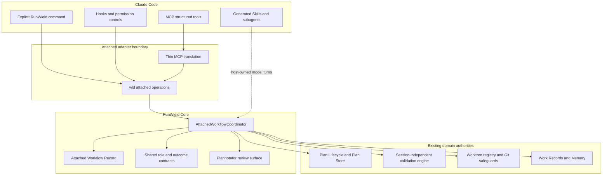
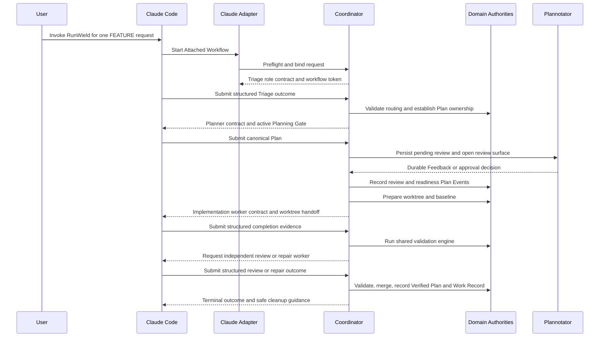

# RunWield Connect for Claude Code: FEATURE Preview

## Context

`docs/prd/attached-mode-prd.md` defines RunWield Connect as the plugin ecosystem in which an External Agent Host owns
the conversation, model access, and every agent turn while RunWield owns durable workflow truth. **Attached mode**
remains the internal architecture and **Attached Workflow** the per-request domain term. This Epic covers only the first
release stage: the complete first-party RunWield Connect for Claude Code FEATURE Preview journey. Claude stable support
and later Codex, OpenCode, and Pi plugins will be planned as subsequent Epics using evidence from this vertical slice.

The Preview must prove that a user can install the Claude adapter, explicitly invoke RunWield for one FEATURE-sized User
Request in an otherwise uninitialized trusted Git repository, plan and review without implementation edits, execute in a
RunWield-owned worktree, pass the canonical Workflow Validation and merge safeguards, recover from supported process
loss, produce a Work Record and eligible memory outcome, then continue using Claude Code normally outside Attached
Workflows. Every model call in that journey remains Claude Code-owned. RunWield must not create a hidden Pi Agent
Session, require separate model credentials, or import the Claude conversation transcript.

A prerequisite refactor is required before this Epic can execute its validation journey. The current
`src/shared/workflow/validation.ts` is 2,454 lines and contains 86 direct references to Pi/session turn machinery; an
Attached-specific copy would be a second validation engine, not small adapter code. A separately triaged and approved
Plan or Epic must first extract the Workflow Validation sequencing, convergence policy, and gate predicates into a
session-independent engine consumed by the existing Pi path. This Epic is blocked until that prerequisite preserves the
current Core Session validation behavior under the shared engine.

ADR-014 records the accepted boundary: an `AttachedWorkflowCoordinator` is a sibling runtime to `SessionRuntime`.
Short-lived `wld attached ...` commands are the canonical Core boundary, and Model Context Protocol (MCP) is a thin
model-facing adapter over those same operations. The existing TUI, Agent Client Protocol (ACP), and SessionRuntime paths
remain RunWield-executed Session surfaces and do not become Attached Mode dependencies.

This control direction is the defining Connect boundary. If RunWield owns the Session and invokes Claude through
`claude -p`, Claude is a Core Execution Backend alongside Pi; that capability is not Connect and has no separate product
mode name.

## Objective

Deliver a capability-disclosed RunWield Connect for Claude Code FEATURE Preview that completes the PRD's full
planned-work journey without weakening existing Plan Lifecycle or verification semantics.

### Target architecture

The dependency direction protects the product promise: Claude Code can ask Core to advance work, but only RunWield's
domain authorities can decide whether a Plan is approved, ready, implemented, validated, merged, or Verified.
`SessionRuntime` is deliberately absent from the Attached path.

### Ownership and persistence

- **Attached Workflow Record** — owns the binding between one explicit host request and one Attached Workflow, the
  adapter/Core versions and capability snapshot, the current pending external action, operation idempotency keys, and
  recovery checkpoints. It references the active Plan and worktree records but never copies their status or evidence. It
  is durable project-local RunWield state so a new Core process can resume safely.
- **Plan Lifecycle and Plan Store** — remain the only authorities for canonical Plan content, Plan Events, Plan Status,
  approval, readiness, and verification. Attached operations must call the same transition services as Core Session
  workflows.
- **Plan Workflow Lease** — must be generalized to recognize an Attached Workflow as a consequential-work owner without
  weakening its single-owner guarantee. Host session identifiers are audit and binding evidence, not an independent
  lifecycle authority. The glossary relationship currently limiting a lease to one Session must be updated in the same
  implementation change that makes this true.
- **Worktree Registry and Git** — retain ownership of worktree identity, path, baseline, registry status, physical Git
  state, merge-back, and cleanup. Claude workers operate in a handed-off RunWield worktree and never create a competing
  worktree lifecycle.
- **Session-independent validation engine** — owns the shared Mechanical Validation, local continuous integration (CI),
  Semantic Code Review convergence, repair, optional human review, and publication sequencing. The coordinator supplies
  or requests host turns through its external-action protocol; it does not reimplement validation policy.
- **Compatibility Matrix** — owns tested capability claims for supported Claude Code and adapter/Core version ranges.
  Preview preflight uses this versioned data and fails before relying on an unsupported hook, worker, permission, or
  worktree capability.
- **Generated Claude assets** — are projections of canonical layered RunWield agent definitions and Skills. They carry a
  version stamp and may be regenerated or removed; they never become the source of role policy.

### Coordination contract

Every canonical CLI operation accepts a typed envelope containing the Attached Workflow identity, canonical Project root
evidence, host and adapter version evidence, an operation id for safe retries, the expected workflow checkpoint
revision, and one structured payload. Mutating operations use an expected-revision check (compare-and-swap, or CAS) so
two host turns cannot silently overwrite each other. Responses return the committed revision, durable state summary,
next required action, applicable role-contract reference, pending interaction or review information, and explicit
recovery actions when an outcome is uncertain.

The operation families cover activation and capability preflight, Triage submission, Plan submission and review,
readiness and execution preparation, implementation completion, validation/review/repair outcomes, status and recovery,
cancellation/closure, and optional project initialization. Exact command spelling is adapter-facing, not a second user
lifecycle command suite; the primary user action remains the host-native equivalent of `/runwield <request>`.

MCP tools expose the same typed operations to Claude's model. They may validate protocol framing and translate errors,
but they call the coordinator surface and contain no Plan, worktree, validation, or recovery decisions. Deterministic
hooks invoke the CLI directly because Planning Gate enforcement and host lifecycle callbacks must not depend on the
model choosing to call a tool.

### Critical control flow

The host-visible conversation coordinates progress, but Core validates every outcome against artifacts and current
state. A model claim such as "implementation complete" cannot advance a Plan without the expected worktree, diff,
baseline, lifecycle position, and completion contract.

### Claude-specific adapter behavior

- Installation presents the integration as **RunWield Connect for Claude Code**, uses Claude Code's first-party plugin
  mechanism, and obtains or verifies a compatible local RunWield Core without asking for model credentials or a RunWield
  account.
- Activation is per request. Hooks, role context, and mutation restrictions are inert unless their host session is bound
  to a live Attached Workflow.
- The Planning Gate uses Claude's deterministic pre-tool permission/hook controls to deny edits and mutating command
  paths during planning, with baseline/working-tree inspection as defense in depth. The capability matrix discloses any
  path the tested host version cannot observe; the adapter may not describe prompt instructions as a hard gate.
- Canonical role prompts and Skills are materialized from the local Core's layered agent assets at install/update time.
  Preflight rejects stale materializations rather than running an older copied prompt against a newer contract.
- Fresh Claude-hosted subagents provide implementation, independent Semantic Code Review, repair, re-verification, and
  bounded recording contexts where independence affects trust. The invoking conversation remains the user-facing
  coordinator; no RunWield process invokes `claude -p` or another model process for Attached work.
- Plan and human code review reuse Plannotator. Because Core is process-per-call, review decisions and waiting reasons
  must be durable and pollable rather than existing only in an in-process `waitForDecision()` promise.
- Disabling or uninstalling the adapter leaves Plans, Work Records, worktree recovery evidence, and Attached Workflow
  checkpoints intact. It removes generated host assets and restores ordinary Claude behavior; recovery remains available
  after reinstalling a compatible adapter.

## Vertical Slice Findings

- `src/shared/workflow/plan-lifecycle.js` and `state-transition.ts` already centralize Plan Events and guarded Plan
  Status transitions. This is the authority the coordinator must call rather than a Claude-specific lifecycle.
- `src/plan-store.js`, `src/shared/worktree.js`, `worktree-registry.js`, objective checks, review-ledger logic, merge
  verification, and Work Record generation are largely session-independent and reusable.
- `src/shared/workflow/orchestrator.ts`, `workflow.js`, `engineer-runner.ts`, and `planning-agent.ts` drive
  Pi/HostedSession turns directly and interpret protected tool results as orchestration signals. Retrofitting Attached
  state into these modules would create fake Hosted Sessions or contaminate SessionRuntime with a conversation it does
  not own.
- `src/shared/workflow/validation.ts` is the major blocking coupling. Its 2,454 lines interleave shared gate policy with
  86 references to Pi/session turn machinery. The agreed architecture therefore requires a separate validation-engine
  refactor before this Epic rather than writing a Claude validation loop that will later be discarded.
- `src/shared/session/agent-assets.js` already exposes bundled role assets without requiring a Session. It is the
  correct source for generated Claude Skills and subagents and prevents role-policy copies from drifting.
- `src/ui/review/review-launcher.js` is already an adapter seam for Plannotator, but its current in-process decision
  wait must gain a durable review mode suitable for short-lived coordination calls.
- ADR-010 makes TUI and ACP sibling adapters over SessionRuntime. Attached is not another such adapter because the
  External Agent Host executes the model turns. ADR-014 preserves ADR-010's dependency direction by introducing a
  sibling runtime over shared domain authorities instead.
- `plans/claude-cli-execution-backend.md` concerns RunWield Core invoking Claude CLI as an Execution Backend alongside
  Pi. Connect reverses that control direction: Claude Code is the External Agent Host. Protocol utilities may converge
  later, but the projects must not share workflow ownership or make either one a prerequisite for the other.

## Files to Modify

- `src/cmd/attached/` — add the thin CLI composition layer for canonical Attached operations, structured JSON results,
  exit semantics, and user-facing diagnostics; command handlers delegate immediately to shared coordination services.
- `src/shared/attached/` — own the host-neutral coordinator, Attached Workflow Record/store, typed operation and outcome
  contracts, expected-revision/idempotency policy, capability matrix, next-action decisions, recovery classification,
  and architectural boundary tests.
- `src/shared/workflow/` — consume the separately delivered session-independent validation engine; centralize any
  Triage, completion, review, and repair schemas currently implicit in Pi tool results so both carriers use one semantic
  contract. This Epic must not recreate validation sequencing here or in the adapter.
- `src/tools/` — make existing Core Session protected tools consume the same structured outcome contracts where needed
  to prevent semantic drift; tools remain Session carriers, not sources of workflow policy.
- `src/shared/session/agent-assets.js` and related asset-resolution modules — expose the canonical layered role/Skill
  inputs and version evidence needed for host-native materialization without creating an Attached dependency on
  SessionRuntime.
- `src/shared/workflow/plan-lifecycle.js` and Plan ownership/transition support — recognize an Attached Workflow lease
  holder while preserving single-owner transitions and the existing lifecycle event authority.
- `src/shared/worktree.js`, `src/shared/worktree-registry.js`, and execution-context services — support a host worker
  handoff and recovery packet without transferring worktree lifecycle ownership to Claude.
- `src/ui/review/review-launcher.js` and `src/ui/workspace/` review endpoints — persist pending plan/code review
  decisions, waiting reasons, and resumable review identifiers for process-per-call coordination while preserving the
  existing Plannotator experience.
- `src/attached/claude/` — package the RunWield Connect for Claude Code plugin manifest, command/Skill/subagent
  templates, hooks, MCP transport adapter, asset materializer, install/update/disable/uninstall integration, and
  black-box host fixtures. Domain decisions are forbidden from this adapter area.
- `README.md`, `docs/`, and `docs/prd/attached-mode-prd.md` — document Preview installation, explicit activation,
  capability limits, permissions, privacy, review, recovery, update/disable/uninstall, and the Connect/Core/Workspace
  product family without implying untested host parity.
- `docs/domain-language.md` — in the implementation change that makes the relationships true, update Plan Workflow Lease
  language to include Attached Workflow ownership and add agreed coordinator/record terms without treating generated
  assets or compatibility projections as authorities.

## Reuse Opportunities

- `src/shared/workflow/plan-lifecycle.js` and `src/shared/workflow/state-transition.ts` — reuse canonical Plan Event
  guards, atomic transition behavior, locks, recovery actions, and Verified semantics.
- `src/plan-store.js` — reuse canonical Plan parsing, atomic writes, front-matter normalization, and project-root
  resolution.
- `src/shared/git-port.ts`, `src/shared/worktree.js`, and `src/shared/worktree-registry.js` — reuse real Git operations,
  baseline evidence, execution isolation, merge safeguards, and recovery records.
- The prerequisite session-independent validation engine plus `validation-local-ci.ts`, `objective-checks.ts`,
  `review-ledger.ts`, delivery hierarchy, and merge-verification modules — reuse one validation policy and evidence
  model across runtimes.
- `src/shared/session/agent-assets.js` and layered resource resolution — reuse canonical project/home/bundled precedence
  when materializing Claude-native assets.
- `src/ui/review/review-launcher.js` and Workspace review endpoints — reuse Plannotator instead of building a
  Claude-only approval or code-review product.
- `src/shared/work-records/` and existing memory candidate flows — synthesize durable knowledge from canonical evidence
  without transcript ingestion.
- `src/shared/runtime-preflight.js`, process-liveness helpers, and existing structured CLI conventions — reuse local
  dependency diagnostics and safe process-loss reporting where their contracts fit.

## Verification Plan

- Automated: every prerequisite and Attached child Plan runs targeted tests through
  `deno run -A scripts/run-tests.js <test paths>`; the integrated Epic gate is `deno task ci`. Never run `deno test`
  directly.
- Automated: black-box Claude adapter coverage runs against each declared Preview-compatible Claude Code version and
  records the tested capability matrix. Test fixtures must verify hook inactivity outside Attached Workflows, Planning
  Gate denial, structured MCP/CLI parity, subagent role isolation, worktree handoff, cancellation, stale-version
  preflight, and disable/uninstall behavior.
- Automated: interruption suites terminate the Core process after durable planning/review checkpoints and after
  execution/validation side effects, then resume from a fresh process. Tests distinguish safely retryable operations
  from uncertain effects requiring user confirmation.
- Automated: architecture tests enforce that Attached coordination modules do not import Pi AgentSession,
  SessionRuntime, TUI, ACP, or Claude adapter modules; MCP and Claude packaging modules cannot import Plan Lifecycle,
  worktree, or validation internals except through the coordinator operation surface.
- Manual: on a supported Claude Code version, install from the documented flow in an uninitialized trusted Git
  repository and complete the PRD's full 16-step FEATURE Preview journey, including Plannotator Feedback/resubmission,
  independent review/repair, optional human review when configured, merge-back, Work Record creation, and two
  process-loss recoveries.
- Manual: verify host-visible installation, update, compatibility, disable, and uninstall surfaces consistently use
  **RunWield Connect for Claude Code**, while logs and developer diagnostics may use the internal attached-mode terms.
- Manual: issue ordinary Claude Code prompts before activation, during a different host conversation, and after terminal
  closure/disablement; verify no RunWield role prompt, restriction, inspection, or state change applies.
- Expected: no Core process contacts a model provider or invokes a Claude/Pi model process; only host-originated turns
  produce planning, implementation, review, repair, and recording outcomes.

### Outcome Evidence

- **The prerequisite prevents a second validation engine** — the separately approved refactor exposes Workflow
  Validation sequencing and convergence through a session-independent API consumed by the current Pi runtime; Attached
  code contains no copied review-round, repair-limit, human-review, or merge-gating policy and calls that same API.
- **Attached is a true sibling runtime** — `src/shared/attached/` has no imports from Pi AgentSession packages,
  `src/shared/session/session-runtime.js`, `src/acp/`, or `src/ui/tui/`; SessionRuntime and ACP have no imports from
  Attached modules.
- **The CLI is canonical and MCP is translation-only** — every MCP tool maps to a typed coordinator operation also
  reachable through `wld attached`; MCP/Claude adapter modules contain no direct Plan Status mutation, validation,
  worktree registry, merge, or Work Record logic.
- **Core never makes an Attached model call** — integration instrumentation observes no provider network call and no
  Claude/Pi model subprocess started by Core across planning, implementation, review, repair, and recording; each role
  result is traceable to the External Agent Host adapter.
- **Inactive installation is a no-op** — black-box tests show that a normal Claude request without an active workflow
  receives no RunWield context injection, tool denial, repository inspection, or Attached state mutation.
- **Role policy cannot silently drift** — installed Claude Skills/subagents are generated from the effective canonical
  RunWield assets, carry matching Core/contract versions, and preflight fails with an actionable update path after
  either side becomes stale.
- **Planning blocks implementation mutation** — supported-version black-box tests deny editing and mutating command
  paths while the Attached Workflow awaits approval/readiness, and post-turn Git inspection detects baseline changes;
  the Preview capability matrix names any path that cannot be proven observable.
- **One workflow has one consequential owner** — two Claude sessions racing the same workflow or Plan cannot both commit
  an operation; expected-revision and Plan Workflow Lease checks return a conflict with recovery guidance rather than
  overwriting state.
- **Structured host claims cannot skip guards** — fabricated completion, review-pass, repair, CI, or merge claims fail
  when the expected Plan Event position, worktree, diff, validation evidence, review ledger, or Git result is absent.
- **Verified has one meaning** — the Attached FEATURE journey reaches `verified` only after approval/readiness,
  RunWield-owned worktree execution, Mechanical Validation, configured CI, independent Semantic Code Review and bounded
  repairs, optional human review, and safeguarded merge-back have committed through the canonical Plan Lifecycle.
- **Recovery is durable and honest** — killing host or Core at one planning/review checkpoint and one
  execution/validation checkpoint lets a fresh process report the exact waiting reason and either continue idempotently
  or request confirmation for an uncertain side effect; no blind replay or silent lifecycle advancement occurs.
- **Review remains canonical** — Plan Feedback, approval, and human code-review decisions are persisted by the existing
  Plannotator/Workspace surface as structured outcomes and survive review-server or CLI-process loss.
- **Execution isolation remains RunWield-owned** — the implementation worker's path, baseline, registry identity, merge
  candidate, publication result, and cleanup decision all resolve through the existing worktree authorities; no
  Claude-created parallel registry or lifecycle exists.
- **No transcript is imported** — Attached persistent state, Plans, review evidence, Work Records, memory candidates,
  and telemetry contain only the explicit request and typed workflow evidence; black-box fixtures can include sentinel
  host conversation text that never appears in RunWield artifacts or indexes.
- **Lazy onboarding works** — the first FEATURE request succeeds in an uninitialized trusted Git repository while
  previewing material repository-local changes and creating only the state and canonical artifacts required by that
  workflow; richer `/runwield:init` behavior remains optional.
- **Disablement preserves recovery** — disabling or uninstalling generated Claude assets restores ordinary host behavior
  without deleting canonical Plans, Work Records, worktree registry entries, or Attached recovery checkpoints.
- **The full Preview promise is black-box proven** — one repeatable supported-version test covers installation through
  Verified Plan, Work Record/memory outcome, interruption recovery, and post-workflow ordinary Claude behavior; passing
  unit tests without this journey is insufficient release evidence.

Existing behavior that must remain protected after every child lands:

- Core TUI/Workspace Sessions continue to use SessionRuntime, existing transcript segmentation, interaction/event
  semantics, routing, planning, execution, validation, and recovery behavior.
- ACP remains a client of RunWield-executed Sessions and preserves ADR-010's dependency direction.
- Existing Plan statuses, Plan Events, readiness rules, validation convergence, worktree publication safeguards, and
  Work Record provenance retain their current meaning.
- Existing layered agent customization continues to resolve project-local, then home, then bundled assets.
- `deno task ci`, the seam ratchet, architecture boundaries, and sandboxed test rules remain green.

Behavior expected to stop existing:

- No existing Core Session, ACP, Plan Lifecycle, or validation behavior is intentionally removed by this Epic.
- Within the new Attached path, prompt-only planning enforcement, copied role prompts, host-prose lifecycle transitions,
  in-memory-only review waits, and adapter-owned Plan/worktree/validation state must never exist as accepted behavior.

## Execution Policy

- This PROJECT Epic is a non-executable container. It must not proceed to executable Attached children until the
  separately planned session-independent validation-engine prerequisite is approved, implemented, and mechanically and
  semantically verified.
- Later decomposition must preserve the module boundaries and observable outcomes above rather than organizing work only
  by files or Claude extension primitives.
- Claude plugin and review-surface children that alter browser-visible Plannotator/Workspace behavior require Frontend
  Engineer ownership where appropriate and headed browser verification against `docs/design-system.md` and the existing
  RunWield design-system implementation. Adapter packaging, Core coordination, lifecycle, and recovery work remain
  non-frontend concerns.
- Supported Claude Code versions and experimental capabilities must be frozen by a child Plan from black-box evidence;
  an API listed in documentation is not sufficient release proof.

## Edge Cases & Considerations

- **Prerequisite incompleteness** — if validation sequencing or convergence remains Pi-specific, stop and complete the
  prerequisite; do not add an Attached-only loop or temporary policy copy.
- **Host/Core/asset version skew** — preflight must fail before activation with exact update or regeneration guidance;
  it must not discover incompatibility after a Plan or worktree transition.
- **Two host conversations in one Project** — workflow tokens, host-session evidence, expected revisions, and the Plan
  Workflow Lease prevent split-brain while allowing unrelated ordinary Claude conversations to remain untouched.
- **Unstable host session identity** — treat host identifiers as evidence, not as durable truth by themselves. Recovery
  must rebind through Core-owned workflow identity and explicit user confirmation rather than matching transcript text.
- **Unobservable mutation paths** — capability preflight must disclose them and either use an existing explicit fallback
  or refuse the Preview journey. Post-turn inspection is defense in depth, not proof that a hard pre-tool gate existed.
- **Dirty or nonstandard repositories** — preserve the existing Git/non-Git consent and worktree safety semantics.
  RunWield Connect must not silently clean, stash, reset, or relocate host work.
- **Worktree handoff failure** — prefer a fresh Claude subagent started in the RunWield worktree. Use only an existing
  explicit in-place consent path when its reduced recovery assurance is disclosed and the Preview's declared capability
  allows it; do not let Claude create an independent worktree.
- **Process death around side effects** — operations that may have started a subprocess, changed files, opened review,
  created a worktree, or attempted merge publication must journal intent and evidence. Uncertain effects require
  inspection or user confirmation rather than automatic replay.
- **Review-server loss or port conflict** — durable review identity and decisions must permit restart on another local
  port without changing Plan authority or losing Feedback.
- **Host cancellation, quota exhaustion, or worker failure** — checkpoint the waiting reason and preserve recovery
  metadata. A stopped host turn is not completion and does not release consequential ownership silently.
- **Malicious or malformed structured outcomes** — validate schemas, canonicalize Project/worktree paths, bound payload
  size, reject transcript-shaped blobs, and never interpolate host text into shell commands.
- **Privacy-safe metrics** — capture operation outcomes, timing, capability fallbacks, recovery, and verification state;
  exclude prompts, transcripts, source content, secrets, and sensitive paths.
- **Update, disable, and uninstall during active work** — generated assets may be removed, but Core-owned workflow and
  worktree evidence remains. Reinstallation must either resume compatibly or explain why an older workflow requires a
  specific adapter/Core version.
- **Future host portability** — the coordinator contract remains host-neutral, but this Epic must not generalize Claude
  assumptions into false Codex/OpenCode/Pi claims. Later adapters begin with their own tested capability matrices and
  Preview Epics.
- **Proposed domain language** — `Attached Workflow Coordinator`, `Attached Workflow Record`, `Role Contract`, and
  `Compatibility Matrix` are target-state terms. The implementation change establishing each concept must update
  `docs/domain-language.md`; until then, the current glossary remains implemented truth.
