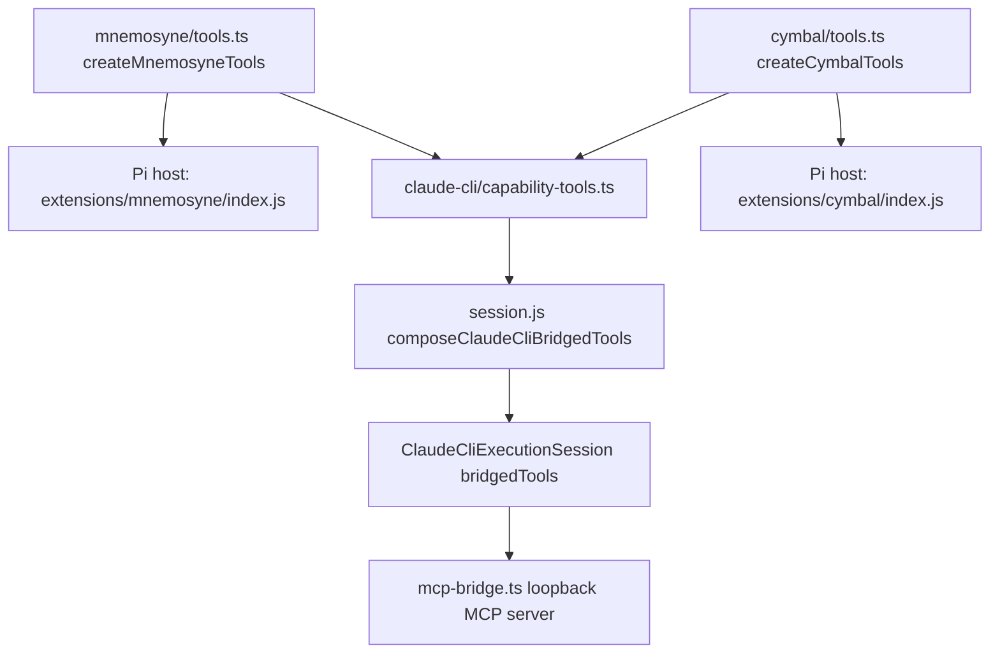

# Bridge RunWield Tools to Claude CLI Turns

## Context

RunWield Agents that run on the Claude CLI Execution Backend declare a full RunWield tool set in their Agent Definitions
(`src/agent-definitions/planner.md`, `engineer.md`, `guide.md`, `architect.md`, `recorder.md`, and others), and their
prompts instruct them to call those tools by name. The Claude CLI backend supplies only four of them.

Four facts make this a real defect, not only a missing feature:

1. `src/shared/session/backends/claude-cli/workflow-mcp-bridge.ts` rejects any tool that is not one of four lifecycle
   tools. `workflowMcpAliasFor` returns `undefined` for every other name, and `startWorkflowMcpBridge` throws.
2. `src/shared/session/session.js:2032` (`composeClaudeCliWorkflowTools`) only ever builds those four lifecycle tools.
3. `buildExecutionSession` ignores `opts.customTools` on the Claude CLI branch. Caller-supplied Tool Definitions are
   dropped, so a Reviewer running on Claude CLI silently loses `review_diff`.
4. `buildExecutionSession` calls `assembleFinalSystemPromptWithContextProjection(agentDef, [], [], ...)` for the Claude
   CLI path, so `{{AVAILABLE_TOOLS}}` renders empty. A Claude CLI Agent reads "## Available tools" with nothing under
   it, immediately followed by "The tools listed above are the tools available in this session."

A Claude CLI Agent is therefore told to call tools that do not exist, and is separately told its tool list is empty.
Memory is injected once as static `{{MEMORIES}}` text at turn start, so the Agent cannot search, store, or delete
memory, has no semantic code search, cannot read Work Records, cannot interview the user, and cannot hand the
conversation back to Router.

The missing tools fall into four groups by what they need from the host, and the groups need different work:

| Group                                                       | Needs                                 | Current obstacle                                       |
| ----------------------------------------------------------- | ------------------------------------- | ------------------------------------------------------ |
| 5 `memory_*`, 11 `code_*`                                   | a helper-binary subprocess            | working bodies exist only inside Pi extension closures |
| `work_record_search`, `work_record_read`, `multi_file_edit` | `cwd` only                            | nothing — already host-neutral `defineTool` factories  |
| `user_interview`, `return_to_router`                        | a `HostedSession`, and a long call    | not composed; bridge has no abort or long-call support |
| `review_diff`                                               | caller-supplied state (the diff text) | `opts.customTools` dropped on the Claude CLI branch    |

The blocker is not the bridge. `startWorkflowMcpBridge` already accepts any `ToolDefinition[]`, validates arguments,
executes, records canonical `toolCall`/`toolResult` Session Transcript messages, stamps provenance, and emits TUI tool
events. The blocker is that the working tool bodies do not exist outside a Pi host: the exported `*ToolDef` constants in
`src/extensions/mnemosyne/index.js` and `src/extensions/cymbal/index.js` are schema-only shells whose `execute()` throws
`"Not implemented"`, and the real bodies are registered inside the extension factory, closed over `pi.exec` and a
`projectCwd` captured on `session_start`. The Claude CLI path never builds a Pi host.

## Objective

Give a Claude CLI turn the full RunWield tool experience: every RunWield Tool an Agent declares, except the ones Claude
Code already covers natively, reaches the Agent — filtered per Agent by the same `tools:` front matter Pi uses, executed
by the same implementations Pi uses, recorded in the Session Transcript as native RunWield tool events, and named in the
system prompt so the Agent knows it has them.

**Bridged after this change (25 named tools, of which 21 are new):**

- Capability, advertised under their internal names: `memory_recall`, `memory_recall_global`, `memory_store`,
  `memory_store_global`, `memory_delete`, `code_search`, `code_structure`, `code_impls`, `code_importers`, `code_show`,
  `code_outline`, `code_batch`, `code_refs`, `code_impact`, `code_trace`, `code_investigate`, `work_record_search`,
  `work_record_read`, `multi_file_edit`, `user_interview`, plus any caller-supplied Tool Definition (today:
  `review_diff`).
- Lifecycle, terminal-gated: `plan_written`, `task_completed`, `review_complete`, `triage_report` keep their existing
  `runwield_`-prefixed aliases; `return_to_router` is newly bridged under its internal name.

Decisions taken with the user:

- **Both helper families, all sixteen tools.** Claude Code's native `Grep`/`Glob` fall short of Cymbal's AST-aware
  queries, and a partial bridge would leave `code_*` declared but dead.
- **Read and write parity with Pi Agents.** `memory_store`, `memory_store_global`, and `memory_delete` are bridged.
  Every Agent prompt ends by asking the Agent to store relevant memories; a read-only bridge makes that instruction
  silently fail. Pi Agents already hold `memory_delete`, so this adds no new risk class.
- **No `runwield_` prefix on newly bridged tools.** A newly bridged tool is advertised under its internal name so Agent
  prompts that name these tools stay literally true. The four original lifecycle tools keep their prefixed aliases;
  renaming them would churn working behavior for no gain.
- **`work_record_*`, `review_diff`, `multi_file_edit`, `return_to_router`, and `user_interview` are in scope.** Without
  `work_record_*`, Planner and Architect on Claude CLI are strictly weaker than on Pi. `review_diff` is required for
  Reviewer and for the semantic repair Engineer. `multi_file_edit` is a token saver. `return_to_router` is named in
  every Agent prompt, so a Claude CLI Agent currently cannot obey its own escalation instructions.
- **`delegate_agent` is deferred to its own Plan.** The user struck it at review. It is the one item here that nests a
  second Claude CLI subprocess and a second loopback MCP bridge inside an open MCP call on the first, which is a
  different and larger risk than everything else in this slice. Nothing else in this Plan depends on it, so removing it
  costs no rework: the abort threading and the long-call support this Plan already builds are exactly what a later
  `delegate_agent` Plan needs. Until then, a Claude CLI Agent has no RunWield subagents — Claude Code's native `Task`
  spawns Claude Code subagents, not RunWield Agents.

**Out of scope and why:**

- `delegate_agent` — deferred to its own Plan by user decision at review. See the reasoning above.
- `write_docs` and `edit_docs` — RunWield cannot restrict Claude Code's native `Write`/`Edit`, so a docs-scoped writer
  adds a rule the turn can bypass anyway. Deliberately not bridged.
- `see_image` — a vision fallback for text-only models. Claude Code reads images natively.
- `read`, `edit`, `write`, `grep`, `find`, `ls`, `bash` — covered by Claude Code's native tools.
- Cymbal's `grep`/`bash` nudge interceptor stays Pi-only, because RunWield does not ingest Claude Code's internal tool
  loop and therefore cannot observe those calls.

## Approach

Four independent pieces of work, in dependency order.

### 1. Make the helper tool bodies host-neutral

The `memory_*` and `code_*` bodies move out of the Pi extension closures into factories that both hosts call. Nothing is
duplicated and no fake Pi `ExtensionAPI` is constructed. The other three groups need no extraction — they are already
plain `defineTool` factories.

Each factory takes a host record `{ cwd, exec }`. `exec` is a named subprocess port, which `CLAUDE.md` lists as a
genuine boundary; it is a required field on the host record, not a `__deps`/`__testDeps` bag, so
`scripts/check-injection-seams.js` does not see a new seam and the zero-seam baseline is unchanged. The Pi host passes
`pi.exec`, keeping Pi's abort and timeout handling; the Claude CLI host passes a `Deno.Command` implementation.

Resolving the Mnemosyne project collection name becomes lazy and memoized inside the factory instead of running on
`session_start`. This is required — the Claude CLI host has no `session_start` event — and it also removes an ordering
dependency that exists today in the Pi host, where a tool call before `session_start` would use the wrong collection.

### 2. Move eligibility from the bridge to the composer

Today the bridge decides eligibility from a hard-coded name map, which cannot express a caller-supplied tool such as
`review_diff`. Eligibility moves to `composeClaudeCliBridgedTools`, which is the only producer of the tool list;
`mcpAliasFor` becomes a naming rule, not an allowlist:

- the four original lifecycle names map to their existing `runwield_`-prefixed aliases;
- every other name maps to itself.

The bridge then validates only that the list is non-empty and that alias names are unique and non-empty. This is a
deliberate reduction of a redundant guard: the composer already filters by `agentDef.tools`, and a tool that is not in
the list is not reachable over the bridge no matter what the alias function says.

`composeClaudeCliBridgedTools` mirrors the Pi auto-wiring block at `session.js:1739-1861`, reusing the same factories
with the same arguments, and appends `opts.customTools` unchanged so `review_diff` reaches Reviewer turns. Tools that
need a `HostedSession` — `user_interview`, `return_to_router`, and the lifecycle four — are omitted when there is none,
exactly as the Pi path omits them.

`return_to_router` needs one wrapper: the bridge's `ExtensionContext` carries no `hostedSession`, so the raw
`returnToRouterTool` would report "requires an active hosted session". Wrap it in a closure over the target
`HostedSession`, the same way `session.js:1744-1752` does for Pi. No runtime change is needed downstream:
`readLatestReturnToRouterOutcome` matches `toolResult` messages by **internal** tool name, the bridge already records
under the internal name with `details` intact, and `onMessage` already pushes bridge messages into
`ClaudeCliExecutionSession.messages` — the array `agent-handler.ts:212` scans.

### 3. Support long-running and cancellable calls

Two gaps block `user_interview`:

- **The bridge discards the abort signal.** `workflow-mcp-bridge.ts:359` passes `undefined` as `execute`'s third
  argument. Harmless while every bridged tool is instant; with an interview in flight, aborting the turn kills the
  subprocess while the bridged call is still running. The turn's `AbortSignal` must be threaded into both `execute()`
  and the `ExtensionContext`. This is also the groundwork a later `delegate_agent` Plan needs.
- **Claude Code aborts a silent MCP tool call.** Verified against the installed Claude Code 2.1.224 binary, which
  carries the message `aborting: no response or progress notification for <N>s (idle timeout <N>s)` and the guidance
  `set a per-server "timeout" (ms) to allow longer silent runs for just this server; otherwise set
  CLAUDE_CODE_MCP_TOOL_IDLE_TIMEOUT (ms) globally (0 disables)`.
  Observed default: 300 seconds — RunWield's own `plan_written` call was killed at exactly that mark while waiting for a
  human plan review.

  The primary fix is the per-server field, because RunWield writes that config file itself: `buildMcpConfigJson` adds
  `timeout` to its own `runwield` server entry. That is scoped to RunWield's bridge and leaves the user's other MCP
  servers on their own settings. `prepareClaudeCliCommand` additionally sets `CLAUDE_CODE_MCP_TOOL_IDLE_TIMEOUT` as a
  fallback for Claude Code versions that do not honor the per-server field; an unrecognized variable is inert, and both
  are overridable by the user's own environment only in the direction of a longer wait.

  Note this is an **idle** timer, not a wall clock: it resets on an MCP progress notification. A heartbeat of
  `notifications/progress` while an interview is open would keep a call alive with no timeout at all. That is the
  principled fix and it is deliberately not in this slice — a generous idle timeout is smaller, and the user can always
  cancel the turn. Revisit if a human wait ever exceeds the configured value in practice.

The single `callQueue` stays. It serializes bridge calls, which is what keeps concurrent Mnemosyne SQLite writes safe
and transcript ordering deterministic. See Edge Cases for the cost.

### 4. Tell the Agent what it has

`buildExecutionSession` composes bridged tools _before_ assembling the system prompt and passes them in, so
`{{AVAILABLE_TOOLS}}` and the Context Projection describe what the turn actually has instead of rendering an empty
section under a heading that claims completeness.

## Files to Modify

- `src/extensions/helper-binary-exec.ts` — new. Owns `HelperBinaryExecResult`, the `HelperBinaryExec` port type, and
  `denoHelperBinaryExec`, a `Deno.Command` implementation that returns `{ code, stdout, stderr }` and maps a spawn
  `NotFound` to `code: 127` so Mnemosyne's existing missing-binary detection keeps working.
- `src/extensions/mnemosyne/tools.ts` — new. Owns the five `defineTool` definitions _and_ their executing bodies, the
  `mnemosyne(...)` runner, `MISSING_BINARY_MSG`, `normalizedProjectCollectionName`, `resolveProjectCollectionName`, and
  the lazy memoized collection resolution plus idempotent `init`. Exports `createMnemosyneTools(host)`.
- `src/extensions/mnemosyne/index.js` — reduced to a Pi host: a mutable host record whose `cwd` is updated on
  `session_start`, `exec` delegating to `pi.exec`, and `pi.registerTool` for each definition the factory returns. Keeps
  re-exporting the five `*ToolDef` names so `src/shared/session/session.js:37` needs no import change.
- `src/extensions/cymbal/tools.ts` — new. Owns the eleven `defineTool` definitions and their bodies, the `runCymbal`
  runner with its mandatory `--no-federate` flag, `validateCodeBatchParams`, `getCodeBatchCymbalArgs`,
  `getCodeBatchOperationLabel`, `formatCodeBatchSection`, `truncateCodeBatchOutput`, and both limit constants. Exports
  `createCymbalTools(host)`.
- `src/extensions/cymbal/index.js` — reduced to a Pi host in the same shape, and retains the `tool_result` nudge
  interceptor, which is Pi-loop-specific and stays here.
- `src/shared/session/backends/claude-cli/capability-tools.ts` — new. Exports `createClaudeCliCapabilityTools({ cwd })`,
  composing both factories over `denoHelperBinaryExec`, and `CLAUDE_CLI_CAPABILITY_TOOL_NAMES` as the canonical
  sixteen-name list.
- `src/shared/session/backends/claude-cli/mcp-bridge.ts` — renamed from `workflow-mcp-bridge.ts` and generalized. The
  module doc currently claims it exposes "exactly the RunWield lifecycle completion tools"; that claim stops being true.
  `startWorkflowMcpBridge` becomes `startRunWieldMcpBridge`, `WorkflowMcpBridgeOptions`/`WorkflowMcpBridgeHandle` become
  `RunWieldMcpBridgeOptions`/`RunWieldMcpBridgeHandle`. `WORKFLOW_MCP_ALIASES` and `workflowMcpAliasFor` keep their
  names and lifecycle-only meaning. Adds `mcpAliasFor`, a `kind` on each bridge entry, a kind-scoped terminal gate,
  `advertisedToolNames` on the handle, and a `signal` option threaded into `execute()` and `createToolContext`.
  `buildMcpConfigJson` adds a long `timeout` (ms) to the `runwield` server entry so Claude Code allows a human-paced
  `user_interview` to hold the call open.
- `src/shared/session/backends/claude-cli/execution-session.ts` — `workflowTools` becomes `bridgedTools`; alias
  resolution goes through `mcpAliasFor`; the turn's combined `AbortSignal` is passed to `startRunWieldMcpBridge`;
  `buildWorkflowPromptAppendix` becomes `buildBridgedToolPromptAppendix` and names the capability tools alongside the
  lifecycle tools.
- `src/shared/session/backends/claude-cli/command.ts` — `PreparedClaudeCliCommand` gains an `env` record carrying
  `CLAUDE_CODE_MCP_TOOL_IDLE_TIMEOUT` as the version-fallback for the per-server `timeout`.
- `src/shared/session/backends/claude-cli/process.ts` — `DenoClaudeCliProcessPort.run` passes `command.env` to
  `Deno.Command` as `env`, merged over the inherited environment rather than replacing it.
- `src/shared/session/session.js` — `composeClaudeCliWorkflowTools` becomes an exported `composeClaudeCliBridgedTools`
  that also returns capability tools filtered by `agentDef.tools` and appends `opts.customTools`;
  `buildExecutionSession` composes them before prompt assembly, feeds them to
  `assembleFinalSystemPromptWithContextProjection`, and forwards `opts.customTools` into the composer.
- `docs/domain-language.md` — adds the **Bridged Tool** term, which this change introduces into module docs, the prompt
  appendix, and the PRD.
- `docs/prd/runwield-core-prd.md` — section 8's Claude CLI paragraph states RunWield persists "final assistant/workflow
  Session Transcript history rather than native RunWield tool events". After this change RunWield does persist native
  RunWield tool events for bridged memory and code tools; only Claude Code's _internal_ file/Bash/tool activity stays
  unrecorded.
- Test files listed in `affectedPaths` — see Verification Plan.

## Reuse Opportunities

- `src/shared/session/backends/claude-cli/workflow-mcp-bridge.ts` — the entire transport, Bearer authorization,
  `validateToolCall` argument checking, `stampDetails` provenance, transcript recording, and TUI event emission already
  work for arbitrary `ToolDefinition[]`. Only the alias map and the gate are lifecycle-specific.
- `src/shared/session/tool-event-title.js` — `describeRuntimeTool` already has cases for `code_search`, `memory_recall`,
  `memory_recall_global`, `memory_store`, and `memory_store_global`, and already classifies several of these as
  read-only. Because the bridge records under the _internal_ tool name, TUI titles work with no change.
- `src/extensions/mnemosyne/index.js` `resolveProjectCollectionName` — already maps an execution worktree back to the
  primary checkout through `git rev-parse --git-common-dir`. Move it as-is; it is what keeps memory project-scoped when
  a Claude CLI turn runs inside a worktree.
- `src/shared/session/session.js:200` `resolveEffectiveSessionToolNames` and the `agentDef.tools` front matter — the
  per-Agent tool policy already exists and needs no new mechanism.
- `src/shared/session/session.js:1739-1861` — the Pi auto-wiring block already builds `return_to_router`,
  `user_interview`, `work_record_search`, `work_record_read`, and `multi_file_edit` with exactly the arguments the
  Claude CLI composer needs, including the `AGENTS.GUIDE`/`AGENTS.RECORDER` Work Record access-mode rule and the
  `SYSTEM_WORK_RECORD_MNEMOSYNE_PORT` wiring. Mirror it; do not re-derive it. Ignore the `delegate_agent` branch in that
  block — it is out of scope for this Plan.
- `src/shared/workflow/workflow-results.js` `readLatestReturnToRouterOutcome` and `agent-handler.ts:212` — the routing
  handoff already reads the message stream by internal tool name, which the bridge already produces. No change needed.
- `src/tools/work-record-search.ts`, `src/tools/work-record-read.ts`, `src/tools/multi_file_edit.ts`, and
  `src/tools/user-interview.ts` — already host-neutral `defineTool` factories. Call them; do not extract or rewrite
  them.
- `Deno.Command` usage in `src/shared/session/backends/claude-cli/process.ts` and `src/shared/runtime-preflight.ts` —
  the existing pattern for `denoHelperBinaryExec`.

## Implementation Steps

- [ ] `src/extensions/helper-binary-exec.ts` exports `HelperBinaryExec`, `HelperBinaryExecResult`, and
      `denoHelperBinaryExec`, and `denoHelperBinaryExec` returns `code: 127` with a non-empty `stderr` when the named
      binary is absent from `PATH` rather than throwing.
- [ ] `src/extensions/mnemosyne/tools.ts` exports `createMnemosyneTools` and `MnemosyneToolHost`, and declares all five
      `memory_*` `defineTool` definitions with executing bodies. `src/extensions/mnemosyne/index.js` contains no
      `execute(` implementation, no `mnemosyne(` runner, and no `MISSING_BINARY_MSG`; it imports and re-exports the five
      `*ToolDef` names from `tools.ts`.
- [ ] `createMnemosyneTools` resolves the project collection name lazily on first tool call and memoizes it, so a
      `memory_recall` issued with no prior `session_start` still targets the collection derived from
      `git rev-parse --git-common-dir`.
- [ ] `src/extensions/cymbal/tools.ts` exports `createCymbalTools` and `CymbalToolHost` and declares all eleven `code_*`
      definitions with executing bodies, including `code_batch`'s five-operation limit and 50,000-character truncation
      marker. `src/extensions/cymbal/index.js` contains no `runCymbal(` and no `execute(` implementation, retains its
      `tool_result` nudge handler, and re-exports the eleven `*ToolDef` names.
- [ ] Every Cymbal invocation issued by `createCymbalTools` passes `--no-federate` as the first argument.
- [ ] `src/shared/session/backends/claude-cli/capability-tools.ts` exports `createClaudeCliCapabilityTools` returning
      exactly the sixteen tools named in `CLAUDE_CLI_CAPABILITY_TOOL_NAMES`, each with a body that runs the real
      `mnemosyne` or `cymbal` binary through `denoHelperBinaryExec`.
- [ ] `src/shared/session/backends/claude-cli/mcp-bridge.ts` exists, `workflow-mcp-bridge.ts` no longer exists, and no
      file in `src/` imports `workflow-mcp-bridge.ts`. The module exports `startRunWieldMcpBridge`,
      `RunWieldMcpBridgeHandle`, `RunWieldMcpBridgeOptions`, `mcpAliasFor`, and the unchanged `WORKFLOW_MCP_ALIASES` and
      `workflowMcpAliasFor`.
- [ ] `mcpAliasFor` returns the `runwield_`-prefixed alias for the four original lifecycle names and the unchanged
      internal name for every other name, including `return_to_router` and caller-supplied names such as `review_diff`.
- [ ] `startRunWieldMcpBridge` accepts a mixed lifecycle and capability tool list, tags each entry with
      `kind: "lifecycle" | "capability"`, exposes `advertisedToolNames` on the returned handle, and throws when two
      entries resolve to the same alias or an alias is empty.
- [ ] After a lifecycle result with `terminate: true`, a further lifecycle call is rejected with the existing
      `"runwield lifecycle call rejected: ..."` wording, and a capability call still executes and returns its real
      result.
- [ ] `startRunWieldMcpBridge` accepts a `signal` and passes it as `execute`'s third argument and as
      `ExtensionContext.signal`, so a bridged tool that is still running when the turn aborts observes the abort instead
      of running to completion unobserved.
- [ ] `startRunWieldMcpBridge`'s returned `config` parses to JSON whose `mcpServers.runwield.timeout` is at least 600000
      ms, alongside the existing `type`, `url`, and `Authorization` header.
- [ ] `prepareClaudeCliCommand` returns an `env` record whose `CLAUDE_CODE_MCP_TOOL_IDLE_TIMEOUT` is at least 600000 ms,
      and `DenoClaudeCliProcessPort.run` passes it to `Deno.Command` merged over the inherited environment, so the
      spawned subprocess keeps every variable it has today plus the timeout.
- [ ] A bridged `user_interview` call that stays open for longer than Claude Code's 300-second default is not aborted:
      the bridge holds the MCP response until the interaction resolves, and the Agent receives the answers.
- [ ] `src/shared/session/session.js` exports `composeClaudeCliBridgedTools`, which takes `cwd` and `customTools` and
      returns: the lifecycle tools the Agent declares, exactly the capability tools the Agent declares, and every
      caller-supplied `customTools` entry unchanged. Capability tools that need no `HostedSession` are returned even
      when `hostedSession` is null.
- [ ] `composeClaudeCliBridgedTools` builds `work_record_search` with `accessMode: "all"` for Guide and Recorder and
      `"current"` for every other Agent, matching `session.js:1778`, and wires `SYSTEM_WORK_RECORD_MNEMOSYNE_PORT` as
      the Pi path does.
- [ ] `composeClaudeCliBridgedTools` returns `return_to_router` wrapped in a closure over the target `HostedSession`, so
      it returns `terminate: true` with `details.reason` instead of the "requires an active hosted session" error.
- [ ] A Claude CLI turn whose Agent calls `return_to_router` produces a `toolResult` message with
      `toolName === "return_to_router"` and a non-empty `details.reason` in `ClaudeCliExecutionSession.messages`, so
      `readLatestReturnToRouterOutcome` returns a handoff for it with no change to `agent-handler.ts`.
- [ ] `composeClaudeCliBridgedTools` does **not** return `delegate_agent`, even for an Agent that declares it, so no
      Claude CLI turn can nest a second execution session inside an open bridge call in this slice.
- [ ] `buildExecutionSession` forwards `opts.customTools` into `composeClaudeCliBridgedTools`, so a Reviewer or semantic
      repair turn on a Claude CLI model receives `review_diff`.
- [ ] `buildExecutionSession` calls `composeClaudeCliBridgedTools` before
      `assembleFinalSystemPromptWithContextProjection` and passes the bridged tool names and definitions to it, so a
      Claude CLI system prompt lists its bridged tools under `## Available tools` instead of rendering that section
      empty.
- [ ] `ClaudeCliExecutionSession` takes `bridgedTools`, and the `--allowedTools` arguments it builds contain both
      `memory_recall` and `mcp__runwield__memory_recall` for an Agent that declares `memory_recall`, and contain neither
      form of a capability tool the Agent does not declare.
- [ ] `buildBridgedToolPromptAppendix` names the eligible capability tools in the system prompt appendix, states that
      file, search, and shell work uses Claude Code's native tools while memory, code, Work Record, interview, and
      lifecycle tools come from RunWield, and keeps the existing lifecycle paragraph and the `runwield_review_complete`
      note unchanged.
- [ ] `docs/domain-language.md` defines **Bridged Tool** as a RunWield Tool exposed to one Claude CLI turn over the
      loopback MCP bridge, distinguishes lifecycle from capability Bridged Tools, and lists avoided aliases.
- [ ] `docs/prd/runwield-core-prd.md` section 8 states that RunWield persists native RunWield tool events for Bridged
      Tools while Claude Code's internal file/Bash/tool activity stays unrecorded.

## Verification Plan

**Automated**

- `deno task ci` passes. This includes `deno task check`, `lint`, `language-policy:check`, `seams:check`,
  `doc-links:check`, and `test`.
- `deno task seams:check` passes with no baseline update. If it flags `exec`, the fix is in the module, not the
  baseline.
- `deno run -A scripts/run-tests.js src/extensions/mnemosyne/tools.test.ts src/extensions/cymbal/tools.test.ts` covers
  the moved behavior against a fake `HelperBinaryExec`.
- `deno run -A scripts/run-tests.js src/shared/session/backends/claude-cli/capability-tools.test.ts` covers real binary
  execution against `PATH`-shimmed fake `mnemosyne` and `cymbal` executables, including the missing-binary message.
- `deno run -A scripts/run-tests.js src/shared/session/backends/claude-cli/mcp-bridge.test.ts` covers a capability tool
  being advertised, executed, and _not_ rejected after a lifecycle terminal result; a duplicate-alias list being
  rejected; and an aborted turn delivering an aborted signal to a bridged tool that is still running.
- `deno run -A scripts/run-tests.js src/shared/session/backends/claude-cli/claude-cli-backend.test.ts` covers per-Agent
  filtering, `--allowedTools` content, the prompt appendix, and the subprocess environment carrying the MCP tool timeout
  while retaining inherited variables.
- `deno run -A scripts/run-tests.js src/shared/session/claude-cli-execution.test.ts` covers the `return_to_router` round
  trip: a bridged call produces a `toolResult` message that `readLatestReturnToRouterOutcome` resolves into a handoff,
  and a caller-supplied `review_diff` reaches a Claude CLI turn's bridged tool list.

**Behavior that must still be protected after the move**

These assertions exist today in `src/extensions/mnemosyne/index.test.js` and `src/extensions/cymbal/index.test.js` and
reach the behavior through a fake `pi.exec`. After the extraction they must assert the same behavior against
`createMnemosyneTools` / `createCymbalTools` with a fake `HelperBinaryExec`. No test may be deleted unless an equivalent
assertion exists in the new `tools.test.ts` file:

- `memory_recall` wraps the query in double quotes and doubles embedded quotes.
- Project-scoped calls pass `--name <collection>`; global calls pass `--global`; `core: true` adds `--tag core`.
- `resolveProjectCollectionName` maps a linked worktree to the primary checkout directory name and falls back to
  `basename(cwd)`, with `"global"` normalized to `"default"`.
- The Mnemosyne missing-binary message is returned for exit 127 and for `ENOENT`-style failures, and is not thrown.
- Every Cymbal call passes `--no-federate`; Cymbal failures return `Error (exit N): ...` text with the `Usage:` tail
  stripped, and never throw.
- `code_batch` rejects more than five operations, rejects malformed operations, numbers its sections, and appends the
  truncation marker past 50,000 characters.
- Empty helper output becomes `"No results found."` / `"No memories found."` / `"No global memories found."`.

**Behavior that is expected to stop existing**

- Nothing. No tool, argument, or message is removed. The `session_start`-time Mnemosyne `init` moves to the first tool
  call, so a test that asserts `init` runs _during_ `session_start` must be rewritten to assert it runs once before the
  first Mnemosyne query — not deleted.

**Manual**

1. Set a Claude CLI model (for example `/model claude-cli/sonnet`) and start a Planner or Engineer turn.
2. Ask the Agent to search project memory. Confirm a `memory_recall` tool block appears in the TUI with a real result,
   not a "tool not available" reply.
3. Ask the Agent to store a memory, then start a fresh turn and ask it to recall that memory. Confirm the round trip.
4. Ask for a symbol lookup that needs `code_search` or `code_investigate`. Confirm a Cymbal-backed result.
5. Run a Claude CLI turn inside an execution worktree and store a memory. Confirm it lands in the primary checkout's
   collection, not a worktree-named one.
6. Confirm the `## Available tools` section of a Claude CLI Agent's system prompt is no longer empty.
7. Run a Planner turn on Claude CLI and let it call `user_interview`. Wait more than six minutes before answering the
   first question, which is past Claude Code's 300-second default. Confirm the questions render in the TUI while the
   turn is still streaming, the answers reach the Agent, and the call is not aborted.
8. During an open interview, press Esc. Confirm the Agent receives a canceled interview result and keeps working, rather
   than the turn dying.
9. Ask a Claude CLI Agent to hand the conversation back to Router. Confirm the session actually switches to Router with
   the handoff text as Router's first user message — not an error result or a stalled turn.
10. Run a semantic review round with a Claude CLI model selected for Reviewer. Confirm `review_diff` is callable and
    returns real diff content.

## Edge Cases & Considerations

- **Serialized bridge calls.** `startRunWieldMcpBridge` funnels every call through one `callQueue`. Twenty-one extra
  tools make that queue busier, and Claude Code likes to issue tool calls in parallel, so a slow `code_impact` will now
  block a following `code_show`. This becomes sharper with `user_interview`: an open interview blocks every other
  bridged call until the user answers. Keeping the single queue is deliberate for this slice — it prevents concurrent
  Mnemosyne SQLite writes and keeps transcript ordering deterministic, and an Agent waiting on an interview answer has
  nothing useful to do meanwhile. Splitting the queue by `kind` is a reasonable follow-up if turn latency becomes a real
  complaint. **Assumption open for review.**
- **`user_interview` needs no pause mechanism, because there is no pause.** The Agent is never suspended, on either
  backend. `createUserInterviewTool` blocks inside its own `execute()` on `requestHostedSessionInteraction`
  (`src/tools/user-interview.ts:477`) while the client renders the prompt, then returns the answers as an ordinary tool
  result. From the model's side it is one slow tool call. Three existing facts make this work unchanged over the bridge:
  the bridge already receives the `HostedSession` and forwards it (`execution-session.ts:145`), which is the only host
  capability the tool needs; the Claude CLI subprocess pipes stdin, stdout, and stderr (`process.ts:22-29`) and
  therefore never owns the terminal, so the RunWield TUI keeps it and draws the select or text overlay exactly as it
  does for a Pi turn; and the MCP call is a plain JSON-RPC request Claude Code blocks on. The only genuine constraint is
  the idle timeout in Approach step 3.
- **Cancelling an interview already works; cancelling the turn is what needed the abort threading.** Esc during an open
  interview reaches `hostedSession.cancelActiveInteractions()` (`hosted-session.js:461`, already called from
  `session-runtime.js:2751`), which aborts the interaction; the tool returns a `canceled` result and the Agent
  continues. That path needs nothing new. Aborting the whole turn is different: the subprocess is killed while the
  bridged call is still in flight, which is what the `signal` threading in Approach step 3 covers.
- **What the deferred `delegate_agent` Plan will have to solve.** A delegated run from a Claude CLI turn calls
  `runIsolatedAgentSession`, which calls `buildExecutionSession` again — so a Claude CLI Agent delegating to another
  Claude CLI Agent nests a second subprocess and a second loopback MCP bridge inside an open MCP call on the first. Each
  bridge binds its own port and each subprocess gets its own environment, so it should work, but it is untested and it
  interacts with the single `callQueue` above: the outer call holds the queue for the whole delegated run. Recorded here
  so the follow-up Plan starts from this analysis rather than rediscovering it.
- **`multi_file_edit` competes with a native tool.** Claude Code has its own `Edit` and `MultiEdit` and will often
  prefer them, so the expected token saving may not appear without prompt pressure. Bridging it is still correct: it is
  the only edit path that enforces RunWield's Plan Markdown revision check, which native `Edit` and `Write` bypass. That
  bypass is an existing hole in the Claude CLI backend and this Plan does not close it — a Claude CLI Agent can still
  overwrite a Plan file with native `Write`. Worth a follow-up Plan.
- **The model sees `mcp__runwield__<name>`.** MCP tools reach Claude Code namespaced, so the literal name in the model's
  tool list is `mcp__runwield__memory_recall`, not `memory_recall`. The four existing lifecycle tools already work this
  way, and `--allowedTools` authorizes both forms. The unprefixed alias still matters: it is what appears in the Session
  Transcript, in TUI tool titles, and in `readLatestReturnToRouterOutcome`.
- **Missing helper binaries.** `mnemosyne` returns an installer-pointing message; `cymbal` returns `Error (exit N)`
  text. Both degrade to a tool result, never a failed turn. Preserve that asymmetry rather than unifying it here.
- **Cymbal index in a fresh worktree.** A newly created execution worktree may have no Cymbal index, so early `code_*`
  calls can be slow or return nothing useful. This matches Pi behavior today and is not addressed here.
- **`memory_delete` is destructive and bridged.** This is the user's explicit decision, taken because Pi Agents already
  hold it and read/write parity was the requirement. It deletes by numeric document ID from the Mnemosyne database,
  which lives outside the repository and outside worktree isolation.
- **Context cost.** Up to twenty-one extra tool schemas are advertised over MCP each turn, plus one prompt line each.
  `user_interview` has a large schema. Still small relative to the system prompt, and it replaces a section that
  currently claims the Agent has no tools at all.
- **`{{AVAILABLE_TOOLS}}` lists bridged tools only.** Claude Code's native `Read`/`Bash`/`Grep`/`Glob` are not RunWield
  Tool Definitions and are not listed. Listing RunWield's lowercase `read`/`grep`/`bash` names would be false, since
  those tools are not present in a Claude CLI turn. The prompt appendix says plainly that file, search, and shell work
  uses Claude Code's native tools while memory, code, and lifecycle tools come from RunWield.
- **Rename risk.** Renaming `workflow-mcp-bridge.ts` touches two importers and one test file. It is included because the
  module's own documentation asserts a lifecycle-only contract that this change makes false. The lifecycle-specific
  exports keep their names, so the diff stays bounded.
- **Pi host entry points keep their `.js` paths.** `src/extensions/mnemosyne/index.js` and
  `src/extensions/cymbal/index.js` are edited in place, not renamed to `.ts`. The JS-to-TS ratchet only rejects _new_
  production `.js` files, so shrinking these two is allowed, and the new `tools.ts` modules that take over their logic
  are TypeScript. Converting the two host shells is a separate, optional cleanup.
- **`write_docs` and `edit_docs` stay unbridged by decision, not oversight.** Guide declares both. After this change a
  Guide turn on Claude CLI writes documentation with Claude Code's native `Write`/`Edit` instead. The RunWield tools
  exist to confine writes to documentation paths, and RunWield cannot confine the native tools, so bridging them would
  add a rule the same turn can step around. Revisit only if Claude Code gains enforceable per-path tool restrictions.
