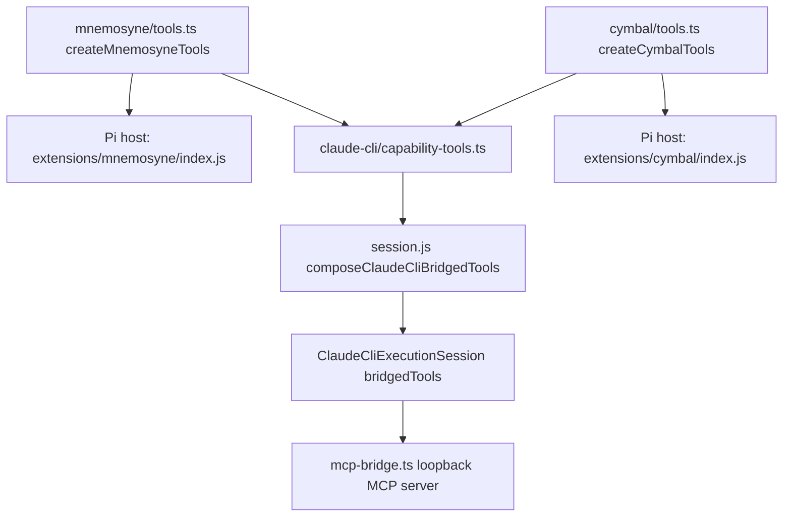

# Bridge memory_* and code_* Tools to Claude CLI Turns

## Context

RunWield Agents that run on the Claude CLI Execution Backend declare `memory_*` and `code_*` in their Agent Definitions
(`src/agent-definitions/planner.md`, `engineer.md`, `guide.md`, `recorder.md`, and others), and their prompts instruct
them to call those tools. The Claude CLI backend does not supply them.

Three facts make this a real defect, not only a missing feature:

1. `src/shared/session/backends/claude-cli/workflow-mcp-bridge.ts` rejects any tool that is not one of four lifecycle
   tools. `workflowMcpAliasFor` returns `undefined` for every other name, and `startWorkflowMcpBridge` throws.
2. `src/shared/session/session.js:2032` (`composeClaudeCliWorkflowTools`) only ever builds those four lifecycle tools.
3. `buildExecutionSession` calls `assembleFinalSystemPromptWithContextProjection(agentDef, [], [], ...)` for the Claude
   CLI path, so `{{AVAILABLE_TOOLS}}` renders empty. A Claude CLI Agent reads "## Available tools" with nothing under
   it, immediately followed by "The tools listed above are the tools available in this session."

A Claude CLI Agent is therefore told to call tools that do not exist, and is separately told its tool list is empty.
Memory is injected once as static `{{MEMORIES}}` text at turn start, so the Agent cannot search, store, or delete
memory, and has no semantic code search at all.

The blocker is not the bridge. `startWorkflowMcpBridge` already accepts any `ToolDefinition[]`, validates arguments,
executes, records canonical `toolCall`/`toolResult` Session Transcript messages, stamps provenance, and emits TUI tool
events. The blocker is that the working tool bodies do not exist outside a Pi host: the exported `*ToolDef` constants in
`src/extensions/mnemosyne/index.js` and `src/extensions/cymbal/index.js` are schema-only shells whose `execute()` throws
`"Not implemented"`, and the real bodies are registered inside the extension factory, closed over `pi.exec` and a
`projectCwd` captured on `session_start`. The Claude CLI path never builds a Pi host.

## Objective

Give Claude CLI turns read and write parity with Pi turns for RunWield's memory and code capabilities: all five
`memory_*` tools and all eleven `code_*` tools, filtered per Agent by the same `tools:` front matter Pi uses, executing
the same Mnemosyne and Cymbal binaries with the same arguments, recorded in the Session Transcript as native RunWield
tool events, and named in the system prompt so the Agent knows it has them.

Decisions taken with the user:

- **Both families, all sixteen tools.** Claude Code's native `Grep`/`Glob` fall short of Cymbal's AST-aware queries, and
  a partial bridge would leave `code_*` declared but dead.
- **Read and write parity with Pi Agents.** `memory_store`, `memory_store_global`, and `memory_delete` are bridged.
  Every Agent prompt ends by asking the Agent to store relevant memories; a read-only bridge makes that instruction
  silently fail. Pi Agents already hold `memory_delete`, so this adds no new risk class.
- **No `runwield_` prefix.** A bridged capability tool is advertised under its internal name (`memory_recall`, not
  `runwield_memory_recall`) so Agent prompts that name these tools stay literally true. The four lifecycle tools keep
  their existing `runwield_`-prefixed aliases.

Out of scope: `work_record_search`, `work_record_read`, `user_interview`, `review_diff`, `see_image`, `write_docs`,
`edit_docs`, `multi_file_edit`, and `return_to_router` stay unbridged. Cymbal's `grep`/`bash` nudge interceptor stays
Pi-only, because RunWield does not ingest Claude Code's internal tool loop and therefore cannot observe those calls.

## Approach

The tool bodies move out of the Pi extension closures into host-neutral factories that both hosts call. Nothing is
duplicated and no fake Pi `ExtensionAPI` is constructed.

Each factory takes a host record `{ cwd, exec }`. `exec` is a named subprocess port, which `CLAUDE.md` lists as a
genuine boundary; it is a required field on the host record, not a `__deps`/`__testDeps` bag, so
`scripts/check-injection-seams.js` does not see a new seam and the zero-seam baseline is unchanged. The Pi host passes
`pi.exec`, keeping Pi's abort and timeout handling; the Claude CLI host passes a `Deno.Command` implementation.

Resolving the Mnemosyne project collection name becomes lazy and memoized inside the factory instead of running on
`session_start`. This is required — the Claude CLI host has no `session_start` event — and it also removes an ordering
dependency that exists today in the Pi host, where a tool call before `session_start` would use the wrong collection.

The bridge gains a second tool kind. Lifecycle tools keep their prefixed aliases and the terminal gate; capability tools
are advertised under their internal names and are never rejected by the terminal gate, because a memory write after an
accepted completion is harmless while refusing it would silently drop a memory the Agent was told to store.

Finally, `buildExecutionSession` composes bridged tools _before_ assembling the system prompt and passes them in, so
`{{AVAILABLE_TOOLS}}` and the Context Projection describe what the turn actually has.

## Files to Modify

- `src/extensions/helper-binary-exec.ts` — new. Owns `HelperBinaryExecResult`, the `HelperBinaryExec` port type, and
  `denoHelperBinaryExec`, a `Deno.Command` implementation that returns `{ code, stdout, stderr }` and maps a spawn
  `NotFound` to `code: 127` so Mnemosyne's existing missing-binary detection keeps working.
- `src/extensions/mnemosyne/tools.ts` — new. Owns the five `defineTool` definitions _and_ their executing bodies, the
  `mnemosyne(...)` runner, `MISSING_BINARY_MSG`, `normalizedProjectCollectionName`, `resolveProjectCollectionName`, and
  the lazy memoized collection resolution plus idempotent `init`. Exports `createMnemosyneTools(host)`.
- `src/extensions/mnemosyne/index.js` — reduced to a Pi host: a mutable host record whose `cwd` is updated on
  `session_start`, `exec` delegating to `pi.exec`, and `pi.registerTool` for each definition the factory returns. Keeps
  re-exporting the five `*ToolDef` names so `src/shared/session/session.js:37` needs no import change.
- `src/extensions/cymbal/tools.ts` — new. Owns the eleven `defineTool` definitions and their bodies, the `runCymbal`
  runner with its mandatory `--no-federate` flag, `validateCodeBatchParams`, `getCodeBatchCymbalArgs`,
  `getCodeBatchOperationLabel`, `formatCodeBatchSection`, `truncateCodeBatchOutput`, and both limit constants. Exports
  `createCymbalTools(host)`.
- `src/extensions/cymbal/index.js` — reduced to a Pi host in the same shape, and retains the `tool_result` nudge
  interceptor, which is Pi-loop-specific and stays here.
- `src/shared/session/backends/claude-cli/capability-tools.ts` — new. Exports `createClaudeCliCapabilityTools({ cwd })`,
  composing both factories over `denoHelperBinaryExec`, and `CLAUDE_CLI_CAPABILITY_TOOL_NAMES` as the canonical
  sixteen-name list.
- `src/shared/session/backends/claude-cli/mcp-bridge.ts` — renamed from `workflow-mcp-bridge.ts` and generalized. The
  module doc currently claims it exposes "exactly the RunWield lifecycle completion tools"; that claim stops being true.
  `startWorkflowMcpBridge` becomes `startRunWieldMcpBridge`, `WorkflowMcpBridgeOptions`/`WorkflowMcpBridgeHandle` become
  `RunWieldMcpBridgeOptions`/`RunWieldMcpBridgeHandle`. `WORKFLOW_MCP_ALIASES` and `workflowMcpAliasFor` keep their
  names and lifecycle-only meaning. Adds `mcpAliasFor`, a `kind` on each bridge entry, a kind-scoped terminal gate, and
  `advertisedToolNames` on the handle.
- `src/shared/session/backends/claude-cli/execution-session.ts` — `workflowTools` becomes `bridgedTools`; alias
  resolution goes through `mcpAliasFor`; `buildWorkflowPromptAppendix` becomes `buildBridgedToolPromptAppendix` and
  names the capability tools alongside the lifecycle tools.
- `src/shared/session/session.js` — `composeClaudeCliWorkflowTools` becomes an exported `composeClaudeCliBridgedTools`
  that also returns capability tools filtered by `agentDef.tools`, and `buildExecutionSession` composes them before
  prompt assembly and feeds them to `assembleFinalSystemPromptWithContextProjection`.
- `docs/domain-language.md` — adds the **Bridged Tool** term, which this change introduces into module docs, the prompt
  appendix, and the PRD.
- `docs/prd/runwield-core-prd.md` — section 8's Claude CLI paragraph states RunWield persists "final assistant/workflow
  Session Transcript history rather than native RunWield tool events". After this change RunWield does persist native
  RunWield tool events for bridged memory and code tools; only Claude Code's _internal_ file/Bash/tool activity stays
  unrecorded.
- Test files listed in `affectedPaths` — see Verification Plan.

## Reuse Opportunities

- `src/shared/session/backends/claude-cli/workflow-mcp-bridge.ts` — the entire transport, Bearer authorization,
  `validateToolCall` argument checking, `stampDetails` provenance, transcript recording, and TUI event emission already
  work for arbitrary `ToolDefinition[]`. Only the alias map and the gate are lifecycle-specific.
- `src/shared/session/tool-event-title.js` — `describeRuntimeTool` already has cases for `code_search`, `memory_recall`,
  `memory_recall_global`, `memory_store`, and `memory_store_global`, and already classifies several of these as
  read-only. Because the bridge records under the _internal_ tool name, TUI titles work with no change.
- `src/extensions/mnemosyne/index.js` `resolveProjectCollectionName` — already maps an execution worktree back to the
  primary checkout through `git rev-parse --git-common-dir`. Move it as-is; it is what keeps memory project-scoped when
  a Claude CLI turn runs inside a worktree.
- `src/shared/session/session.js:200` `resolveEffectiveSessionToolNames` and the `agentDef.tools` front matter — the
  per-Agent tool policy already exists and needs no new mechanism.
- `Deno.Command` usage in `src/shared/session/backends/claude-cli/process.ts` and `src/shared/runtime-preflight.ts` —
  the existing pattern for `denoHelperBinaryExec`.

## Implementation Steps

- [ ] `src/extensions/helper-binary-exec.ts` exports `HelperBinaryExec`, `HelperBinaryExecResult`, and
      `denoHelperBinaryExec`, and `denoHelperBinaryExec` returns `code: 127` with a non-empty `stderr` when the named
      binary is absent from `PATH` rather than throwing.
- [ ] `src/extensions/mnemosyne/tools.ts` exports `createMnemosyneTools` and `MnemosyneToolHost`, and declares all five
      `memory_*` `defineTool` definitions with executing bodies. `src/extensions/mnemosyne/index.js` contains no
      `execute(` implementation, no `mnemosyne(` runner, and no `MISSING_BINARY_MSG`; it imports and re-exports the five
      `*ToolDef` names from `tools.ts`.
- [ ] `createMnemosyneTools` resolves the project collection name lazily on first tool call and memoizes it, so a
      `memory_recall` issued with no prior `session_start` still targets the collection derived from
      `git rev-parse --git-common-dir`.
- [ ] `src/extensions/cymbal/tools.ts` exports `createCymbalTools` and `CymbalToolHost` and declares all eleven `code_*`
      definitions with executing bodies, including `code_batch`'s five-operation limit and 50,000-character truncation
      marker. `src/extensions/cymbal/index.js` contains no `runCymbal(` and no `execute(` implementation, retains its
      `tool_result` nudge handler, and re-exports the eleven `*ToolDef` names.
- [ ] Every Cymbal invocation issued by `createCymbalTools` passes `--no-federate` as the first argument.
- [ ] `src/shared/session/backends/claude-cli/capability-tools.ts` exports `createClaudeCliCapabilityTools` returning
      exactly the sixteen tools named in `CLAUDE_CLI_CAPABILITY_TOOL_NAMES`, each with a body that runs the real
      `mnemosyne` or `cymbal` binary through `denoHelperBinaryExec`.
- [ ] `src/shared/session/backends/claude-cli/mcp-bridge.ts` exists, `workflow-mcp-bridge.ts` no longer exists, and no
      file in `src/` imports `workflow-mcp-bridge.ts`. The module exports `startRunWieldMcpBridge`,
      `RunWieldMcpBridgeHandle`, `RunWieldMcpBridgeOptions`, `mcpAliasFor`, and the unchanged `WORKFLOW_MCP_ALIASES` and
      `workflowMcpAliasFor`.
- [ ] `mcpAliasFor` returns the `runwield_`-prefixed alias for the four lifecycle names, the unchanged internal name for
      each of the sixteen capability names, and `undefined` for anything else.
- [ ] `startRunWieldMcpBridge` accepts a mixed lifecycle and capability tool list, tags each entry with
      `kind: "lifecycle" | "capability"`, and exposes `advertisedToolNames` on the returned handle.
- [ ] After a lifecycle result with `terminate: true`, a further lifecycle call is rejected with the existing
      `"runwield lifecycle call rejected: ..."` wording, and a capability call still executes and returns its real
      result.
- [ ] `src/shared/session/session.js` exports `composeClaudeCliBridgedTools`, which takes `cwd` and returns the
      lifecycle tools the Agent declares plus exactly the capability tools the Agent declares, and returns capability
      tools even when `hostedSession` is null.
- [ ] `buildExecutionSession` calls `composeClaudeCliBridgedTools` before
      `assembleFinalSystemPromptWithContextProjection` and passes the bridged tool names and definitions to it, so a
      Claude CLI system prompt lists its bridged tools under `## Available tools` instead of rendering that section
      empty.
- [ ] `ClaudeCliExecutionSession` takes `bridgedTools`, and the `--allowedTools` arguments it builds contain both
      `memory_recall` and `mcp__runwield__memory_recall` for an Agent that declares `memory_recall`, and contain neither
      form of a capability tool the Agent does not declare.
- [ ] `buildBridgedToolPromptAppendix` names the eligible capability tools in the system prompt appendix, states that
      they run RunWield's Mnemosyne and Cymbal helpers, and keeps the existing lifecycle paragraph and the
      `runwield_review_complete` note unchanged.
- [ ] `docs/domain-language.md` defines **Bridged Tool** as a RunWield Tool exposed to one Claude CLI turn over the
      loopback MCP bridge, distinguishes lifecycle from capability Bridged Tools, and lists avoided aliases.
- [ ] `docs/prd/runwield-core-prd.md` section 8 states that RunWield persists native RunWield tool events for Bridged
      Tools while Claude Code's internal file/Bash/tool activity stays unrecorded.

## Verification Plan

**Automated**

- `deno task ci` passes. This includes `deno task check`, `lint`, `language-policy:check`, `seams:check`,
  `doc-links:check`, and `test`.
- `deno task seams:check` passes with no baseline update. If it flags `exec`, the fix is in the module, not the
  baseline.
- `deno run -A scripts/run-tests.js src/extensions/mnemosyne/tools.test.ts src/extensions/cymbal/tools.test.ts` covers
  the moved behavior against a fake `HelperBinaryExec`.
- `deno run -A scripts/run-tests.js src/shared/session/backends/claude-cli/capability-tools.test.ts` covers real binary
  execution against `PATH`-shimmed fake `mnemosyne` and `cymbal` executables, including the missing-binary message.
- `deno run -A scripts/run-tests.js src/shared/session/backends/claude-cli/mcp-bridge.test.ts` covers a capability tool
  being advertised, executed, and _not_ rejected after a lifecycle terminal result.
- `deno run -A scripts/run-tests.js src/shared/session/backends/claude-cli/claude-cli-backend.test.ts` covers per-Agent
  filtering, `--allowedTools` content, and the prompt appendix.

**Behavior that must still be protected after the move**

These assertions exist today in `src/extensions/mnemosyne/index.test.js` and `src/extensions/cymbal/index.test.js` and
reach the behavior through a fake `pi.exec`. After the extraction they must assert the same behavior against
`createMnemosyneTools` / `createCymbalTools` with a fake `HelperBinaryExec`. No test may be deleted unless an equivalent
assertion exists in the new `tools.test.ts` file:

- `memory_recall` wraps the query in double quotes and doubles embedded quotes.
- Project-scoped calls pass `--name <collection>`; global calls pass `--global`; `core: true` adds `--tag core`.
- `resolveProjectCollectionName` maps a linked worktree to the primary checkout directory name and falls back to
  `basename(cwd)`, with `"global"` normalized to `"default"`.
- The Mnemosyne missing-binary message is returned for exit 127 and for `ENOENT`-style failures, and is not thrown.
- Every Cymbal call passes `--no-federate`; Cymbal failures return `Error (exit N): ...` text with the `Usage:` tail
  stripped, and never throw.
- `code_batch` rejects more than five operations, rejects malformed operations, numbers its sections, and appends the
  truncation marker past 50,000 characters.
- Empty helper output becomes `"No results found."` / `"No memories found."` / `"No global memories found."`.

**Behavior that is expected to stop existing**

- Nothing. No tool, argument, or message is removed. The `session_start`-time Mnemosyne `init` moves to the first tool
  call, so a test that asserts `init` runs _during_ `session_start` must be rewritten to assert it runs once before the
  first Mnemosyne query — not deleted.

**Manual**

1. Set a Claude CLI model (for example `/model claude-cli/sonnet`) and start a Planner or Engineer turn.
2. Ask the Agent to search project memory. Confirm a `memory_recall` tool block appears in the TUI with a real result,
   not a "tool not available" reply.
3. Ask the Agent to store a memory, then start a fresh turn and ask it to recall that memory. Confirm the round trip.
4. Ask for a symbol lookup that needs `code_search` or `code_investigate`. Confirm a Cymbal-backed result.
5. Run a Claude CLI turn inside an execution worktree and store a memory. Confirm it lands in the primary checkout's
   collection, not a worktree-named one.
6. Confirm the `## Available tools` section of a Claude CLI Agent's system prompt is no longer empty.

## Edge Cases & Considerations

- **Serialized bridge calls.** `startRunWieldMcpBridge` funnels every call through one `callQueue`. Sixteen extra tools
  make that queue busier, and Claude Code likes to issue tool calls in parallel, so a slow `code_impact` will now block
  a following `code_show`. Keeping the single queue is deliberate for this slice: it prevents concurrent Mnemosyne
  SQLite writes and keeps transcript ordering deterministic. Splitting the queue by `kind` is a reasonable follow-up if
  turn latency becomes a real complaint. **Assumption open for review.**
- **Missing helper binaries.** `mnemosyne` returns an installer-pointing message; `cymbal` returns `Error (exit N)`
  text. Both degrade to a tool result, never a failed turn. Preserve that asymmetry rather than unifying it here.
- **Cymbal index in a fresh worktree.** A newly created execution worktree may have no Cymbal index, so early `code_*`
  calls can be slow or return nothing useful. This matches Pi behavior today and is not addressed here.
- **`memory_delete` is destructive and bridged.** This is the user's explicit decision, taken because Pi Agents already
  hold it and read/write parity was the requirement. It deletes by numeric document ID from the Mnemosyne database,
  which lives outside the repository and outside worktree isolation.
- **Context cost.** Sixteen extra tool schemas are advertised over MCP each turn, plus sixteen prompt lines. Small
  relative to the system prompt, and it replaces a section that currently claims the Agent has no tools at all.
- **`{{AVAILABLE_TOOLS}}` lists bridged tools only.** Claude Code's native `Read`/`Bash`/`Grep`/`Glob` are not RunWield
  Tool Definitions and are not listed. Listing RunWield's lowercase `read`/`grep`/`bash` names would be false, since
  those tools are not present in a Claude CLI turn. The prompt appendix says plainly that file, search, and shell work
  uses Claude Code's native tools while memory, code, and lifecycle tools come from RunWield.
- **Rename risk.** Renaming `workflow-mcp-bridge.ts` touches two importers and one test file. It is included because the
  module's own documentation asserts a lifecycle-only contract that this change makes false. The lifecycle-specific
  exports keep their names, so the diff stays bounded.
- **Pi host entry points keep their `.js` paths.** `src/extensions/mnemosyne/index.js` and
  `src/extensions/cymbal/index.js` are edited in place, not renamed to `.ts`. The JS-to-TS ratchet only rejects _new_
  production `.js` files, so shrinking these two is allowed, and the new `tools.ts` modules that take over their logic
  are TypeScript. Converting the two host shells is a separate, optional cleanup.
- **`work_record_*` stays unbridged.** The Recorder Agent declares `work_record_search` and `work_record_read`, so a
  Recorder turn on Claude CLI still has a gap after this change. Out of scope by the user's stated scope; worth a
  follow-up Plan.
