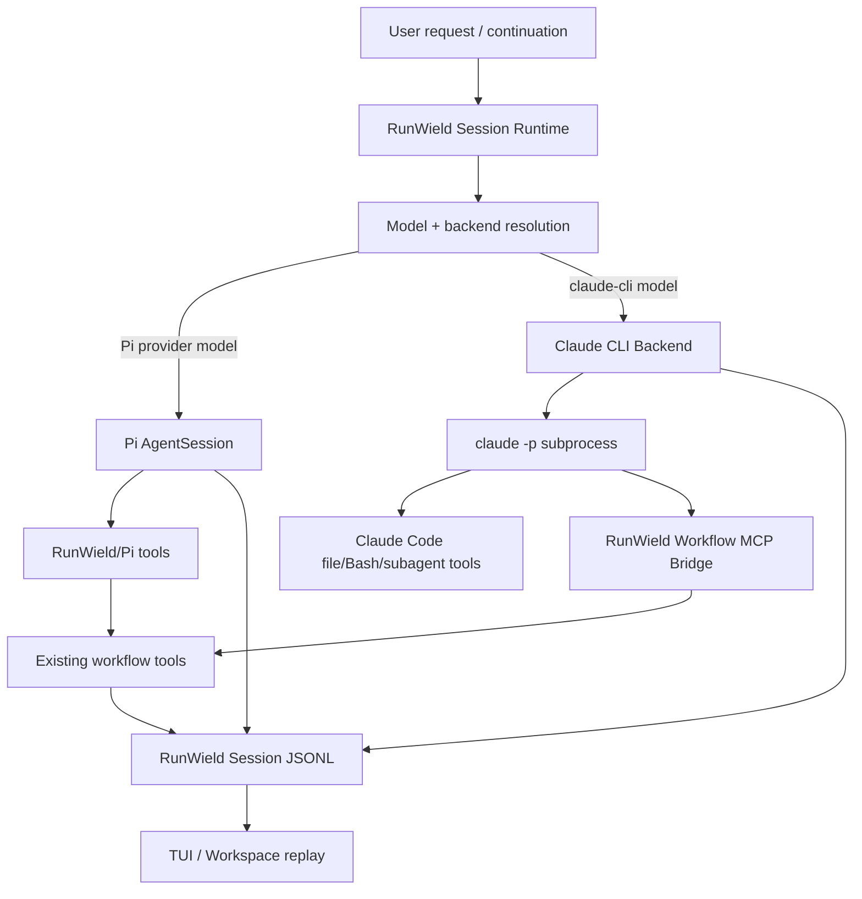

# Claude CLI Execution Backend

## Context

RunWield currently executes native agent turns through Pi's `AgentSession` and `ModelRuntime`: RunWield assembles the
agent definition, system prompt, tools, model, thinking level, and `SessionManager`, then Pi owns the provider call and
tool loop while RunWield subscribes to Pi events for live UI and persists the resulting Session Transcript JSONL.

The requested capability is different from adding another raw LLM provider. The user wants RunWield to shell out to
Claude Code print mode (`claude -p`) so Claude Code can perform planning, implementation, and review using its own tool
loop, while RunWield remains authoritative for workflow state, Plan lifecycle, validation, model/preset selection, and
Session Transcript persistence. Claude Code's internal file/Bash/tool transcript may be omitted for MVP, provided this
limitation is surfaced clearly.

Current Claude Code documentation supports the necessary execution controls:

- `claude -p` / `--print` runs non-interactively.
- `--model <alias-or-full-id>` selects a model such as `sonnet`, `opus`, `haiku`, or a full model identifier.
- `--effort low|medium|high|xhigh|max|ultracode` controls Claude Code's reasoning effort, roughly corresponding to
  RunWield thinking levels where supported.
- `--system-prompt`, `--system-prompt-file`, `--append-system-prompt`, and `--append-system-prompt-file` control prompt
  injection. The safer default for coding-agent behavior is to append RunWield role instructions rather than replace
  Claude Code's default system prompt.
- `--output-format json` provides a final structured result;
  `--output-format stream-json --verbose --include-partial-messages` provides newline-delimited event output plus a
  final result.
- `--mcp-config` and plugin-provided Model Context Protocol (MCP) servers allow Claude Code to call structured tools in
  print mode.

The architectural decision settled in ideation is to treat Claude CLI as a RunWield execution backend / agent runtime
sibling to the current Pi-backed runtime, not as an ordinary Pi `ModelRuntime` provider. Claude owns coding tools.
RunWield owns lifecycle signals through a thin, isolated MCP workflow bridge.

## Objective

Add a Claude CLI execution backend that lets users configure and select Claude-backed models in settings and model
presets, then execute supported RunWield agent turns by shelling out to `claude -p` while preserving RunWield's durable
workflow authority.

The target architecture must make these ownership boundaries explicit:

- **Claude Code owns external agent execution** for Claude-backed turns: file reads/writes, Bash, Claude Code
  permissions, internal tool loop, and Claude subagents.
- **RunWield owns workflow truth**: active agent/workflow state, Plan lifecycle, validation transitions, session
  segmentation, Work Records, memory candidates, and user-facing replay.
- **RunWield Session Transcript JSONL remains the source of truth** for RunWield resume/replay; Claude Code's own
  transcript and session id are metadata only.
- **Workflow signals cross through one small bridge**: Claude calls MCP tools named for RunWield workflow signals; the
  bridge delegates to existing `plan_written`, `task_completed`, and `review_complete` machinery instead of
  reimplementing lifecycle behavior.

No ADR was created during this Epic drafting. The rationale is recorded here because the decision is localized to this
feature and follows the same host-native-capability principle as RunWield Connect while preserving a different control
direction and Core-owned workflow semantics.

## Vertical Slice Findings

The existing RunWield execution path has a clear vertical seam around agent-session construction and prompt execution:

- `src/shared/session/session.js` assembles agent definitions, tools, final system prompt, selected model, thinking
  level, temperature behavior, event subscribers, and then calls Pi `createAgentSession` with a `SessionManager`.
- `runPrompt`, `runRootTurn`, `runNonInteractiveAgentPrompt`, and `runIsolatedAgentSession` assume a Pi `AgentSession`
  object with `prompt()`, `agent.waitForIdle()`, `agent.state.messages`, `subscribe()`, `abort()`, and `dispose()`
  capabilities.
- `attachSessionEventSubscribers` converts Pi message/tool/thinking events into RunWield runtime events for
  TUI/Workspace projection. Claude CLI cannot provide equivalent first-class RunWield tool events for its internal tools
  in MVP.
- `src/shared/session/root-session.js` creates and opens Pi `SessionManager` JSONL files under
  `~/.wld/sessions/<encoded-cwd>/`. The JSONL format already supports normal message entries, model changes,
  thinking-level changes, and RunWield custom entries.
- `src/shared/session/session-transcript-projection.js` replays committed JSONL entries into runtime events. It already
  projects ordinary assistant messages, thinking blocks, tool-use blocks, tool-result blocks, model changes,
  thinking-level changes, and custom workflow display entries.
- `src/shared/models/model-registry.js` and model resolution in `session.js` already support strict `provider/id` model
  references, `activeModelPreset`, `modelPresets`, per-agent model settings, default provider/model settings, and
  auth/status checks.
- `src/tools/plan-written.js`, `src/tools/task-completed.js`, and `src/tools/review-complete.js` are the existing
  workflow authorities. They validate parameters, emit user-visible workflow events, update lifecycle or validation
  state, and return terminal tool results.
- Existing agent prompts instruct agents to call workflow tools only when ready and to ask plain-text questions without
  calling completion tools. Claude-backed turns should preserve the same user-visible convention but deliver terminal
  signals through the MCP bridge rather than Pi custom tools.

These findings make the desired seam concrete: Claude CLI should replace only the model/tool-loop execution path for
selected turns. It must not replace SessionManager, Plan lifecycle tools, validation, or transcript projection.

The important consequence is that Claude Code may mutate the worktree through its own tools, but only RunWield workflow
tools may move RunWield lifecycle state.

## Files to Modify

- `src/shared/session/session.js` — introduce or consume an execution-backend abstraction so selected `claude-cli/*`
  turns route to a Claude backend instead of Pi `AgentSession`; preserve Pi as the default path and keep RunWield prompt
  assembly reusable.
- `src/shared/session/session-runtime.js` — route root/isolated turns through the selected backend while preserving
  active-agent, steering, abort, and workflow continuation semantics for existing Pi sessions.
- `src/shared/session/root-session.js` — keep JSONL SessionManager ownership; add any helper needed for Claude backend
  transcript entries without giving Claude's own session files authority.
- `src/shared/session/session-transcript-projection.js` — project Claude-backed persisted entries and workflow-signal
  custom entries into the same user-visible replay model without treating Claude internal tool logs as native RunWield
  events.
- `src/shared/models/model-registry.js` — make `claude-cli` discoverable/configurable as a RunWield model provider
  facade with model aliases such as `sonnet`, `opus`, `haiku`, and optional full Claude model ids.
- `src/shared/models/model-validation.js` — ensure strict provider/model parsing and formatting accepts
  `claude-cli/<model-or-alias>` while preserving existing provider validation behavior.
- `src/shared/settings.js` — preserve Claude CLI provider/backend settings and model-preset values through settings
  writes; avoid conflating Claude CLI auth health with API-key provider auth.
- `src/tools/plan-written.js` — expose or reuse the existing `plan_written` execution path from the MCP bridge without
  duplicating review/lifecycle logic.
- `src/tools/task-completed.js` — expose or reuse `task_completed` as the terminal implementation/operation completion
  signal from the MCP bridge.
- `src/tools/review-complete.js` — expose or reuse `review_complete` as the structured semantic-review completion signal
  from the MCP bridge.
- `src/ui/tui/model-welcome.js` — show Claude CLI model availability/auth-health guidance where model selection is
  introduced.
- `src/ui/workspace/` — surface Claude CLI provider/model selection and caveats in settings/model preset UI; any visual
  work here needs Frontend Engineer ownership and headed-browser verification in child Plans.
- `docs/prd/runwield-core-prd.md` — document Claude CLI as a Core-supported execution backend and clarify model/provider
  terminology if needed.
- `docs/prd/attached-mode-prd.md` — keep language aligned with RunWield Connect without conflating this Core Execution
  Backend with a user-hosted Attached Workflow; document what is shared and what differs.

Likely new modules should live under a narrow execution/backend namespace, for example
`src/shared/session/backends/claude-cli/`, so the subprocess runner, stream parser, prompt appendix, MCP bridge, and
health checks can be removed or replaced without touching Pi internals.

## Reuse Opportunities

Existing functions, modules, or patterns to reuse:

- `src/shared/session/session.js` — reuse agent definition loading, tool-name resolution for workflow intent, final
  system prompt assembly, configured model/thinking/temperature resolution where applicable, and active agent metadata
  conventions.
- `src/shared/models/model-registry.js` — reuse the model registry facade and settings model resolution instead of
  inventing separate Claude-specific preset storage.
- `src/shared/settings.js` — reuse merged global/project custom setting reads and preservation logic for `modelPresets`,
  `activeModelPreset`, and provider/backend settings.
- `src/shared/session/root-session.js` — reuse `SessionManager.create/open/list` and append-only JSONL behavior for
  Claude-backed RunWield transcripts.
- `src/shared/session/session-transcript-projection.js` — reuse replay projection for normal user/assistant messages and
  workflow display entries.
- `src/tools/plan-written.js` — reuse `createPlanWrittenTool` or a factored shared execution function; the MCP bridge
  must not independently approve Plans or mutate Plan lifecycle.
- `src/tools/task-completed.js` — reuse `createTaskCompletedTool` or a factored shared execution function so
  active-workflow owner checks remain centralized.
- `src/tools/review-complete.js` — reuse `createReviewCompletedTool` or a factored shared execution function so
  approved/findings validation remains centralized.
- `src/shared/session/session-runtime-events.js` — reuse normalized runtime event types for visible Claude text,
  workflow statuses, usage, errors, and replay.
- `scripts/run-tests.js` / `deno task test` — use the repository's sandboxed test runner; do not invoke `deno test`
  directly.

## Verification Plan

- Automated: `deno task test` for targeted and full test coverage under the sandboxed runner.
- Automated: `deno task ci` before declaring the full feature complete, because backend selection, seams, lifecycle,
  settings, and replay all have broad regression risk.
- Automated: tests that simulate `claude` as a subprocess fixture rather than requiring a real Claude installation for
  unit/integration coverage.
- Automated: tests for the MCP bridge using an in-process or stdio fixture that calls `runwield_plan_written`,
  `runwield_task_completed`, and `runwield_review_complete` and proves those calls delegate to existing tool machinery.
- Automated: transcript tests proving a Claude-backed turn appends RunWield-owned JSONL entries and replays them
  correctly after reload.
- Automated: settings/model-resolution tests proving `activeModelPreset` and per-agent model settings can select
  `claude-cli/<model>` without weakening strict provider/model errors for existing providers.
- Manual: with Claude Code installed and authenticated, select a Claude CLI model for Planner, write a small Plan,
  receive Plan review, and confirm `plan_written` drives normal review/approval behavior.
- Manual: execute a small approved Plan with Claude CLI as Engineer, confirm Claude uses its own tools, RunWield records
  the final response and `task_completed`, then normal validation continues.
- Manual: run a semantic review through Claude CLI, confirm `review_complete` findings/approval are recorded and
  validation loops behave like Pi-backed review.
- Manual: ask a Planner question path, confirm no workflow terminal signal fires and RunWield waits for the user reply.

### Outcome Evidence

An Epic is not executed directly, so it does not carry runnable checks of its own. What it owes its children is the
thing only the Epic knows: **what must be observably true when this architecture is real.**

For each Epic outcome, state the evidence that proves it — concrete enough that a child Plan can turn it into a command
that is red before the work and green after.

- `claude-cli` is a selectable model/backend — model listing and model resolution expose `claude-cli/<alias-or-id>`
  entries that work in `agents.<agent>.model`, `activeModelPreset`, and `modelPresets`, and existing strict
  provider/model errors still fire for unknown non-Claude providers.
- Claude-backed turns do not instantiate Pi `AgentSession` for execution — a test-selected `claude-cli/*` turn reaches a
  Claude backend subprocess runner while a Pi/provider model still reaches `createAgentSession`; the backend branch is
  selected by resolved model/backend metadata, not by agent name.
- RunWield owns transcript persistence — a Claude-backed root turn creates/appends a RunWield Session JSONL containing
  normal RunWield-owned user/assistant/workflow entries under `~/.wld/sessions`, and replay after `loadSession` shows
  the same user-visible messages without reading Claude Code's transcript files.
- Claude owns coding tools — no child work maps Claude's file/Bash/edit activity into RunWield `read`, `bash`, `edit`,
  or `multi_file_edit` tool events for MVP; docs and UI caveats state that Claude internal tool history is not native
  RunWield tool history.
- Workflow terminal signals cross through MCP, not prose parsing — the Claude backend passes an MCP config that exposes
  only RunWield workflow-signal tools, and there is no production parser that treats sentinel text like
  `RUNWIELD_SIGNAL` as lifecycle authority.
- The MCP bridge is only a shim — MCP tool implementations delegate to existing `plan_written`, `task_completed`, and
  `review_complete` machinery or shared factored functions; they do not directly edit Plan status, active workflow
  state, validation ledgers, or review results.
- Plain-text questions remain non-terminal — a Claude-backed planning response that asks a question and calls no MCP
  workflow tool persists as an assistant message and leaves the Session waiting for user input without invoking
  `plan_written`, `task_completed`, or `review_complete`.
- Existing Pi behavior is protected — all existing Pi-backed model selections, custom tools, thinking-level changes,
  temperature handling, image fallback, compaction, and workflow validation tests continue to pass with no new seams
  added to RunWield-owned machinery.
- Claude CLI failures are recoverable and visible — missing executable, failed auth/health, non-zero subprocess exit,
  malformed stream JSON, missing terminal signal, and cancellation each produce deterministic RunWield runtime
  status/error entries without corrupting Plan lifecycle or clearing active execution workflow incorrectly.
- UI/settings behavior is user-visible — TUI/Workspace settings can select Claude CLI models and show the MVP caveat;
  headed-browser checks confirm Workspace model preset UX remains visually consistent with RunWield's design system.

Across the whole Epic, existing behavior that must remain protected:

- Pi-backed agents remain the default and continue using Pi `AgentSession`, Pi event subscriptions, RunWield custom
  tools, compaction, image fallback, and existing SessionManager persistence.
- RunWield lifecycle transitions remain centralized in existing tool/workflow modules; no backend may hand-edit Plan
  front matter, active workflow state, validation evidence, or Work Record state.
- `task_completed` still rejects mismatched workflow owners and pre-execution/provisional completion attempts.
- `review_complete` still rejects approval with unresolved findings.
- `plan_written` still validates Plan existence, policy, classification-specific Objective-Failing Checks for
  PLANNED_CHANGE Plans, and review/approval outcomes.
- Session Transcript projections remain projections only; they must not become lifecycle authority.
- Tests must continue using `deno task test` / `scripts/run-tests.js` rather than direct `deno test`.

Behavior expected to stop existing or intentionally not exist after this Epic:

- Claude-backed execution must not be represented as an ordinary OpenAI/Pi API provider that Pi calls directly.
- RunWield must not parse final Claude prose as authoritative lifecycle signals in production when the MCP bridge is
  available.
- Claude Code's own session transcript must not become a source of truth for RunWield resume, lifecycle, validation, or
  Work Records.
- MVP must not claim full RunWield tool transcript parity for Claude internal file/Bash/tool activity.
- MVP must not bridge `user_interview` or `delegate_agent` into Claude; questions remain plain text and delegation
  remains Claude-owned.

## Execution Policy

PROJECT Epics are non-executable containers. Do not set `executionAgent` or `collaborationRecommendation`; execution
policy belongs only on child Plans.

This Epic should decompose into child Plans along architectural seams, not by superficial file grouping. The likely
ownership areas are:

- backend/model/session runtime changes, owned by Engineer;
- MCP bridge and workflow tool delegation, owned by Engineer with lifecycle-focused tests;
- TUI/Workspace model settings and caveat display, requiring Frontend Engineer ownership for browser-rendered Workspace
  surfaces and headed-browser verification;
- documentation/PRD caveats, which may be bundled with the implementation slice that makes each statement true.

No child Plan should implement Claude CLI support by adding `__deps`/`__testDeps` bags to modules that do not already
own such seams. Subprocess execution and MCP server startup are legitimate external boundaries and may have narrow
capability ports or fixtures. RunWield-owned lifecycle machinery should be tested through real fixtures and existing
tool entry points.

## Edge Cases & Considerations

- **Product and control-direction confusion:** This feature runs Claude Code from inside a RunWield Core Session; Claude
  is an Execution Backend alongside Pi. It is not RunWield Connect, where Claude Code is the user's External Agent Host.
  Documentation must explain that Core owns the workflow and transcript in both cases, but Connect leaves the
  conversation and every model call under the external host's control.
- **Prompt/system-prompt choice:** Appending RunWield's agent instructions to Claude Code's default system prompt is the
  safer default because it preserves Claude Code's tool guidance and permission behavior. Replacing the system prompt
  should be an explicit advanced configuration only if later evidence requires it.
- **Effort/thinking mismatch:** Claude `--effort` does not map perfectly to RunWield thinking levels. `low`, `medium`,
  `high`, `xhigh`, and `max` can map directly where supported; `off`/`minimal` need documented fallback behavior.
- **Permissions:** Claude Code permission modes (`acceptEdits`, `bypassPermissions`, scoped `--allowedTools`, or
  default/manual behavior) materially affect safety. The MVP should select a conservative explicit policy per workflow
  and document what Claude may do.
- **Terminal signal after extra output:** Claude Code may continue producing text after an MCP workflow call even if
  RunWield treats the signal as terminal. RunWield should treat the first valid terminal workflow signal as
  authoritative and ignore, abort, or mark post-terminal output according to a deterministic backend policy.
- **Plan feedback loop:** `plan_written` can return review feedback requiring revision. The MCP path should allow Claude
  to receive that tool result in the same `claude -p` invocation when possible; if Claude exits instead, RunWield must
  preserve feedback and drive the next user/agent continuation safely.
- **Missing terminal signal:** A Claude-backed Engineer/Reviewer response that ends without
  `task_completed`/`review_complete` is not completion. It should be recorded as assistant output and either continue
  prompting Claude with a bounded reminder or wait for user/validation handling according to the active workflow.
- **Cancellation and process cleanup:** Aborting a Claude-backed turn must terminate the `claude -p` subprocess and any
  MCP bridge process without clearing active workflow truth or corrupting Session JSONL.
- **Authentication and executable health:** `claude` may be missing, outdated, unauthenticated, or blocked by settings.
  Health checks should fail before workflow mutation and provide clear user guidance.
- **Claude session persistence:** Use `--no-session-persistence` or otherwise ensure Claude's own transcript is metadata
  only. RunWield should not resume by passing Claude `--resume` in MVP.
- **Streaming variability:** `stream-json` is useful for live UI but can fail or contain events RunWield does not
  understand. MVP may persist only final assistant text and selected metadata while treating intermediate
  thinking/tool/subagent events as optional display-only improvements.
- **Security/secrets:** Do not persist environment variables, API keys, auth tokens, full command env, or Claude
  settings payloads in Session JSONL. Persist sanitized command metadata only.
- **Testing without Claude:** The core automated suite must use fake subprocess/MCP fixtures. Real Claude Code black-box
  checks are manual or separately gated, not required for normal `deno task test`.
