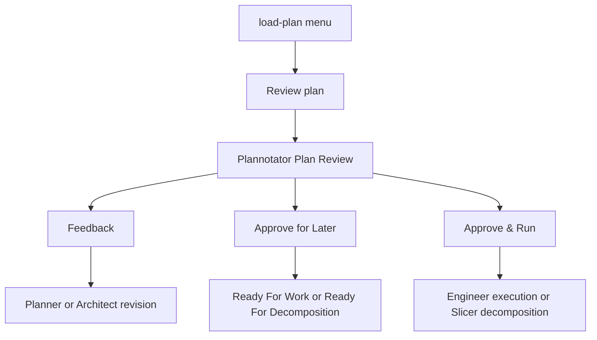

# Direct Plan Review from load-plan

## Context

`load-plan` currently starts Planner or Architect for `draft` and `feedback` Plans. This is slow and can block recovery
when a planning Session ended after writing the Plan but before `plan_written` submitted it for review. A
`ready_for_work` Plan already has a review path, but the command presents it as a re-review action and its review
handling is embedded in the main command.

The requested behavior is a direct shortcut: an eligible Plan can open the Plannotator Plan Review surface without
starting Planner or Architect first. The review surface must retain the normal Feedback, Approve for Later, and Approve
& Run outcomes and their workflow effects.

## Objective

Add a distinct **Review plan** action to the `load-plan` menus for eligible `draft`, `feedback`, and `ready_for_work`
Plans. The action must:

- open the existing Plan Review surface directly;
- avoid a Planner or Architect turn before review;
- forward review Feedback and attached images to the next planning or execution owner;
- make Approve for Later perform readiness and stop without execution;
- make Approve & Run perform readiness and continue with the normal execution and Workflow Validation path;
- make PROJECT Epics use the same direct review path, with Approve & Run approving and starting Slicer decomposition
  rather than Engineer execution;
- hide the direct-review option when a draft or feedback Plan is not valid enough to submit, including missing
  Objective-Failing Checks or an invalid execution policy.

`Resume planning` and the existing planning-agent review action remain separate choices. Direct review is a shortcut,
not a replacement for Planner or Architect.

## Approach

Extract the existing inline review-and-decision handling from `runLoadPlanCommand` into a load-plan review coordinator.
The coordinator will receive the loaded Plan, review owner, session surface, UI, and agent runners. It will reuse the
existing recovery-aware review transport and lifecycle helpers rather than create a second review protocol.

For PLANNED_CHANGE Plans, eligibility is checked before the menu option is added. Reuse the same persisted Front Matter
and policy rules used by `plan_written`: a valid execution policy and at least one valid Objective-Failing Check.
PROJECT Epics do not require execution policy or Objective-Failing Checks, but must remain classification-safe and use
Later or Decompose outcomes only.

The direct-review coordinator will preserve these transitions and handoffs:

1. Verify that any recorded execution worktree is managed before opening review.
2. Switch the active runtime Agent to Planner or Architect only for the review result's follow-up; do not run that Agent
   before the browser surface.
3. Open the recoverable Plan Review interaction through `session.reviewPlan` and `requestRecoverablePlanReview`.
4. Handle cancellation, remote review, and retry exactly as the current load-plan review path does.
5. Reload canonical Plan Front Matter after review and normalize the approval action.
6. On Feedback, run the appropriate planning Agent with the feedback text and all review images.
7. On approval, run readiness. For Approve for Later, return to the Session with no execution segment. For Approve &
   Run, continue through the existing execution/Slicer and post-execution validation decisions.
8. Preserve active workflow ownership and restore the prior Agent only when the flow is complete.

The PROJECT Epic menu will expose both choices: **Review plan** for direct Plannotator review and **Review with
Architect** for the existing planning-agent path. `ready_for_work` PROJECT Epics will also expose direct review;
approval will use the existing `epic_readiness_passed` transition and normalize execution to Slicer decomposition or
Later.

The option set aside is opening review automatically whenever `load-plan` sees a draft. That would remove the user's
choice between revising with Planner/Architect and reviewing the current artifact, and would make an incomplete draft
harder to repair.

## Files to Modify

- `src/cmd/load-plan/index.ts` — add the direct-review option to eligible non-Epic menus; call the shared review
  coordinator; keep Resume planning on the existing planning-agent path; remove duplicated inline review orchestration
  after the coordinator is proven equivalent.
- `src/cmd/load-plan/plan-epic-flow.ts` — add a distinct direct-review menu result for draft, feedback, approved, and
  ready-for-work PROJECT Epics, while retaining Architect review and Slicer choices; pass the direct-review decision
  back to the command.
- `src/cmd/load-plan/plan-review-flow.ts` — add the load-plan-owned coordinator and eligibility/preflight helpers. Reuse
  `requestRecoverablePlanReview`, `assertRecoveryWorktreeIsManaged`, `prepareApprovedPlanForWork`,
  `executePostPlanningDecision`, `executeReadyPlanWithRepair`, `validatePostExecutionDecision`, and the existing
  planning decision builders. Keep lifecycle mutations in the existing RunWield-owned helpers.
- `src/cmd/load-plan/index.integration.test.ts` — add real-runtime coverage proving direct review from `draft`,
  `feedback`, and `ready_for_work`: no planning Agent turn before review; Feedback returns to Planner/Architect with
  images; Later reaches readiness without execution; Run continues to execution. Add ineligible-draft cases proving the
  menu omits direct review when Objective-Failing Checks or execution policy are missing/invalid.
- `src/ui/tui/golden-scenarios/load-plan-workflow.ts` — cover the visible non-Epic menu and direct-review path,
  including the no-pre-review-agent-turn invariant and the final status for Later/Run.
- `src/ui/tui/golden-scenarios/load-plan-epic-workflow.ts` — cover direct review for PROJECT
  draft/feedback/ready-for-work menus, Feedback to Architect, Approve for Later, and Approve & Run to Slicer; retain
  coverage for the separate Review with Architect choice.

## Reuse Opportunities

- `src/cmd/load-plan/index.ts` — current review branch is the behavioral source for recovery checks, canonical reload,
  approval normalization, Feedback handoff, execution, and restoration.
- `src/tools/plan-written.ts` — existing Plan Review contract and preflight rules for execution policy and
  Objective-Failing Checks.
- `src/cmd/load-plan/plan-execution.ts` — `prepareApprovedPlanForWork`, `executeReadyPlanWithRepair`,
  `executePostPlanningDecision`, and `validatePostExecutionDecision`.
- `src/shared/workflow/plan-review-recovery.js` — recoverable interaction and retry behavior.
- `src/shared/workflow/plan-approval.js` — classification-safe Later, Run, and Decompose normalization.
- `src/shared/workflow/plan-actions.ts` and `src/shared/workflow/plan-lifecycle.js` — canonical action evidence and
  lifecycle transitions.

## Implementation Steps

- [ ] `src/cmd/load-plan/plan-review-flow.ts` exports a direct-review eligibility check that returns false for
      PLANNED_CHANGE Plans without at least one valid Objective-Failing Check or with an invalid execution policy, and
      returns true for valid draft, feedback, and ready_for_work Plans; PROJECT Epics are classification-safe without
      those PLANNED_CHANGE-only fields.
- [ ] `src/cmd/load-plan/plan-review-flow.ts` exports a coordinator that opens the existing recoverable Plan Review
      surface without invoking Planner, Architect, Engineer, or Slicer before the review decision, and handles
      cancellation, remote review, retry, managed-worktree refusal, canonical reload, and active-agent restoration.
- [ ] The coordinator routes review Feedback and every attached image to the correct planning owner, and routes approved
      Feedback/images to execution or Slicer through the same payload fields used by `plan_written`.
- [ ] The coordinator records `readiness_passed` for approved PLANNED_CHANGE Plans and `epic_readiness_passed` for
      approved PROJECT Epics; Approve for Later returns with no execution segment, while Approve & Run starts the
      existing execution path or Slicer decomposition.
- [ ] The non-Epic `load-plan` menu shows **Review plan** for eligible `draft`, `feedback`, and `ready_for_work` Plans,
      keeps **Resume planning** separate, and omits direct review for invalid or incomplete drafts.
- [ ] The PROJECT menu shows **Review plan** independently from **Review with Architect** for eligible `draft`,
      `feedback`, and `ready_for_work` Epics; the direct option does not start Architect before opening Plannotator.
- [ ] Integration tests prove direct review from each requested status, the no-pre-review-agent-turn invariant, Feedback
      text/image forwarding, Approve for Later readiness without execution, Approve & Run continuation, and
      invalid-draft menu omission.
- [ ] Golden TUI scenarios prove the user-visible menu labels and both PLANNED_CHANGE and PROJECT direct-review flows,
      including PROJECT Approve & Run dispatch to Slicer and separate Architect review behavior.

## Approval Confirmation

No Work Record supersession is proposed. This Plan adds a new load-plan entry path and does not replace a completed Work
Record.

## Verification Plan

- Automated: `deno task seams:check`.
- Automated: `deno run -A scripts/run-tests.js src/cmd/load-plan/index.integration.test.ts`.
- Automated:
  `deno run -A scripts/run-tests.js src/ui/tui/golden-scenarios/load-plan-workflow.ts src/ui/tui/golden-scenarios/load-plan-epic-workflow.ts`
  (or the repository-supported golden-scenario test command if these scenario modules are exercised through their
  existing aggregate test).
- Automated: `deno task ci`.
- Objective behavior: a focused direct-review integration test must fail on the current tree because `draft` and
  `feedback` menus do not expose direct review, then pass only when the menu opens Plannotator and completes the
  requested lifecycle outcome.
- Manual: load a valid draft, feedback, and ready_for_work PLANNED_CHANGE with `wld load-plan`; choose **Review plan**;
  verify the browser Plan Review surface opens before any planning Agent turn. Submit Feedback and verify the planning
  Agent receives text and images. Repeat with Approve for Later and Approve & Run.
- Manual: repeat for a PROJECT draft, feedback, and ready-for-work Epic. Verify **Review plan** opens Plannotator
  directly, **Review with Architect** remains a separate option, Approve for Later stops at Ready For Decomposition, and
  Approve & Run starts Slicer.
- Manual: load a draft with no Objective-Failing Checks or invalid execution policy and verify **Review plan** is absent
  while **Resume planning** remains available.
- Existing behavior that must remain protected: normal `plan_written` review, direct ready-for-work re-review lifecycle,
  managed worktree safety, feedback/image forwarding, no execution segment for Approve for Later, and
  classification-safe PROJECT/Slicer behavior. Behavior that should stop existing: draft/feedback `load-plan` menus must
  no longer force the user to start Planner or Architect when they choose the new direct-review action.

## Edge Cases & Considerations

- A direct review of an eligible draft still requires a valid Plan contract. Do not expose a shortcut that can approve a
  Plan that `plan_written` would reject.
- A review Feedback result starts Planner or Architect only after the user submits Feedback; direct review does not
  bypass the planning Agent when revision is needed.
- Review approval must reload the canonical Plan revision before lifecycle mutation so stale or remote review decisions
  cannot overwrite newer Plan content.
- A ready_for_work Plan may have an execution worktree. The existing managed-worktree guard and review transaction must
  remain in force; unmanaged recovery state must block before opening the browser.
- PROJECT Epics are never executed by Engineer. Their direct Approve & Run outcome is Slicer decomposition, and Approve
  for Later leaves the Epic ready for decomposition.
- Do not add a new dependency seam for the browser or lifecycle owner. Use the existing runtime interaction adapter and
  real temporary Git/Plan fixtures in tests.
- The current working tree already contains unrelated modifications, including `src/cmd/load-plan/index.ts`;
  implementation must preserve those changes and resolve the extracted coordinator against the current file rather than
  assuming a clean baseline.
