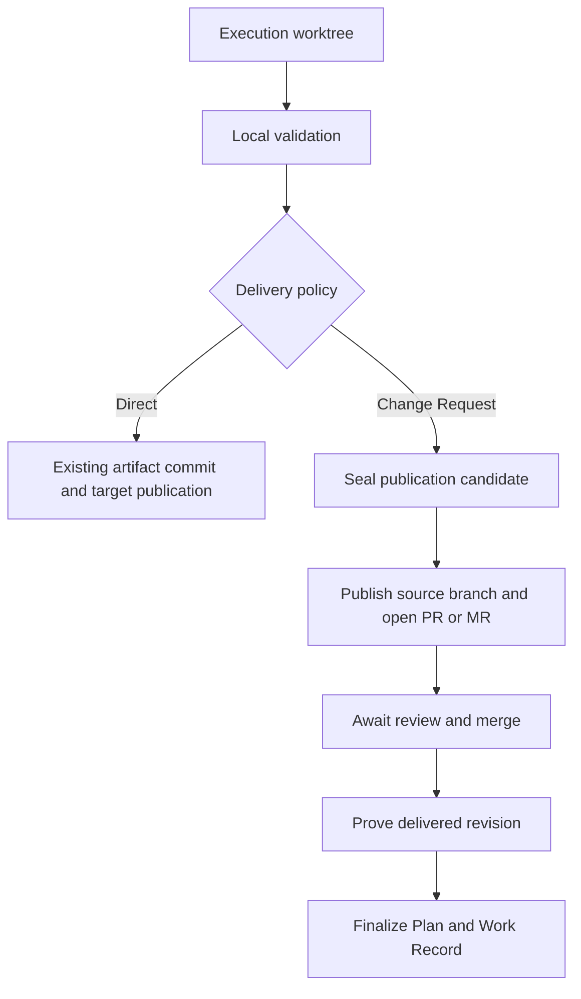
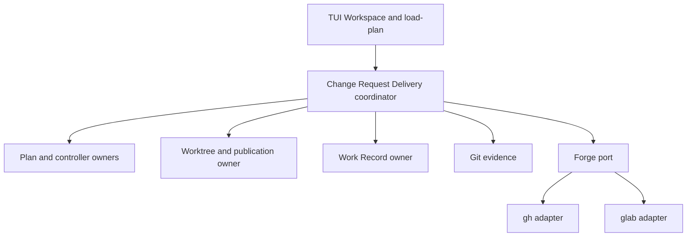
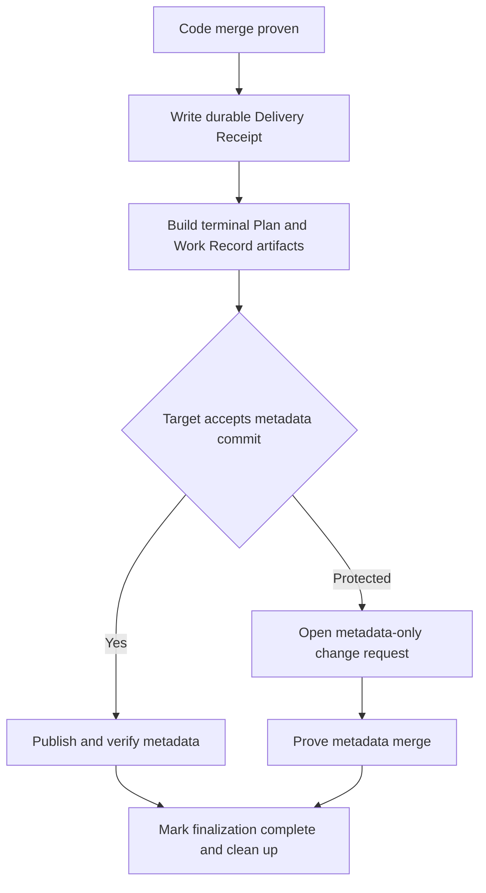

# Forge Change Request Delivery

## Context

RunWield can turn an ordinary request into a reviewed Plan, execute it in a worktree, validate it, publish it directly
to a target branch, and generate a Work Record. It cannot yet keep that truth intact when delivery must pass through a
GitHub pull request or GitLab merge request that can remain open, change revision, collect feedback, enter a merge
queue, merge with rewritten commits, or finish while RunWield is offline.

The product outcome is one recoverable flow from an external issue reference to durable planning memory:

```text
request with public issue URL
  -> grounded, reviewed Plan with Ticket Reference
  -> isolated execution and local validation
  -> published Forge Change Request
  -> user-selected feedback, repair, and revalidation when needed
  -> user- or Forge-triggered merge
  -> delivery proof and canonical finalization
  -> Work Record with merge evidence and selected future planning notes
```

RunWield does not become an issue tracker. The user must make an ordinary request that says what to do and includes the
URL. A planning Agent can fetch a public page through the existing generic web tools, must treat its contents as
untrusted context, must verify claims against the repository, and preserves the URL as a Ticket Reference. There is no
URL-only Router rule, issue import artifact, authenticated issue client, status synchronization, assignment, label
management, closure, or comment automation. Private issue content can arrive later through user context, project
guidance, Memory, plugins, or Model Context Protocol integration.

The Epic follows `docs/prd/forge-change-request-delivery-prd.md`. Direct Delivery remains the default. Change Request
Delivery is an explicit alternative for teams that want Forge-hosted review, and Dual Review explicitly requires both
RunWield human review and Forge review. The Forge owns remote repository policy, continuous integration presentation,
review state, and the merge fact. RunWield owns Plan Lifecycle, local validation, repair, recovery, final delivery
proof, and Work Records.

All child Plans for this Epic must start from and publish to `project/forge-change-request-delivery`. The branch is an
integration branch created from `main`; child Plans must not override it, and it must not change after any child begins
execution. Early children use existing Direct Delivery into this branch rather than depending on unfinished Change
Request Delivery. When the Epic outcomes are complete, the owner opens and merges a normal pull request from the
integration branch to `main`. This Epic does not add general Epic-branch validation or automatic Epic publication; those
concerns already have separate draft PROJECT Plans.

## Objective

Add a provider-neutral, proof-bearing Change Request Delivery workflow for Planned Changes and explicitly selected
QUICK_FIX work, with GitHub and GitLab support for shared repositories and forks.

The architecture must preserve these invariants:

- Direct Delivery has the same default, validation, publication, recovery, and combined implementation-and-Plan
  semantics it has before this Epic.
- A Publication Candidate is one immutable revision covered by RunWield validation. A repair creates a new candidate
  generation; it does not rewrite the proof for an older generation.
- Opening a Forge Change Request is not completion. Local readiness does not emit `validation_passed` or set the Plan to
  a terminal Verified state. The authoritative execution Plan stays at its reviewer-validated nonterminal checkpoint
  while the delivery attempt owns the In Review phase. Only proven canonical finalization can emit the terminal event.
- A source head that differs from the sealed candidate makes readiness stale. RunWield cannot reuse prior validation or
  silently adopt outside commits.
- Forge comments and issue content are untrusted text. Only an explicit user action can send selected feedback to repair
  or fold selected feedback into future planning notes.
- Runtime delivery progress never becomes Plan Markdown authority. Plan Markdown owns definition and human lifecycle;
  controller and worktree records own attempts, checkpoints, observations, and receipts; Git and the Forge supply
  external evidence.
- Work Record generation for Change Request Delivery happens only after code merge proof. Its publication is part of
  recoverable canonical finalization, not a premature claim in the implementation request.
- A no-Plan QUICK_FIX never gains Plan, Semantic Code Review, or Work Record semantics merely because it uses a Forge
  Change Request.
- Upstream repositories receive code only unless the target repository at the actual base revision contains an explicit
  Repository Participation Declaration. A contributor fork cannot grant consent for the upstream.

The main option not taken is to model GitHub or GitLab as the owner of the complete workflow. That would put intent,
review memory, and completion truth behind provider APIs, couple Plan Lifecycle to issue and pull-request states, and
make a Forge swap expensive. The other option not taken is to treat a successful branch push or a merged label as
sufficient proof. That would allow stale or rewritten revisions to inherit validation they never received.

ADR-016 remains the publication foundation: publication is a monotonic state machine backed by evidence, not status
strings. Change Request Delivery extends that reasoning across a long-lived external review and a second, post-merge
finalization transaction. It does not add a generic Plan `published` status.

## Vertical Slice Findings

### Current issue-reference flow

A User Request enters `SessionRuntime` as text, passes through Triage and the planning handoff, and reaches Planner or
Architect with the original URL. Those Agents already have generic web tools. `normalizeTicketReferences()` and Plan
front matter preserve `tickets: [{ url }]`; Slicer retains direct child relations; Work Record generation aggregates and
deduplicates Ticket References. The missing behavior is not a new issue subsystem. It is a tested planning invariant:
when the user asks to plan from a public issue, the planning Agent reads it, treats it as untrusted, checks it against
source, and retains the direct URL relation.

```text
SessionRuntime
  -> Router handoff with original request
  -> Planner or Architect generic web fetch
  -> repository-grounded Plan
  -> Plan store Ticket Reference
  -> Work Record Ticket Reference
```

The Router remains provider-neutral and receives no URL-only behavior. Ticket content and state remain owned by the
External Work Source.

### Current Direct Delivery flow

`runValidationLoop()` moves a worktree-backed Planned Change through Mechanical Validation, Semantic Code Review, any
configured human review, and publication. `runPublicationPhase()` seals a candidate, stages final Plan and Work Record
artifacts, and calls isolated publication. `.wld/worktrees.json` owns the active `PublicationAttempt`; controller files
own validation checkpoints and final delivery evidence; Git proves target publication. ADR-016 requires monotonic,
compare-and-swap updates and restart reconciliation before cleanup.

That sequence cannot be reused unchanged. Change Request Delivery must branch after local readiness and before terminal
Plan staging or Work Record generation:



Direct Delivery must not pass through Forge abstractions. Both paths can reuse validation, repair, Git fixtures, locks,
and evidence conventions, but they have different delivery transactions.

### Application ownership and dependency direction

A new application-owned Change Request Delivery coordinator governs the workflow. It calls Plan, controller, worktree,
validation, Git, and Work Record machinery directly. It reaches GitHub and GitLab through a provider-neutral Forge port
implemented over the authenticated official `gh` and `glab` command-line clients. The adapter returns observations and
proof; it cannot mutate Plans, lifecycle records, worktree records, or Work Records.



The Forge port interface includes only independently varying external operations: resolve repository identity, preflight
authentication and permission, publish a source ref with lease, create or find a change request by an idempotency
marker, read its source and target revisions, checks and review summary, read selected review material, and prove open,
merged, closed-unmerged, superseded, inaccessible, or temporarily unavailable outcomes. Provider names and response
formats stay inside adapters. Lifecycle transitions and local persistence are not injection seams.

### Durable delivery model

A live Planned Change keeps one `ForgeDeliveryAttempt` beside its worktree identity in `.wld/worktrees.json`, parallel
to the existing `PublicationAttempt`. The attempt contains stable provider/repository/change-request identity, source
and target refs, current candidate generation, observations, finalization phase, retryable failure, and compare-and-swap
revision. It stores only facts needed for recovery; it is not a local copy of every comment, approval, check, or
provider policy.

Each candidate generation is immutable and binds:

- the validated execution commit and publication tree;
- the observed target base;
- the source ref and exact published head;
- validation and review receipts for that head;
- the bound Forge Change Request identity; and
- whether the generation was superseded, became externally stale, or was delivered.

Repair supersedes the old generation and creates a new one. External source-head changes create a visible stale state
and block merge proof until the user explicitly resumes repair or restores a known candidate. No state transition sends
external text to an Agent automatically.

A QUICK_FIX that selects Change Request Delivery needs the same durable source-branch and worktree identity but no Plan.
The worktree registry therefore identifies its owner as either a `planId` or a no-Plan delivery ID. QUICK_FIX keeps
Mechanical Validation and Forge delivery receipts only. After successful cleanup, its commit and Forge history are the
audit trail and no Work Record is generated.

After planned delivery completes, a controller-owned `DeliveryReceipt` survives worktree cleanup. It records delivery
mode, provider and repository identity, change-request URL and stable ID, validated candidate, intended target, proven
merge result, proof method, and timestamps. Workspace, Plans Doctor, final Plan evidence, and Work Record generation
read this receipt rather than requiring a retained live worktree entry.

### Review and repair flow

Foreground refresh and explicit user refresh read Forge state; restart and later resume reconcile the same attempt. V1
uses no daemon or webhook. The user can select review feedback and choose one of two application actions:

```text
selected feedback
  -> Resume repair
       -> bounded existing repair flow
       -> complete applicable validation and review
       -> new immutable candidate generation
       -> update the same PR or MR

  -> Fold into planning memory
       -> durable pending note attached to finalization input
       -> Recorder distills it into Future Planning Notes
       -> no code or lifecycle change
```

The feedback selection receipt binds the stable provider feedback ID, its observed edit revision or timestamp, and the
exact selected text bytes or their digest-backed immutable snapshot. Repair and Recorder receive only that selected
version. If the provider text changes after selection, resume stops and requires a new user selection; it cannot fetch
new text under an old authorization.

The two review gates remain independent. Forge review replaces Local Human Code Review only when Change Request Delivery
policy says so; Dual Review requires both and does not synchronize approvals or comments between surfaces. Local
Mechanical Validation and Semantic Code Review remain required for Planned Changes. Forge continuous integration never
inherits or replaces local validation evidence.

### Merge proof and finalization

Merge proof requires all of these facts:

1. the Forge reports that the bound change request merged into the intended repository and target;
2. the merged request source revision equals the sealed candidate generation;
3. Git and provider evidence identify the delivered target result; and
4. the delivered content is covered by RunWield validation.

For merge commits, normal Git ancestry and target evidence provide the strongest proof. For squash merges, rebase
merges, and merge queues, the coordinator uses provider merge identity plus a content proof that compares the
candidate's net changed blobs and modes from its recorded base with the delivered result against the provider-proven
merge base. Patch ID, commit message, changed-path equality, commit count, and provider merge status are never
sufficient. If target movement or conflict resolution changes overlapping content, or if either provider cannot expose
enough stable evidence, RunWield validates the actual delivered result before it accepts proof. It fails closed on
ambiguity.

Code merge proof starts a separate finalization transaction:



A code merge cannot be undone by a later Recorder, indexing, or metadata-publication failure. Such failures leave
`finalization_pending` with the code merge receipt intact and an idempotent resume path. The canonical Plan does not
claim completion until terminal Plan and Work Record artifacts reach the canonical target. Work Record generation is
idempotent by Plan identity, and a retry reconciles an existing record instead of creating a duplicate.

### Fork and consent boundary

Shared-repository delivery publishes a topic branch in the target repository. Fork delivery publishes the source branch
to the contributor fork and opens a cross-repository request against the upstream. Repository identities are stable
provider IDs plus canonical host/path information, not remote aliases alone.

The publication projection is code-only by default. A Plan snapshot can enter an upstream request only when a Repository
Participation Declaration is read from the authoritative upstream base revision. The declaration cannot be inferred from
contributor settings, repository contents in the fork, prior RunWield commits, or the presence of `docs/plans/`.
Contributor-only RunWield use requires no post-merge synchronization. Maintainer finalization in the canonical
repository owns any canonical Plan and Work Record claim.

### Epic development and rollout boundary

This Epic uses `project/forge-change-request-delivery` as its development integration branch. Existing Slicer behavior
copies an Epic `targetBranch` to children, and execution uses that branch as both base and publication target. The Epic
adds a project-level invariant around that current behavior. Before Slicer writes any child, RunWield records the
integration-branch baseline. Materialization rejects an omitted, null, or different child `targetBranch`; execution
preflight rejects a direct Plan edit or retarget after the family baseline is locked. Each child starts from the current
integration-branch head when its execution starts. Existing dependencies and concurrency policy, not this Epic, decide
child order.

Capability exposure follows proven end-to-end behavior rather than provider or interface layers. Direct Delivery stays
available throughout. Change Request Delivery remains unavailable unless the selected provider, repository model, review
policy, recovery path, and finalization path are complete for that scenario. GitHub shared-repository behavior is the
reference contract; GitLab, forks, feedback continuation, QUICK_FIX, and enterprise/self-managed compatibility must
conform to the same application state model rather than create parallel lifecycle systems.

## Expected Change Surface

- `docs/prd/forge-change-request-delivery-prd.md` — remain the product contract; reconcile any architecture-level terms
  that become settled during implementation without widening issue-tracker scope.
- `docs/domain-language.md` — add proposed terms such as Review Memory Fold only in the same implementation change that
  makes them true; retain provider-neutral Forge vocabulary.
- `docs/plan-lifecycle.md` and ADR-016-aligned documentation — define Change Request Delivery phases, proof,
  finalization, recovery, and the unchanged Direct Delivery path.
- `src/agent-definitions/` — make public Ticket content explicitly untrusted planning input; require repository
  grounding and direct Ticket Reference preservation without changing Router URL semantics.
- `src/plan-front-matter.js` and `src/plan-store.js` — represent explicit Plan-owned delivery/review policy and durable
  terminal Forge delivery evidence while keeping attempt state out of Markdown.
- `src/shared/ticket-references.js` — retain provider-neutral URL relations and safe display behavior; no issue schema
  or synchronized state enters this module.
- `src/shared/workflow/validation-engine.ts`, `validation-publication.ts`, and related workflow modules — branch at
  local readiness, coordinate candidate generations, feedback repair, merge proof, and finalization without changing
  Direct Delivery semantics.
- `src/shared/workflow/publication-attempt.ts`, `publication-machine.ts`, and new Forge delivery modules under
  `src/shared/workflow/` — reuse proof-bearing, monotonic, compare-and-swap publication patterns for long-lived
  delivery.
- `src/shared/worktree-registry.js` and `src/shared/isolated-publication.ts` — retain candidate worktrees and source
  refs, support Plan or QUICK_FIX delivery identity, publish with leases, and clean up only after final proof.
- `src/shared/work-records/` — delay Change Request Work Record generation until merge proof, include delivery
  provenance and distilled selected feedback, and preserve existing no-record QUICK_FIX policy.
- `src/cmd/load-plan/` and Plans Doctor surfaces — refresh and reconcile Forge state, resume repair or finalization, and
  explain closed, stale, inaccessible, and failed outcomes.
- `src/ui/tui/` — select delivery/review presets, display the change-request URL and exact phase, refresh state, select
  feedback, resume repair, and distinguish merged code from complete finalization.
- `src/ui/workspace/` — show the same application read model through current RunWield browser design-system primitives;
  do not create a Workspace-only lifecycle authority.
- `src/testing/`, Git fixtures, workflow integration tests, and authentic TUI/Workspace journeys — prove provider
  contracts, process-loss recovery, revision staleness, proof, finalization, and Direct Delivery regression safety.

## Reuse Opportunities

- `src/shared/workflow/validation-engine.ts` and validation checkpoints — reuse phase selection, resumable repair, and
  existing validation authorities.
- `src/shared/workflow/validation-semantic.ts`, `validation-human-review.ts`, and repair-resume integration tests —
  reuse bounded repair and complete revalidation rather than add a Forge-controlled repair Agent.
- `src/shared/workflow/publication-attempt.ts` and `publication-machine.ts` — reuse immutable evidence, monotonic
  phases, compare-and-swap writes, effect reconciliation, and cleanup discipline from ADR-016.
- `src/shared/isolated-publication.ts` — reuse remote resolution, leases, isolated Git work, and target-movement safety;
  do not reuse its assumption that the target ref is updated immediately after local validation.
- `src/shared/workflow/controller-registry.ts` and `controller-state.ts` — retain validation checkpoints and final
  delivery receipts outside Plan Markdown.
- `src/shared/worktree-registry.js` — retain live execution and publication identity until finalization and cleanup are
  proven.
- `src/shared/work-records/auto-generation.ts` and generation/reconciliation modules — reuse Recorder, backlinks,
  supersession, indexing, and idempotent source-Plan identity after merge proof.
- `src/shared/ticket-references.js`, Plan serialization, Slicer, Workspace Ticket display, and Work Record ticket
  aggregation — reuse the complete existing URL-preservation path.
- `defineGitFixture`, process-loss publication tests, `makeValidationProjectRoot`, Golden TUI scenarios, and Workspace
  integration tests — exercise real application machinery and external-process seams without adding RunWield-owned
  dependency injection.
- Authenticated official `gh` and `glab` clients — use existing user-owned credentials and mature provider behavior
  instead of adding long-lived tokens or duplicate HTTP clients to Core.

## Verification Plan

- Automated: run focused Plan-store, Slicer, Ticket Reference, Work Record, validation, publication, recovery, TUI, and
  Workspace tests through `deno run -A scripts/run-tests.js <test paths>`; run `deno task seams:check`; run
  `deno task
  ci` for the integrated branch. Tests that change `HOME` or current working directory must use the project
  process lock, and Git scenarios must use real isolated fixtures.
- Automated: run multi-process restart matrices that stop after each Forge side effect and each local receipt write,
  then prove idempotent change-request discovery, no duplicate metadata, retained repair state, exact merge/finalization
  evidence, and safe cleanup.
- Automated: run provider contract fixtures for GitHub and GitLab covering shared repositories, forks, merge commits,
  squash, rebase, merge queues where exposed, target movement, closed-unmerged requests, changed source heads,
  authentication failure, rate limits, network loss, and inaccessible repositories. Adversarial cases must include an
  edited comment after selection and overlapping target-context changes that preserve a patch ID; both must block use of
  stale authority or proof until reselection or validation of the delivered result.
- Automated: prove the Epic branch lock rejects an omitted target, explicit `null`, a different explicit target, a
  direct child Plan edit, and a retarget after the first execution starts; prove the first child and every later child
  resolve the recorded integration baseline rather than checkout accident.
- Manual: from a normal request containing a public issue URL, review the fetched source and resulting Plan, confirm the
  Plan retains the direct Ticket Reference, complete Change Request Delivery, and confirm the Work Record retains the
  URL without any issue mutation.
- Manual: complete one GitHub and one GitLab Planned Change through publication, feedback repair, merge, finalization,
  Work Record display, restart reconciliation, and recovery from a failed metadata publication.
- Manual: complete shared-repository and fork flows, verify code-only default publication, then repeat against an
  upstream base with a valid participation declaration and confirm only the permitted Plan snapshot is included.
- Manual: run the same repository with no Change Request Delivery selection and confirm Direct Delivery has no new
  prompt, state, provider preflight, or UI obstruction.
- Manual: inspect TUI and Workspace at open review, stale revision, closed-unmerged, merged-but-finalization-pending,
  and complete states. Confirm each surface names the known fact, uncertainty, owner, and next action.

### Outcome Evidence

- **Ordinary issue-linked planning stays provider-light** — a request that includes a public GitHub or GitLab issue URL
  can produce a repository-grounded Plan and later Work Record with the exact Ticket Reference; a fixture in which the
  issue names an obsolete path or embeds instructions proves current repository evidence wins and the external text is
  not executed; Router has no URL-only rule; no Core store contains synchronized issue body, status, labels, assignment,
  or closure state; no issue mutation permission is requested.
- **Direct Delivery is unchanged by default** — existing Direct Delivery integration and restart tests pass without a
  Forge client, delivery-policy prompt, changed artifact ordering, or changed delivery evidence when Change Request
  Delivery is not selected.
- **One validated revision enters review** — the published source head equals the active immutable candidate generation,
  and any outside head change makes readiness visibly stale and blocks delivery proof until explicit user action and
  applicable revalidation.
- **GitHub and GitLab implement one application contract** — the coordinator has no provider-specific lifecycle branch;
  provider adapters return the same normalized repository, request, revision, review/check summary, and terminal outcome
  shapes for equivalent scenarios.
- **External review never controls an Agent** — no fetched issue, comment, review, or check text reaches repair or
  Recorder as an instruction without a persisted user selection bound to the exact observed text version; edited text
  requires reselection, and automatic refresh alone cannot change code, Plan definition, or lifecycle state.
- **Feedback returns through proof** — repair from selected Forge feedback creates a new candidate generation and runs
  complete applicable validation before source publication; a memory fold changes no code or lifecycle claim and is
  visible only as distilled Future Planning Notes in the final Work Record.
- **Merge means the validated work was delivered** — merge-commit scenarios have Git ancestry proof; rewrite and queue
  scenarios compare candidate and delivered blobs/modes against provider-proven bases or validate the actual delivered
  result; patch ID, commit messages, path lists, provider status, and ambiguous or mismatched evidence cannot produce
  finalization. An overlapping-context fixture that preserves patch ID remains blocked until delivered-result
  validation.
- **Finalization is truthful and recoverable** — a proven code merge survives later failures as a durable receipt;
  terminal Plan and Work Record artifacts appear once in the canonical target before finalization completes; protected
  targets use a verified metadata-only change request rather than a silent local claim.
- **Fork consent is authoritative** — a fork without an upstream-authored declaration publishes code only; a declaration
  present only in the fork cannot change the projection; accepted Plan artifacts come only from policy read at the
  actual upstream base revision.
- **QUICK_FIX keeps its meaning** — explicit Change Request Delivery can publish and recover a mechanically validated
  QUICK_FIX, but no Plan, Semantic Code Review, Work Record, or false RunWield Workflow Validation claim is created.
- **Completed state survives cleanup** — live attempt state is removable only after proof and cleanup; controller-owned
  delivery evidence and the Work Record retain the stable Forge URL, repository/target identity, validated candidate,
  delivered result, and proof method afterward.
- **This Epic remains isolated until owner publication** — before materialization, one recorded baseline binds the Epic
  family to `targetBranch: project/forge-change-request-delivery`; omitted, null, different, directly edited, and later
  retargeted child values are rejected; the first and every later child worktree start from the current branch head and
  publish back to it; no child publishes to `main`; final integration to `main` occurs only through the owner's normal
  pull request.
- **Behavior expected to stop existing** — selected Change Request Delivery no longer proceeds from local readiness
  directly into terminal Plan staging, pre-merge Work Record generation, or target-branch publication; a changed remote
  head, merged label, or successful push can no longer be mistaken for RunWield-verified delivery.

Across the Epic, existing planning, Direct Delivery, validation, local human review, repair, Work Record supersession,
archive/recovery, no-Plan QUICK_FIX, non-Git operation, local-only publication, and primary-checkout safety behavior
must remain protected.

## Edge Cases & Considerations

- **Integration branch state:** `project/forge-change-request-delivery` must be created from the intended `main` head.
  Current missing-branch behavior creates from local `main`; execution must fail clearly if that base is unavailable or
  differs from the selected remote baseline. The existing dirty primary checkout must not be modified or cleaned by this
  Epic.
- **One-time Slicer inheritance:** current children can override or clear the inherited branch. This Epic requires
  mechanical equality for its own child family and rejects retargeting after execution starts; it does not silently
  redefine branch policy for unrelated Epics.
- **Target movement:** movement before or during review is normal. It can require updated merge proof or validation of
  an integrated result, but it is not itself a merge conflict or permission to rewrite the candidate.
- **Merge methods:** patch identity alone can hide changed context, while strict ancestry would reject valid squash and
  rebase workflows. The proof hierarchy uses ancestry where available, content equivalence for provider rewrites, and
  actual-result validation when overlap makes equivalence uncertain.
- **Duplicate requests:** timeouts after creation or publication can hide successful external effects. Stable repository
  identity, source/target refs, and an idempotency marker must find the existing request before any retry creates
  another.
- **External source changes:** an unexpected force-push or collaborator commit must preserve the local candidate and
  present restore, inspect, or explicit repair choices. It cannot be adopted automatically.
- **Closed without merge:** preserve the candidate and recovery evidence. The user can reopen where the provider allows,
  create a replacement request, return to repair, or cancel without a Work Record completion claim.
- **Merge while offline:** resume reads the saved request identity and fresh provider/Git facts, then advances only the
  phases those facts prove. No daemon or webhook is required.
- **Protected finalization:** a metadata-only request can itself remain open or fail. The implementation merge remains
  proven, but Plan completion and Work Record publication stay pending until canonical metadata lands.
- **Work Record failure:** generation or indexing failure cannot reverse a Forge merge. Generation retries by Plan
  identity; indexing remains a rebuildable projection and cannot become canonical completion authority.
- **Credential scope:** V1 uses local user-owned `gh` and `glab` authentication and requests no issue mutation scope.
  Enterprise and self-managed hosts are best effort after preflight; errors must name unsupported capabilities without
  weakening proof.
- **Provider API drift:** child planning must recheck current official CLI/provider behavior for the operations it uses.
  Adapter contract tests must isolate provider vocabulary and optional fields from application lifecycle semantics.
- **Security:** repository names, issue bodies, request bodies, comments, check output, branch names, and provider error
  text are untrusted. They must never become shell fragments, file paths, lifecycle events, or Agent instructions
  without validation and explicit user authority.
- **Observability:** TUI and Workspace are projections over the same stored attempt and receipt. They must distinguish
  local readiness, awaiting review, stale candidate, merge observed, finalization pending, complete, and uncertain
  external access without inventing provider policy or claiming that work is safe when proof is incomplete.
- **No upstream issue integration:** plugins or MCP can later add private issue retrieval or richer issue workflows.
  Such extensions provide planning context; they must not move Ticket lifecycle authority into Core or alter Change
  Request delivery proof.
