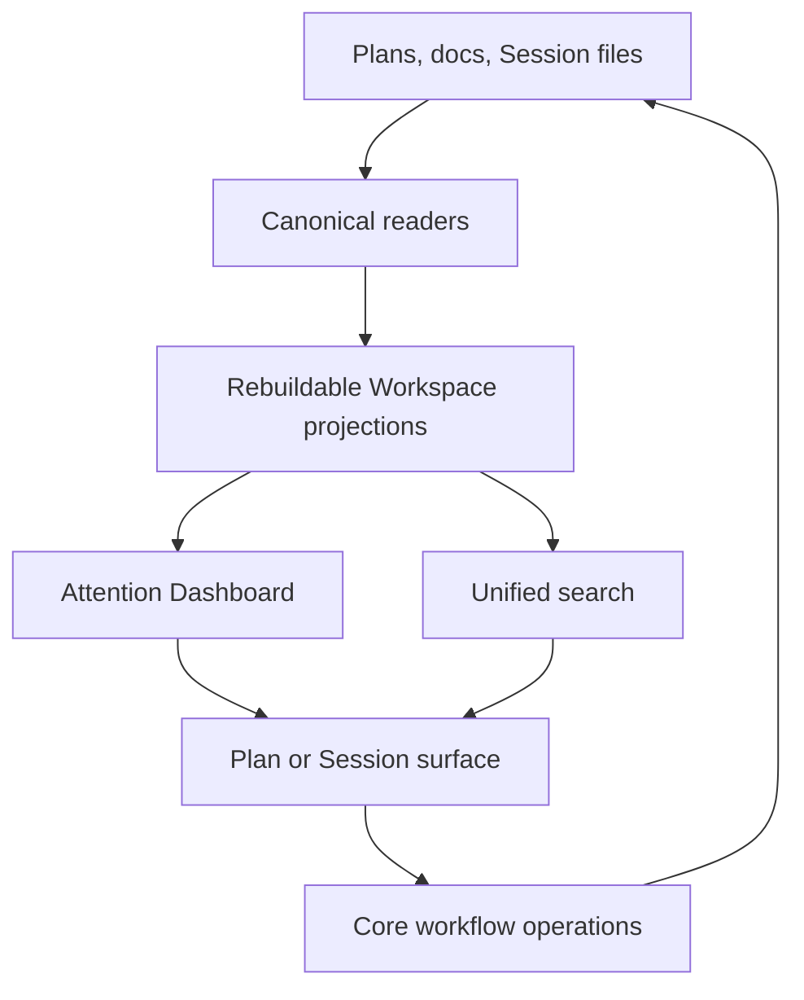

# Personal Remote Workspace v2

## Context

Personal Remote Workspace v1 delivered the owner browser loop: registered Projects, paired devices, durable Sessions,
Plan review, Feedback, approval, execution, and progress. Real use now exposes a navigation and continuity problem. The
Workspace reopens the last Session, the sidebar treats Sessions as the main objects, and loading a saved Plan continues
in a new or current Session without finding the conversation that produced it. The owner can lose planning rationale and
must inspect Projects separately to find work that needs a decision.

The v2 outcome is a Plan-centered personal Workspace. Opening Workspace answers “what needs me now?”, open Plans lead
Project navigation, Plan-associated Sessions keep their conversation context, and one in-app search finds the durable
knowledge or Session entry point the owner needs.

This Epic is for one owner. Multi-user privacy, collaborator permissions, and organization search policy are later
Workspace concerns. Full Session Transcript search, source-code search, Cymbal federation, code-server, and another Code
Surface are not part of v2.

## Objective

Deliver three connected capabilities:

1. Make the Attention Dashboard the Workspace home. It groups Plan-centered work into **Needs You**, **Ready to
   Continue**, **In Progress**, and **Recently Finished**, while standalone Sessions and Project health remain visible
   when they require attention.
2. Make Plan-to-Session continuity reliable. Open Plans appear before standalone Sessions in each Project. Loading a
   Plan resumes its one safe, idle planning Session by default when that relationship is known, and otherwise gives the
   owner an explicit choice or preserves the current fallback.
3. Provide one Spotlight-style Workspace search across Plans, PRDs, ADRs, Work Records, the RunWield Design System,
   applicable domain-language documents, Session Names, and the first user message when present. A visible global Search
   action and `Cmd+K` / `Ctrl+K` open a centered quick-search surface. Focus controls narrow the same result set by
   Project or content type, and a **View all results** path opens the full search page without creating a second search
   system.

Workspace remains able to advance work. Session messages, Plan review decisions, approval, execution, and recovery use
the existing Core-owned operations and current evidence checks. Dashboard and search summaries help the owner find the
right action; they do not become a second copy of Plan, Session, or worktree state.

The main option not taken is separate Dashboard and search Epics. That would isolate delivery but duplicate the
cross-Project discovery, navigation, failure handling, and shell work. With code search and Code Surface scope removed,
one v2 Epic is coherent and remains suitable for later decomposition into a small number of executable Plans. The other
option not taken is code search without an actionable code workflow. It would stop at a file match and add indexing and
interface cost before the owner can inspect, edit, or deliberately send that code into a Session.

## Vertical Slice Findings

The shipped owner Workspace already has most workflow evidence needed by the Dashboard:

```text
GET /api/owner/sidebar
  listOwnerProjects
  WorkspaceSessionContinuationService.listSessions
  FileSessionStore.listProjectSessions
```

Session files and verified transcript prefixes own Session identity, activation, committed generations, and persisted
attention events. Plan progress already joins the authorities needed to explain planned work:

```text
loadOwnerPlanProgress
  findPlanEvidenceById
  findByPlanId
  load execution-worktree Plan when present
  load controller validation and delivery evidence
```

The new cross-Project view must compose these existing readers instead of copying lifecycle logic. Today the sidebar
uses one all-or-nothing `Promise.all`; one damaged Project can fail the full response. Dashboard and search must instead
return successful Project groups plus a visible failure for each Project that could not be read.

Current Plan continuation loses conversation context:

```text
wld load-plan <plan>
  start or use current Session
  read Plan
  send synthetic resume request to Planner or Architect
```

The Session records only a mutable `planName`; the Plan does not point back to a Session. A Plan can legitimately have
more than one Session, so v2 must record durable `planId` association in committed Session evidence and derive the
reverse lookup from Sessions. It must not add one owner Session field to Plan Front Matter.

The target relationship and dependency direction are:



The index is disposable display and retrieval state. SQLite full-text search (FTS5) fits the existing local stack and
avoids another service, but its tables must be separable from owner coordination authority so index loss or corruption
can be rebuilt without affecting Project registration, paired devices, Sessions, Plans, or workflow state. Search
candidates are rechecked against canonical files before navigation or action.

## Expected Change Surface

- `src/ui/workspace/layouts/WorkspaceLayout.astro` and `src/ui/workspace/static/workspace-shell.ts` — make Dashboard and
  Search stable top navigation actions, remove last-Session home redirection, register the global search shortcut, and
  render Plan-first Project navigation with latest-activity ordering.
- `src/ui/workspace/pages/`, `components/`, `islands/`, and `react/` — add the responsive Attention Dashboard and
  unified search experience using the RunWield Design System.
- `src/ui/workspace/server/`, `routes/owner-api.js`, and owner server composition — compose cross-Project attention,
  Plan-to-Session, and search results; isolate per-Project failures; and route selected results to stable Plan, Session,
  or artifact views.
- `src/shared/session/file-session-store.ts`, `workflow-context-session.js`, and transcript projection modules — record
  and read durable Plan identity and association purpose without making a Workspace database authoritative for Session
  history.
- `src/shared/workflow/` and `src/ui/workspace/server/owner-plan-progress.ts` — reuse one Plan progress interpretation
  for Plan screens and Dashboard categories rather than implementing another lifecycle mapping in the browser.
- `src/cmd/load-plan/` and Session resume surfaces — find Plan-associated Sessions by durable Plan ID and support safe
  resume-or-current-Session behavior across TUI and Workspace.
- `src/plan-store.js` — provide canonical Plan identity and authority-aware hydration needed by navigation and search,
  including the execution-worktree Plan when it is authoritative.
- `src/shared/work-records/` and new focused artifact readers beside the owning modules — reuse canonical hydration for
  search candidates without turning the Work Record index adapter into a false general-purpose artifact service.
- `src/shared/owner-coordination/` — expose registered Project scope to projections while keeping rebuildable search
  state outside registration, device, and operation-receipt authority.
- `docs/prd/runwield-workspace-prd.md` — move code search and Code Surface claims out of the personal v2 milestone and
  record the settled Plan-centered navigation and focused search scope.
- `docs/design-system.md` — document only reusable Dashboard, search, or nested Plan/Session navigation patterns that
  are not already covered by existing Workspace and review components.

## Reuse Opportunities

- `src/ui/workspace/server/owner-projects.js` — registered-root eligibility and browser-safe Project projection.
- `src/ui/workspace/server/session-continuation.js` and `src/shared/session/session-transcript-manifest.ts` — stable
  Session listing and verified committed transcript reads.
- `src/shared/session/session-transcript-projection.js#summarizeProjectedEntries` — persisted workflow and attention
  facts; extend the durable Plan identity rather than adding a second Session summary format.
- `src/ui/workspace/server/owner-plan-progress.ts#loadOwnerPlanProgress` — joined Plan, controller, worktree,
  validation, delivery, and optional Session evidence.
- `src/ui/workspace/server/plan-adapter.js` and `src/plan-store.js` — canonical Plan listing, identity, and detail
  reads.
- `src/shared/work-records/search.js` — candidate selection followed by canonical Markdown hydration; reuse the rule,
  not the Work Record-specific adapter as a generic abstraction.
- `src/ui/design-system/` and the current Session, Plan Review, and Code Review surfaces — shared tokens, compact rows,
  status labels, focus behavior, and responsive shell patterns.

## Verification Plan

- Automated: run focused Session, Plan continuation, owner Workspace, Plan progress, search-index, and browser component
  tests with `deno run -A scripts/run-tests.js <test paths>` as each area changes.
- Automated: run `deno task workspace:check`, `deno task seams:check`, and `deno task ci` at Epic integration.
- Manual browser: run `deno task workspace:dev` for visual and responsive fixtures, then verify the real paired owner
  server because the development catalog does not exercise registration, Session locks, or cross-Project filesystem
  reads.
- Manual journey: use at least two registered Projects containing an active Plan, a Plan needing review, an approved
  Plan, a recently finished Plan, a standalone Guide or Ideator Session, a Project read failure, and searchable
  artifacts of every supported type.
- Expected result: the owner can open Workspace, identify the next required decision, return to its Plan and original
  planning context, advance work through existing Workspace actions, and find known project knowledge without browsing
  each Project separately.

### Outcome Evidence

- **Attention-first home** — `/` renders the Dashboard and no client code replaces it with the last Session route;
  direct Session URLs still open their Session.
- **Plan-centered Dashboard** — the same Plan and associated Session produce one Plan-centered attention row, while a
  Session with no proven Plan association remains independently visible. Category results agree with canonical Plan
  progress and committed Session evidence.
- **Failure isolation** — an unreadable or damaged registered Project produces a Project-specific degraded result while
  healthy Projects still render Dashboard, sidebar, and search results.
- **Plan-first Project navigation** — each enabled Project renders open Plans before standalone Sessions; associated
  Sessions nest under their Plan, uncertain associations are not guessed, terminal Plans do not fill the sidebar, and
  standalone Sessions sort by latest committed activity.
- **Durable Plan-to-Session continuity** — new Plan-associated Session evidence contains durable `planId`; no Plan Front
  Matter field claims one Session owner; reverse lookup can return zero, one, or several associated Sessions.
- **Safe Plan resume** — loading a Plan with exactly one idle associated planning Session resumes that stable Session
  and its committed conversation by default. Multiple matches require selection, an active match explains its current
  surface, and no match retains the current Plan-only continuation behavior. Loading from a non-empty unrelated Session
  does not replace it without a user choice.
- **Unified focused search** — the visible Search action and `Cmd+K` / `Ctrl+K` open the same centered quick-search
  experience; one query can return Project-labeled results for every included artifact and Session entry type, and the
  same interface can narrow by Project or type. **View all results** preserves the query and filters on a full search
  page rather than starting another search flow. Full Session messages after the first user message, tool output,
  reasoning, source code, and Plan-worktree code are absent.
- **Canonical hydration** — deleting and rebuilding the search index preserves result identity from canonical sources; a
  stale candidate cannot open removed, changed-identity, or no-longer-eligible content as if it were current.
- **Workspace action authority preserved** — Dashboard and search routes lead to the existing Session and Plan action
  paths; sending a message, reviewing, approving, running, or recovering still performs current Session, Plan revision,
  controller, and worktree checks rather than mutating projection rows.

Existing behavior that must remain protected: paired-device owner access, registered Project root checks, Session Writer
Lock enforcement, committed-generation synchronization, Session messaging, Plan review and Feedback, Approve for Later,
Approve & Run, execution and repair segment handoff, Plan Recovery, action-time Plan/worktree checks, local Plan Board
behavior, and direct Plan or Session URLs.

Behavior expected to stop existing: automatic last-Session redirection from `/`; Session-only Project navigation; Plan
continuation that cannot discover a known original planning Session; Plan association based only on mutable `planName`;
all-or-nothing cross-Project sidebar failure; and the old v2 promise to add Cymbal search or code-server.

## Edge Cases & Considerations

- A Plan can have zero, one, or several associated Sessions. Association is historical committed evidence, not exclusive
  ownership and not permission to mutate the Plan.
- An associated Session active in another surface is expected to be rare. Workspace explains the active surface and does
  not create a competing writer.
- Planning, execution, repair, and follow-up can have different Session roles. Resuming planning context must not route
  a normal prompt to an execution worktree or execution Agent without current workflow evidence.
- Legacy Sessions contain only `planName` or no association. Name-only matches may be shown as uncertain migration hints
  but must not trigger automatic resume or nesting.
- A Session can produce more than one Plan. The association model must not require one Plan per Session or duplicate the
  same Session as if it had several independent histories.
- Plans can move to execution worktrees after execution starts. Search and Dashboard must use the same authority choice
  as Plan progress, while Session and documentation search remain rooted in registered Project evidence.
- A Session started through Plan loading may have no original user message. Its searchable entry is the Session Name.
- Search indexing is rebuildable and bounded. Startup or one changed Project must not block normal Session and Plan
  operations, and stale or malformed content must produce partial diagnostics instead of removing healthy results.
- Recently Finished needs a bounded age and result cap so old terminal work does not dominate the home; older results
  remain available through search and Plan Board.
- The sidebar must stay compact on desktop and collapse to the established drawer behavior on narrow screens. Search
  remains discoverable through a visible action when keyboard shortcuts are unavailable. The Attention Dashboard and
  human gates remain phone-usable; dense Plan management and full search results can continue to use focused views.
- Multi-user privacy, collaborator search rules, source-code handoff, Cymbal federation, and a confined Code Surface
  need later product and architecture decisions rather than dormant provider seams in v2.
